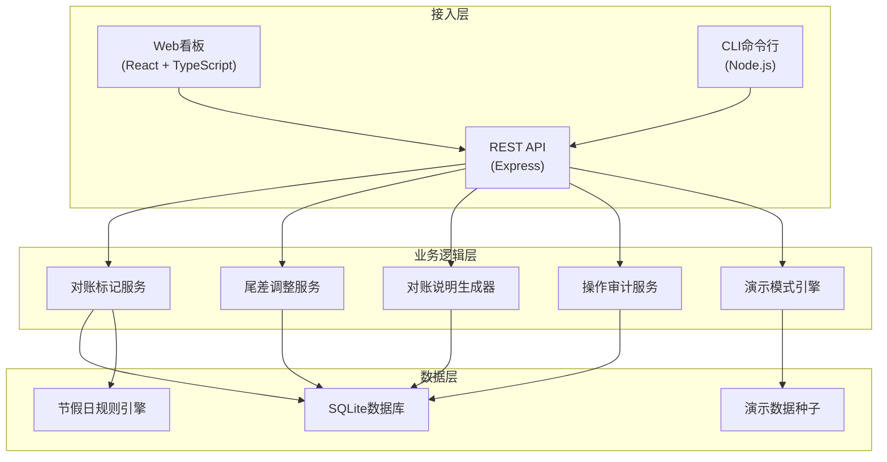
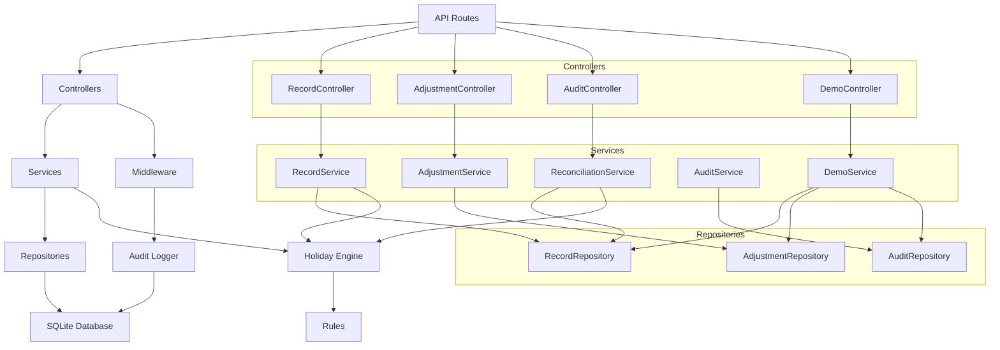
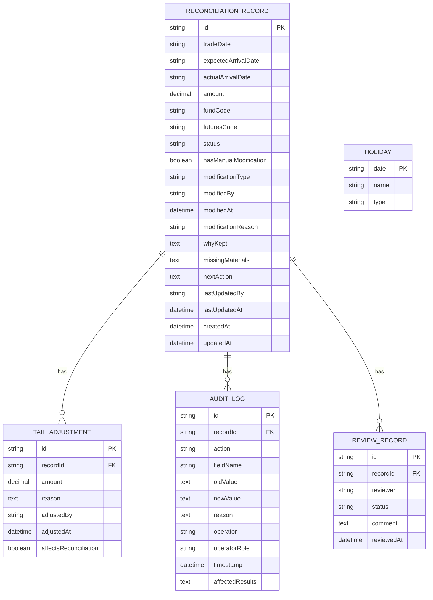

## 1. 架构设计



## 2. 技术描述

- **前端**：React@18 + TypeScript + Vite + TailwindCSS@3 + React Router + Axios
- **后端**：Express@4 + TypeScript + Node.js
- **数据库**：SQLite（轻量级，便于本地部署和演示）
- **CLI工具**：Commander.js
- **初始化工具**：Vite
- **状态管理**：React Context + useReducer
- **UI组件**：Headless UI + Heroicons
- **数据可视化**：简单自定义CSS动画 + 时间线组件

## 3. 路由定义

| Route | Purpose |
|-------|---------|
| / | 对账核查主页 - 记录列表、异常标记、对账说明 |
| /import | 数据导入看板 |
| /record/:id | 记录详情页 - 操作时间线、复核追踪 |
| /adjustment | 尾差调整管理 |
| /demo | 演示模式引导页 |
| /demo/step/1 | 演示Step1 - 节假日顺延导入 |
| /demo/step/2 | 演示Step2 - 尾差调整补录 |
| /demo/step/3 | 演示Step3 - 对账说明更新 |

## 4. API 后端路由
| Method | Path | Purpose |
|--------|------|---------|
| GET | /api/records | 获取对账记录列表 |
| GET | /api/records/:id | 获取单条记录详情 |
| POST | /api/records/import | 导入交割数据 |
| PUT | /api/records/:id/reconciliation | 更新对账说明 |
| POST | /api/adjustments | 创建尾差调整 |
| GET | /api/adjustments | 获取尾差调整列表 |
| GET | /api/audit/record/:id | 获取记录操作历史 |
| POST | /api/records/:id/review | 基金经理复核 |
| GET | /api/demo/init | 初始化演示数据 |
| GET | /api/holidays | 获取节假日配置 |

### 4.1 TypeScript 类型定义

```typescript
// 对账记录
interface ReconciliationRecord {
  id: string;
  tradeDate: string;
  expectedArrivalDate: string; // T+1 原始到账日
  actualArrivalDate: string; // 实际到账日（可能被手工修改为T+2）
  amount: number;
  fundCode: string;
  futuresCode: string;
  status: 'pending' | 'reviewing' | 'approved' | 'rejected';
  hasManualModification: boolean;
  modificationType?: 't1_to_t2' | 'other';
  modifiedBy?: string;
  modifiedAt?: string;
  modificationReason?: string;
  reconciliationNote: ReconciliationNote;
  createdAt: string;
  updatedAt: string;
}

// 对账说明
interface ReconciliationNote {
  whyKept: string;           // 为什么被留下
  missingMaterials: string[];  // 还缺什么材料
  nextAction: string;           // 下一步找谁
  lastUpdatedBy: string;
  lastUpdatedAt: string;
}

// 尾差调整
interface TailAdjustment {
  id: string;
  recordId: string;
  amount: number;
  reason: string;
  adjustedBy: string;
  adjustedAt: string;
  affectsReconciliation: boolean;
}

// 操作审计
interface AuditLog {
  id: string;
  recordId: string;
  action: 'create' | 'modify' | 'import' | 'adjust' | 'review';
  fieldName?: string;
  oldValue?: string;
  newValue?: string;
  reason: string;
  operator: string;
  operatorRole: 'fund_manager' | 'product_manager';
  timestamp: string;
  affectedResults: string[];
}

// 复核记录
interface ReviewRecord {
  id: string;
  recordId: string;
  reviewer: string;
  status: 'approved' | 'rejected';
  comment: string;
  reviewedAt: string;
}

// 节假日
interface Holiday {
  date: string;
  name: string;
  type: 'weekend' | 'public_holiday';
}
```

## 5. 后端架构



## 6. 数据模型

### 6.1 ER 图



### 6.2 DDL 语句

```sql
-- 对账记录表
CREATE TABLE reconciliation_records (
    id TEXT PRIMARY KEY,
    trade_date TEXT NOT NULL,
    expected_arrival_date TEXT NOT NULL,
    actual_arrival_date TEXT NOT NULL,
    amount REAL NOT NULL,
    fund_code TEXT NOT NULL,
    futures_code TEXT NOT NULL,
    status TEXT NOT NULL DEFAULT 'pending',
    has_manual_modification INTEGER NOT NULL DEFAULT 0,
    modification_type TEXT,
    modified_by TEXT,
    modified_at TEXT,
    modification_reason TEXT,
    why_kept TEXT,
    missing_materials TEXT,
    next_action TEXT,
    last_updated_by TEXT,
    last_updated_at TEXT,
    created_at TEXT NOT NULL,
    updated_at TEXT NOT NULL
);

-- 尾差调整表
CREATE TABLE tail_adjustments (
    id TEXT PRIMARY KEY,
    record_id TEXT NOT NULL,
    amount REAL NOT NULL,
    reason TEXT NOT NULL,
    adjusted_by TEXT NOT NULL,
    adjusted_at TEXT NOT NULL,
    affects_reconciliation INTEGER NOT NULL DEFAULT 1,
    FOREIGN KEY (record_id) REFERENCES reconciliation_records(id)
);

-- 审计日志表
CREATE TABLE audit_logs (
    id TEXT PRIMARY KEY,
    record_id TEXT NOT NULL,
    action TEXT NOT NULL,
    field_name TEXT,
    old_value TEXT,
    new_value TEXT,
    reason TEXT NOT NULL,
    operator TEXT NOT NULL,
    operator_role TEXT NOT NULL,
    timestamp TEXT NOT NULL,
    affected_results TEXT,
    FOREIGN KEY (record_id) REFERENCES reconciliation_records(id)
);

-- 复核记录表
CREATE TABLE review_records (
    id TEXT PRIMARY KEY,
    record_id TEXT NOT NULL,
    reviewer TEXT NOT NULL,
    status TEXT NOT NULL,
    comment TEXT,
    reviewed_at TEXT NOT NULL,
    FOREIGN KEY (record_id) REFERENCES reconciliation_records(id)
);

-- 节假日表
CREATE TABLE holidays (
    date TEXT PRIMARY KEY,
    name TEXT NOT NULL,
    type TEXT NOT NULL
);

-- 索引
CREATE INDEX idx_records_status ON reconciliation_records(status);
CREATE INDEX idx_records_modification ON reconciliation_records(has_manual_modification);
CREATE INDEX idx_audit_record ON audit_logs(record_id);
CREATE INDEX idx_adjustment_record ON tail_adjustments(record_id);
```

### 6.3 演示数据初始化

```sql
-- 节假日数据（2024年部分节假日）
INSERT INTO holidays (date, name, type) VALUES
('2024-05-01', '劳动节', 'public_holiday'),
('2024-05-02', '劳动节', 'public_holiday'),
('2024-05-03', '劳动节', 'public_holiday'),
('2024-06-10', '端午节', 'public_holiday'),
('2024-09-17', '中秋节', 'public_holiday'),
('2024-10-01', '国庆节', 'public_holiday'),
('2024-10-02', '国庆节', 'public_holiday'),
('2024-10-03', '国庆节', 'public_holiday'),
('2024-10-04', '国庆节', 'public_holiday'),
('2024-10-07', '国庆节', 'public_holiday');

-- 演示对账记录
INSERT INTO reconciliation_records VALUES
('demo-001', '2024-04-30', '2024-05-02', '2024-05-06', 1500000.00, 'FUND-001', 'IF2405', 'reviewing', 1, 't1_to_t2', '张三', '2024-05-05 14:30:00', '节假日顺延+手工调整', '因五一节假日顺延至5月5日，但实际到账为5月6日，存在1天手工延迟', '银行交割凭证、支付平台流水单', '请基金经理复核T+1→T+2修改原因，确认后联系支付平台阿南', '支付平台阿南', '2024-05-05 15:00:00', '2024-05-05 10:00:00', '2024-05-05 15:00:00'),
('demo-002', '2024-06-08', '2024-06-11', '2024-06-11', 850000.00, 'FUND-002', 'IC2406', 'pending', 0, NULL, NULL, NULL, NULL, '端午节后第一个工作日到账，正常', '', '无需处理', '系统', '2024-06-11 09:00:00', '2024-06-11 09:00:00', '2024-06-11 09:00:00'),
('demo-003', '2024-09-16', '2024-09-18', '2024-09-19', 2200000.00, 'FUND-001', 'IF2409', 'pending', 1, 't1_to_t2', '李四', '2024-09-18 16:45:00', '中秋节假日影响', '中秋节假日后银行清算延迟', '交割确认书', '请补录尾差调整后更新对账说明', '支付平台阿南', '2024-09-18 17:00:00', '2024-09-18 10:00:00', '2024-09-18 17:00:00');

-- 演示尾差调整
INSERT INTO tail_adjustments VALUES
('adj-001', 'demo-003', 125.50, '银行手续费尾差调整', '支付平台阿南', '2024-09-19 11:30:00', 1);

-- 演示审计日志
INSERT INTO audit_logs VALUES
('audit-001', 'demo-001', 'import', NULL, NULL, NULL, '导入交割数据', '系统', 'system', '2024-05-05 10:00:00', '预期到账日、金额、基金代码'),
('audit-002', 'demo-001', 'modify', 'actual_arrival_date', '2024-05-05', '2024-05-06', '手工调整到账日', '张三', 'product_manager', '2024-05-05 14:30:00', '对账状态变为reviewing，触发基金经理复核'),
('audit-003', 'demo-001', 'modify', 'why_kept', NULL, '因五一节假日顺延至5月5日，但实际到账为5月6日，存在1天手工延迟', '更新对账说明', '支付平台阿南', 'product_manager', '2024-05-05 15:00:00', '对账说明同步更新'),
('audit-004', 'demo-003', 'adjust', NULL, NULL, NULL, '补录尾差调整', '支付平台阿南', 'product_manager', '2024-09-19 11:30:00', '对账说明自动更新，增加尾差调整说明');
```
