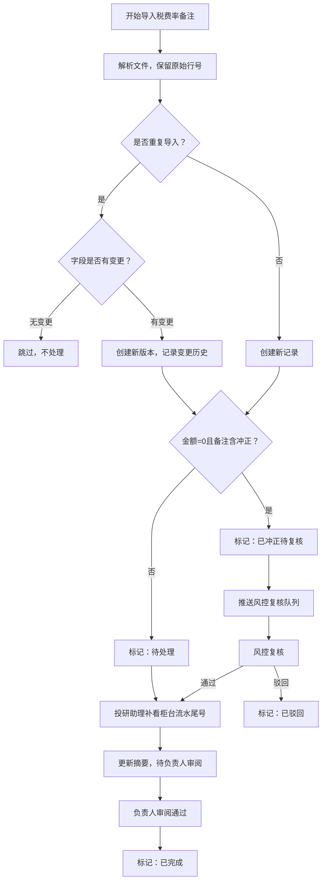

## 1. 产品概述

港股通汇率损益复盘系统，用于管理和追踪港股通交易中的税费率备注信息，确保风控审计时证据链完整可追溯。解决当前税费率备注被清洗成汇总数据导致原始证据丢失、重复导入数据翻倍、边界规则依赖口头约定等问题。

- 核心价值：保留原始证据链，支持历史变更追溯，明确边界处理规则，强化风控复核机制
- 目标用户：投研助理（小周）、风控同事、负责人

## 2. 核心功能

### 2.1 用户角色

| 角色 | 注册方式 | 核心权限 |
|------|----------|----------|
| 投研助理 | 系统登录 | 导入税费率备注、补看柜台流水尾号、更新摘要、编辑备注 |
| 风控同事 | 系统登录 | 查看原始证据、复核异常记录、标记复核状态 |
| 负责人 | 系统登录 | 查看摘要、审批复盘结果 |

### 2.2 功能模块

1. **税费率备注导入页**：导入原始数据、去重校验、预览导入结果
2. **复盘主界面**：展示所有税费率备注记录、原始行号、处理状态、人工改动痕迹
3. **历史变更追踪页**：展示单条记录的所有版本对比、改前改后差异
4. **风控复核页**：展示待复核异常记录、支持复核通过/驳回
5. **边界规则说明页**：展示所有边界处理规则、代码位置引用

### 2.3 页面详情

| 页面名称 | 模块名称 | 功能描述 |
|-----------|-------------|---------------------|
| 税费率备注导入页 | 文件上传模块 | 支持Excel/CSV导入，自动检测重复数据，显示导入前后对比 |
| 税费率备注导入页 | 去重校验模块 | 基于业务主键去重，重复导入仅更新变更字段，不增加记录数 |
| 复盘主界面 | 记录列表模块 | 展示原始行号、原始备注、当前备注、处理状态、操作人、操作时间 |
| 复盘主界面 | 状态筛选模块 | 按处理状态（待处理/已冲正待复核/正常/已驳回）筛选 |
| 复盘主界面 | 三步流程进度模块 | 可视化展示每条记录当前所处流程阶段 |
| 历史变更追踪页 | 版本对比模块 | 展示同一记录的所有历史版本，高亮显示差异字段 |
| 历史变更追踪页 | 变更轨迹模块 | 时间轴展示每次变更的操作人、时间、变更内容 |
| 风控复核页 | 异常列表模块 | 展示金额为0但备注已冲正的待复核记录 |
| 风控复核页 | 复核操作模块 | 支持风控同事标记复核通过/驳回，填写复核意见 |
| 边界规则说明页 | 规则展示模块 | 列出所有边界规则、判断逻辑、处理方式、回滚机制 |

## 3. 核心流程

### 三步主流程
1. **第一步：税费率备注第一次导入**
   - 投研助理上传原始文件
   - 系统自动解析并保留原始行号
   - 系统检测边界情况（金额为0且备注已冲正）
   - 异常记录标记为"已冲正待复核"，正常记录标记为"待处理"

2. **第二步：投研助理补看柜台流水尾号**
   - 投研助理查看每条记录的原始备注
   - 根据柜台流水尾号补充或修正备注信息
   - 系统记录每次人工改动的前后对比
   - 状态更新为"补看完成"

3. **第三步：给负责人看的摘要更新**
   - 系统自动生成摘要信息
   - 投研助理可调整摘要内容
   - 状态更新为"待负责人审阅"
   - 负责人审阅后标记为"已完成"

### 边界处理流程（金额为0但备注已冲正）
- 系统检测到金额=0 且 备注包含"冲正"关键词
- 不归为"正常"状态，强制标记为"已冲正待复核"
- 推送至风控复核队列
- 风控同事复核：
  - 复核通过 → 状态更新为"正常"
  - 复核驳回 → 状态更新为"已驳回"，记录驳回原因
  - 支持回滚操作，恢复到上一状态

### 重复导入流程
- 系统基于业务主键（交易日期+证券代码+流水号）判断重复
- 重复导入时：
  - 无变更字段：跳过，不创建新版本
  - 有变更字段：创建新版本，保留旧版本，更新变更历史
- 记录总数不增加，仅版本号递增

## 4. 用户界面设计

### 4.1 设计风格
- 主色调：深蓝(#1e3a5f) + 深灰(#2d3748)，专业稳重的金融系统风格
- 强调色：橙色(#f6ad55)用于异常状态，绿色(#48bb78)用于正常状态，红色(#fc8181)用于驳回
- 按钮风格：扁平化直角按钮，边框清晰，hover时有轻微阴影
- 字体：标题使用 "Noto Serif SC" 衬线字体体现专业性，正文使用 "Noto Sans SC" 无衬线字体保证可读性
- 布局风格：顶部导航 + 左侧筛选 + 主内容区数据表格，高密度信息展示
- 图标风格：使用Font Awesome线性图标，简洁明了

### 4.2 页面设计概述

| 页面名称 | 模块名称 | UI Elements |
|-----------|-------------|-------------|
| 复盘主界面 | 记录列表 | 斑马纹表格、行内状态标签、展开查看详情、悬停高亮 |
| 复盘主界面 | 三步流程进度 | 横向时间轴，当前阶段高亮，已完成阶段打勾 |
| 历史变更追踪页 | 版本对比 | 左右分栏对比，差异字段背景色高亮，新增绿色删除红色 |
| 风控复核页 | 异常列表 | 橙色边框突出显示，每行附带快速复核按钮 |
| 边界规则说明页 | 规则卡片 | 卡片式布局，每张卡片包含规则描述、代码引用链接 |

### 4.3 响应性
- Desktop-first设计，主表格区域支持水平滚动
- 侧边筛选栏在小屏幕可折叠
- 表格列支持自定义显示/隐藏
- 触控设备优化：按钮最小高度44px，表格行高适配触控

## 5. 证据链设计规范

### 5.1 必须保留的原始信息
- 原始行号：导入文件中的原始行号，永久不可修改
- 原始备注：第一次导入时的备注内容，永久不可修改
- 当前备注：可编辑，但每次修改记录历史版本
- 处理状态：状态流转全程留痕
- 人工改动：每次修改的前后对比、操作人、操作时间

### 5.2 不可清洗的关键字段
- 柜台流水尾号
- 冲正标记
- 原始税费金额
- 汇率损益计算依据
