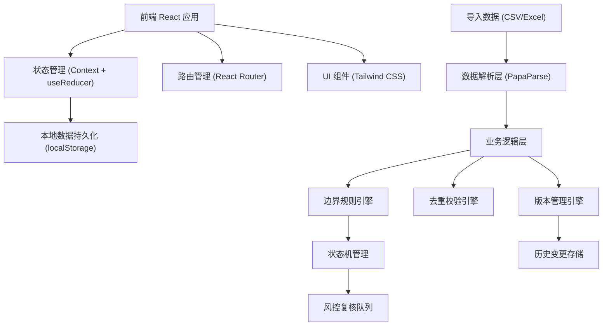
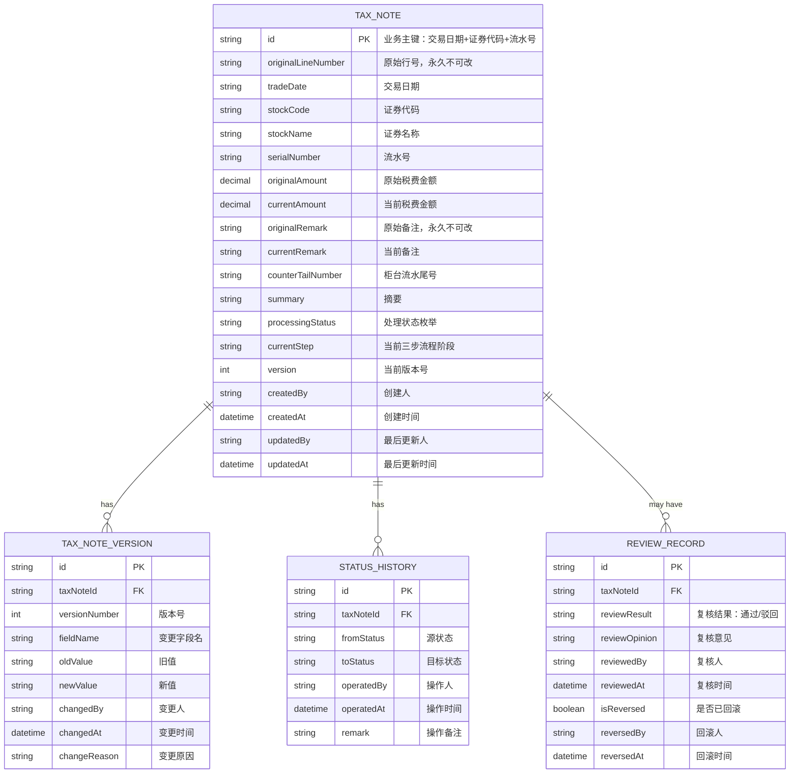
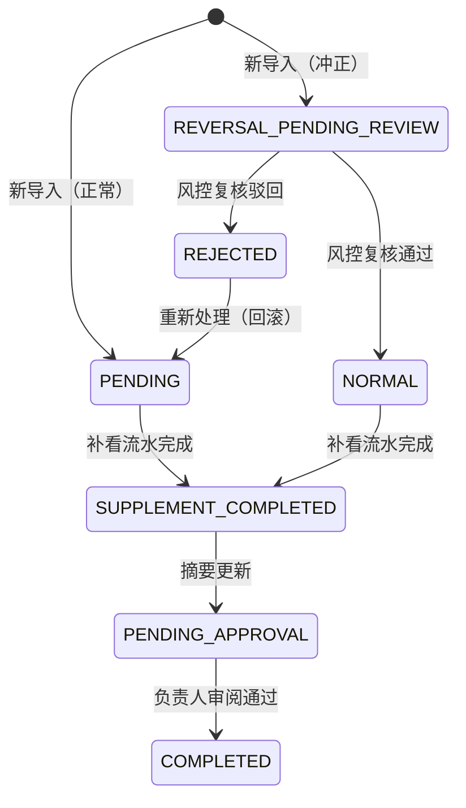

## 1. 架构设计



## 2. 技术描述

- 前端：React@18 + TypeScript + tailwindcss@3 + vite@5
- 初始化工具：npm create vite@latest
- 后端：无后端，纯前端应用，数据持久化使用 localStorage
- 数据存储：localStorage 存储业务数据，mock 数据用于初始演示
- 文件解析：PapaParse 处理 CSV，SheetJS (xlsx) 处理 Excel
- 状态管理：React Context + useReducer，实现中心化状态管理
- 路由：react-router-dom@6

## 3. 路由定义

| Route | Purpose |
|-------|---------|
| / | 复盘主界面 - 记录列表与三步流程进度 |
| /import | 税费率备注导入页 |
| /history/:id | 历史变更追踪页 |
| /review | 风控复核页 |
| /rules | 边界规则说明页 |

## 4. 数据模型

### 4.1 数据模型定义



### 4.2 TypeScript 类型定义

```typescript
// 处理状态枚举
export enum ProcessingStatus {
  PENDING = 'PENDING',                    // 待处理
  REVERSAL_PENDING_REVIEW = 'REVERSAL_PENDING_REVIEW',  // 已冲正待复核
  NORMAL = 'NORMAL',                      // 正常
  REJECTED = 'REJECTED',                  // 已驳回
  SUPPLEMENT_COMPLETED = 'SUPPLEMENT_COMPLETED',  // 补看完成
  PENDING_APPROVAL = 'PENDING_APPROVAL',  // 待负责人审阅
  COMPLETED = 'COMPLETED'                 // 已完成
}

// 三步流程阶段枚举
export enum ProcessStep {
  STEP_1_IMPORT = 'STEP_1_IMPORT',        // 第一步：导入
  STEP_2_SUPPLEMENT = 'STEP_2_SUPPLEMENT', // 第二步：补看流水
  STEP_3_SUMMARY = 'STEP_3_SUMMARY'       // 第三步：摘要更新
}

// 税费率备注主记录
export interface TaxNote {
  id: string;
  originalLineNumber: string;
  tradeDate: string;
  stockCode: string;
  stockName: string;
  serialNumber: string;
  originalAmount: number;
  currentAmount: number;
  originalRemark: string;
  currentRemark: string;
  counterTailNumber: string;
  summary: string;
  processingStatus: ProcessingStatus;
  currentStep: ProcessStep;
  version: number;
  createdBy: string;
  createdAt: string;
  updatedBy: string;
  updatedAt: string;
}

// 历史版本记录
export interface TaxNoteVersion {
  id: string;
  taxNoteId: string;
  versionNumber: number;
  fieldName: string;
  oldValue: string;
  newValue: string;
  changedBy: string;
  changedAt: string;
  changeReason: string;
}

// 状态流转历史
export interface StatusHistory {
  id: string;
  taxNoteId: string;
  fromStatus: ProcessingStatus;
  toStatus: ProcessingStatus;
  operatedBy: string;
  operatedAt: string;
  remark: string;
}

// 风控复核记录
export interface ReviewRecord {
  id: string;
  taxNoteId: string;
  reviewResult: 'APPROVED' | 'REJECTED';
  reviewOpinion: string;
  reviewedBy: string;
  reviewedAt: string;
  isReversed: boolean;
  reversedBy?: string;
  reversedAt?: string;
}

// 边界规则定义
export interface BoundaryRule {
  id: string;
  name: string;
  description: string;
  condition: string;
  action: string;
  rollbackMethod: string;
  codeReference: string;
  status: 'ACTIVE' | 'DEPRECATED';
}

// 导入结果
export interface ImportResult {
  totalRecords: number;
  newRecords: number;
  updatedRecords: number;
  skippedRecords: number;
  errorRecords: number;
  reversalPendingRecords: number;
  details: ImportDetail[];
}

export interface ImportDetail {
  lineNumber: string;
  action: 'NEW' | 'UPDATE' | 'SKIP' | 'ERROR';
  reason: string;
  recordId?: string;
}
```

## 5. 核心模块设计

### 5.1 边界规则引擎

位置：`src/utils/boundaryRules.ts`

核心规则：
1. **规则ID: RULE_001** - 金额为0但备注含"冲正"
   - 判断条件：`amount === 0 && remark.includes('冲正')`
   - 处理动作：设置状态为 `REVERSAL_PENDING_REVIEW`，推送风控队列
   - 回滚方式：恢复到上一状态，清除风控标记
   
2. **规则ID: RULE_002** - 重复导入检测
   - 判断条件：业务主键已存在
   - 处理动作：对比字段变更，有变更则创建新版本
   - 回滚方式：回滚到指定历史版本

3. **规则ID: RULE_003** - 三步流程强制流转
   - 判断条件：状态变更不符合流程顺序
   - 处理动作：拒绝状态变更，提示错误
   - 回滚方式：无（前置校验不通过）

### 5.2 去重校验引擎

位置：`src/utils/deduplication.ts`

- 业务主键生成：`tradeDate + '_' + stockCode + '_' + serialNumber`
- 重复检测逻辑：基于主键查询已存在记录
- 变更检测：深度对比所有可编辑字段
- 版本递增：每次有效变更版本号+1

### 5.3 版本管理引擎

位置：`src/utils/versionControl.ts`

- 每次字段变更创建 `TaxNoteVersion` 记录
- 保留变更前后值、操作人、时间、原因
- 支持版本对比和回滚操作
- 回滚时创建新版本记录（标记为回滚）

### 5.4 状态机管理

位置：`src/utils/stateMachine.ts`

状态流转图：


## 6. 状态管理设计

使用 React Context + useReducer 实现全局状态管理：

```typescript
interface AppState {
  taxNotes: TaxNote[];
  versions: TaxNoteVersion[];
  statusHistories: StatusHistory[];
  reviewRecords: ReviewRecord[];
  currentUser: string;
  filter: {
    status?: ProcessingStatus;
    step?: ProcessStep;
    keyword?: string;
  };
}

type Action =
  | { type: 'IMPORT_DATA'; payload: TaxNote[] }
  | { type: 'UPDATE_TAX_NOTE'; payload: { id: string; updates: Partial<TaxNote>; reason: string } }
  | { type: 'CHANGE_STATUS'; payload: { id: string; toStatus: ProcessingStatus; remark: string } }
  | { type: 'REVIEW_RECORD'; payload: { id: string; result: 'APPROVED' | 'REJECTED'; opinion: string } }
  | { type: 'ROLLBACK_STATUS'; payload: { id: string; reason: string } }
  | { type: 'SET_FILTER'; payload: Partial<AppState['filter']> };
```

## 7. Mock 数据

系统启动时自动加载 mock 数据，包含：
- 10 条税费率备注记录（覆盖各种状态）
- 5 条历史版本记录
- 3 条状态流转历史
- 2 条风控复核记录
- 3 条冲正待复核记录
