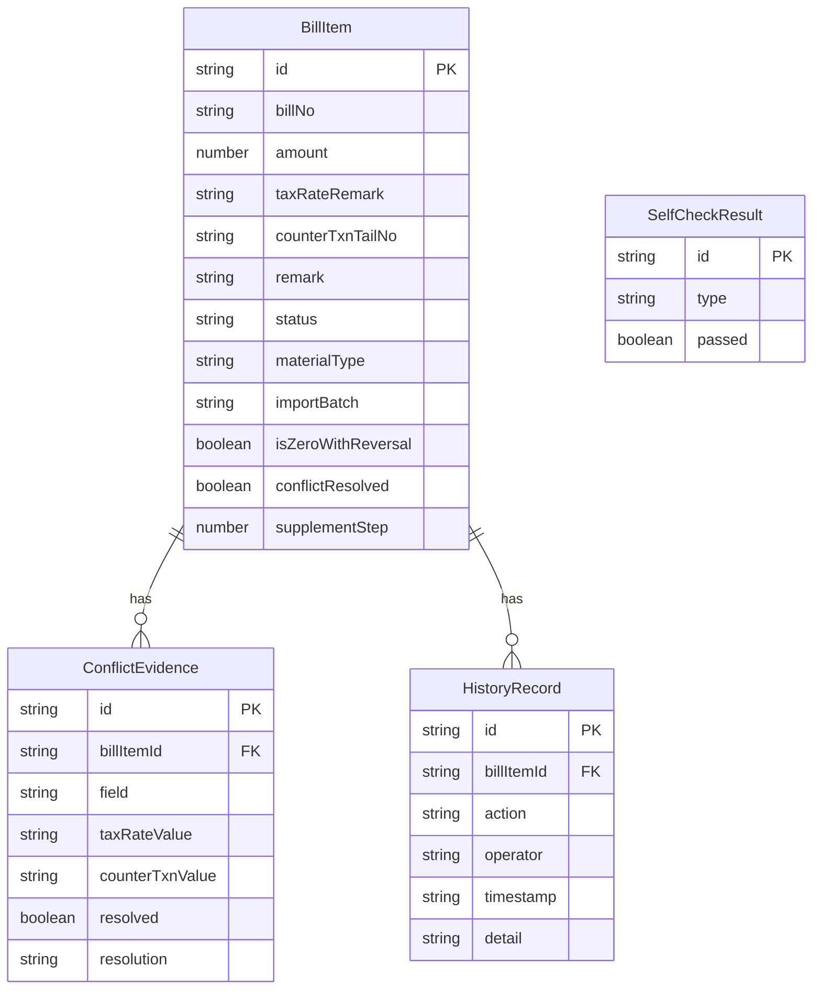

## 1. 架构设计

```mermaid
graph TB
    subgraph "前端层"
        "React 18 + Vite" --> "TailwindCSS 3"
        "React 18 + Vite" --> "Zustand 状态管理"
        "React 18 + Vite" --> "React Router v6"
    end
    subgraph "数据层"
        "Zustand Store" --> "localStorage 持久化"
        "Zustand Store" --> "内存计算引擎"
    end
    subgraph "外部交互"
        "CSV/Excel 解析" --> "PapaParse"
        "导出" --> "SheetJS (xlsx)"
    end
```

纯前端应用，数据持久化使用 localStorage，核心计算逻辑在前端完成，不依赖后端服务。

## 2. 技术说明

- 前端：React@18 + TailwindCSS@3 + Vite
- 初始化工具：Vite (react-ts 模板)
- 后端：无（纯前端，mock 数据 + localStorage）
- 数据库：无（localStorage 持久化 + 内存状态管理）
- 状态管理：Zustand（轻量、支持持久化中间件）
- 路由：React Router v6
- 文件解析：PapaParse（CSV）、SheetJS/xlsx（Excel）
- 图标：Phosphor React
- 日期处理：dayjs

## 3. 路由定义

| 路由 | 用途 |
|------|------|
| `/` | 清单主页（票据列表 + 自检面板 + 导入导出） |
| `/conflict` | 冲突裁决页（税费率备注 vs 柜台流水尾号矛盾处理） |
| `/supplement` | 补录工作台（三步流程） |
| `/history` | 历史记录页（操作时间线 + 证据下钻） |

## 4. API 定义

无后端 API。前端使用 Zustand Store 管理以下核心数据结构：

### 4.1 票据条目类型

```typescript
interface BillItem {
  id: string
  billNo: string
  amount: number
  taxRateRemark: string
  counterTxnTailNo: string
  remark: string
  status: 'normal' | 'wrong_caliber' | 'supplement' | 'conflict' | 'risk_review'
  materialType: 'normal' | 'wrong_caliber' | 'supplement'
  importBatch: string
  importTime: string
  isZeroWithReversal: boolean
  conflictResolved: boolean
  conflictResolution?: 'tax_remark' | 'counter_tail' | 'rejected'
  riskReviewStatus?: 'pending' | 'approved' | 'rejected'
  supplementStep: 0 | 1 | 2 | 3
  summaryUpdated: boolean
}

interface ConflictEvidence {
  billItemId: string
  field: string
  taxRateValue: string
  counterTxnValue: string
  resolved: boolean
  resolution?: 'tax_remark' | 'counter_tail' | 'rejected'
  resolvedBy?: string
  resolvedAt?: string
}

interface HistoryRecord {
  id: string
  billItemId: string
  action: 'import' | 'self_check' | 'conflict_resolve' | 'supplement_step' | 'risk_review' | 'export' | 'summary_update'
  operator: string
  timestamp: string
  beforeSnapshot: Partial<BillItem>
  afterSnapshot: Partial<BillItem>
  detail: string
}

interface SelfCheckResult {
  type: 'duplicate_import' | 'zero_with_reversal' | 'supplement_recalc' | 'export_consistency'
  passed: boolean
  items: { billItemId: string; description: string }[]
}
```

## 5. 服务端架构图

不适用（纯前端应用）。

## 6. 数据模型

### 6.1 数据模型定义



### 6.2 数据定义

使用 localStorage 存储以下键：

| 键名 | 数据类型 | 说明 |
|------|----------|------|
| `bill_items` | BillItem[] | 全部票据条目 |
| `conflict_evidences` | ConflictEvidence[] | 冲突证据记录 |
| `history_records` | HistoryRecord[] | 操作历史记录 |
| `self_check_results` | SelfCheckResult[] | 最近一次自检结果 |
| `import_batches` | { id: string; time: string; type: string; count: number }[] | 导入批次记录 |

初始数据：预置 30 条模拟票据数据，覆盖正常、错口径、补录、冲突、金额为 0 且备注已冲正等场景。
