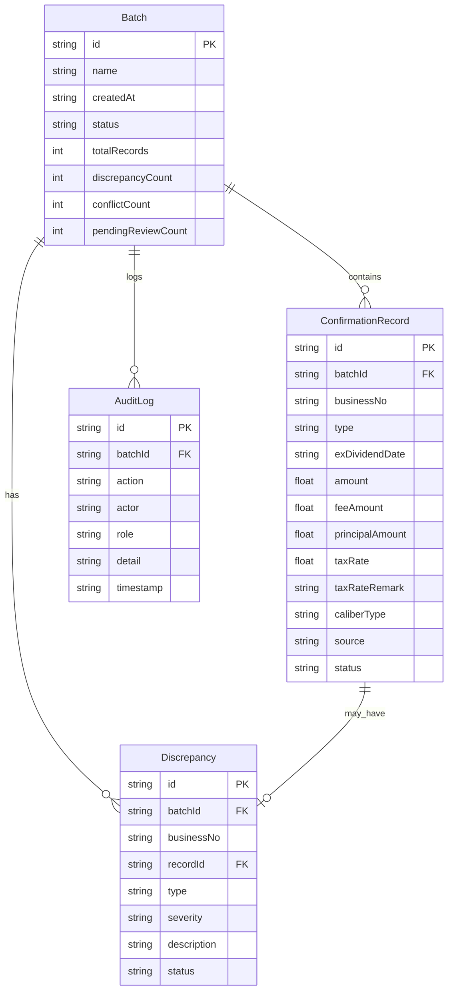

## 1. 架构设计

```mermaid
flowchart TB
    subgraph "前端层"
        "React 18 + Tailwind CSS"
        "Zustand 状态管理"
        "React Router DOM 路由"
    end
    subgraph "后端层"
        "Express 4 + TypeScript"
        "差异比对引擎"
        "冲突裁决服务"
        "复盘命令生成器"
    end
    subgraph "数据层"
        "SQLite 数据库"
        "操作日志"
        "样例数据"
    end
    "React 18 + Tailwind CSS" --> "Express 4 + TypeScript"
    "Express 4 + TypeScript" --> "SQLite 数据库"
    "差异比对引擎" --> "SQLite 数据库"
    "冲突裁决服务" --> "SQLite 数据库"
    "复盘命令生成器" --> "SQLite 数据库"
```

## 2. 技术说明

- 前端：React@18 + TailwindCSS@3 + Vite + Zustand
- 初始化工具：vite-init
- 后端：Express@4 + TypeScript（ESM格式）
- 数据库：SQLite（通过 better-sqlite3），内置样例数据
- 无外部服务依赖

## 3. 路由定义

| 路由 | 用途 |
|------|------|
| / | 工作台页面：三步流程导航、批次状态、快捷操作 |
| /discrepancies | 差异清单页面：差异列表、冲突裁决、拆行详情 |
| /review | 复盘记录页面：操作时间线、命令生成器、历史查询 |

## 4. API 定义

### 4.1 批次管理

```typescript
interface Batch {
  id: string;
  name: string;
  createdAt: string;
  status: "importing" | "comparing" | "reviewing" | "completed";
  totalRecords: number;
  discrepancyCount: number;
  conflictCount: number;
  pendingReviewCount: number;
}

GET    /api/batches           // 获取批次列表
POST   /api/batches           // 创建新批次
GET    /api/batches/:id       // 获取批次详情
```

### 4.2 确认书记录

```typescript
interface ConfirmationRecord {
  id: string;
  batchId: string;
  businessNo: string;
  type: "normal" | "fee_principal_split" | "old_caliber_supplement";
  exDividendDate: string;
  amount: number;
  feeAmount?: number;
  principalAmount?: number;
  taxRate?: number;
  taxRateRemark?: string;
  caliberType?: "new" | "old";
  source: "confirmation" | "tax_remark" | "supplement";
  status: "normal" | "pending_review" | "conflict" | "resolved";
  splitDetail?: {
    feeLine: { amount: number; description: string };
    principalLine: { amount: number; description: string };
    reviewedBy?: string;
    reviewedAt?: string;
  };
}

GET    /api/records                    // 获取记录列表（支持按批次、状态筛选）
GET    /api/records/:id                // 获取记录详情
POST   /api/records/import             // 导入除权日截图数据
POST   /api/records/tax-remark-review  // 补看税费率备注后触发比对
```

### 4.3 差异与冲突

```typescript
interface Discrepancy {
  id: string;
  batchId: string;
  businessNo: string;
  recordId: string;
  type: "data_mismatch" | "split_records" | "old_caliber" | "conflict";
  severity: "info" | "warning" | "critical";
  description: string;
  evidence: {
    confirmationData: Record<string, unknown>;
    taxRemarkData?: Record<string, unknown>;
  };
  status: "open" | "conflict_pending" | "resolved" | "reviewed";
  resolution?: {
    decidedBy: string;
    decision: "confirm_screenshot" | "confirm_remark" | "reject_both";
    reason: string;
    decidedAt: string;
  };
}

GET    /api/discrepancies                     // 获取差异列表
GET    /api/discrepancies/:id                 // 获取差异详情
POST   /api/discrepancies/:id/resolve         // 裁决冲突
POST   /api/discrepancies/compare             // 触发差异比对
```

### 4.4 复盘与命令

```typescript
interface AuditLog {
  id: string;
  batchId: string;
  action: string;
  actor: string;
  role: "fund_accountant" | "settlement_supervisor";
  detail: Record<string, unknown>;
  timestamp: string;
}

interface ReplayCommand {
  command: string;
  parameters: Record<string, unknown>;
  description: string;
  generatedAt: string;
}

GET    /api/audit-logs                       // 获取操作日志
GET    /api/replay-command/:batchId           // 生成可重跑命令
POST   /api/replay-command/execute            // 执行重跑命令
```

## 5. 数据模型

### 5.1 数据模型定义



### 5.2 数据定义语言

```sql
CREATE TABLE batches (
    id TEXT PRIMARY KEY,
    name TEXT NOT NULL,
    created_at TEXT NOT NULL DEFAULT (datetime('now')),
    status TEXT NOT NULL DEFAULT 'importing',
    total_records INTEGER NOT NULL DEFAULT 0,
    discrepancy_count INTEGER NOT NULL DEFAULT 0,
    conflict_count INTEGER NOT NULL DEFAULT 0,
    pending_review_count INTEGER NOT NULL DEFAULT 0
);

CREATE TABLE confirmation_records (
    id TEXT PRIMARY KEY,
    batch_id TEXT NOT NULL REFERENCES batches(id),
    business_no TEXT NOT NULL,
    type TEXT NOT NULL DEFAULT 'normal',
    ex_dividend_date TEXT,
    amount REAL NOT NULL DEFAULT 0,
    fee_amount REAL,
    principal_amount REAL,
    tax_rate REAL,
    tax_rate_remark TEXT,
    caliber_type TEXT,
    source TEXT NOT NULL DEFAULT 'confirmation',
    status TEXT NOT NULL DEFAULT 'normal',
    split_detail TEXT,
    created_at TEXT NOT NULL DEFAULT (datetime('now'))
);

CREATE TABLE discrepancies (
    id TEXT PRIMARY KEY,
    batch_id TEXT NOT NULL REFERENCES batches(id),
    business_no TEXT NOT NULL,
    record_id TEXT REFERENCES confirmation_records(id),
    type TEXT NOT NULL,
    severity TEXT NOT NULL DEFAULT 'info',
    description TEXT NOT NULL,
    evidence TEXT,
    status TEXT NOT NULL DEFAULT 'open',
    resolution TEXT,
    created_at TEXT NOT NULL DEFAULT (datetime('now')),
    updated_at TEXT NOT NULL DEFAULT (datetime('now'))
);

CREATE TABLE audit_logs (
    id TEXT PRIMARY KEY,
    batch_id TEXT NOT NULL REFERENCES batches(id),
    action TEXT NOT NULL,
    actor TEXT NOT NULL,
    role TEXT NOT NULL,
    detail TEXT,
    timestamp TEXT NOT NULL DEFAULT (datetime('now'))
);

CREATE INDEX idx_records_batch ON confirmation_records(batch_id);
CREATE INDEX idx_records_business_no ON confirmation_records(business_no);
CREATE INDEX idx_discrepancies_batch ON discrepancies(batch_id);
CREATE INDEX idx_discrepancies_status ON discrepancies(status);
CREATE INDEX idx_audit_logs_batch ON audit_logs(batch_id);
CREATE INDEX idx_audit_logs_timestamp ON audit_logs(timestamp);
```
