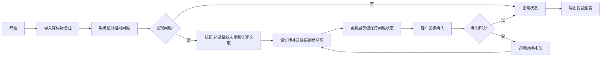

## 1. 产品概述

舞台吊点安全演示系统是一款针对展陈行业的专业工具，解决补录路线未重新计算长度导致的前后不一致问题。系统支持3D/图表展示、服务复核流程、智能报告导出，帮助展陈客户和设计师高效协作。

- 核心目标：消除"补录路线没有重新计算长度"类问题的手工解释成本
- 目标用户：展陈客户、展陈设计师（阿景）、服务复核人员
- 市场价值：提升展陈项目安全性审核效率，标准化问题追踪流程

## 2. 核心功能

### 2.1 用户角色

| 角色 | 入口方式 | 核心权限 |
|------|----------|----------|
| 展陈客户 | 小看板/WEB | 查看报告、复核问题、确认状态 |
| 展陈设计师（阿景） | 小看板/WEB/命令行 | 导入数据、补录草图、导出报告 |
| 服务复核人员 | API/命令行 | 批量审核、状态流转、数据校验 |

### 2.2 功能模块

1. **数据导入看板**：路线数据导入、障碍物备注上传、楼层剖面草图管理
2. **3D/图表展示**：舞台吊点3D可视化、路线长度图表、问题标注高亮
3. **服务复核工作台**：问题列表、回退编辑、状态标记、复核记录追踪
4. **智能报告导出**：带上下文说明的截图、问题原因分析、材料缺失提示、责任人指引
5. **命令行/API接口**：批量导入、自动化检测、第三方系统集成

### 2.3 页面详情

| 页面名称 | 模块名称 | 功能描述 |
|-----------|-------------|---------------------|
| 项目总览 | 项目卡片列表 | 展示所有项目状态、问题数量、最新更新时间 |
| 项目详情 | 3D视图 | 舞台吊点3D可视化、可旋转缩放、问题点高亮标记 |
| 项目详情 | 路线检测面板 | 自动检测"补录路线未重新计算长度"问题、列表展示 |
| 项目详情 | 服务复核区 | 点击问题可跳转至障碍物备注/楼层剖面草图编辑 |
| 报告导出 | 截图预览 | 实时预览导出内容、添加自定义说明、选择责任人 |
| 数据导入 | 上传区域 | 支持拖拽上传路线数据、障碍物备注、楼层剖面草图 |

## 3. 核心流程

### 三步核心工作流：
1. **障碍物备注第一次导入**：设计师阿景导入路线数据和障碍物备注，系统自动检测"补录路线未重新计算长度"问题
2. **展陈设计师阿景补看楼层剖面草图**：发现问题后，阿景补录楼层剖面草图，系统更新但不自动标记为正常
3. **导出截图更新**：导出带完整说明的报告截图，明确问题原因、缺失材料、下一步责任人

**关键约束**：问题状态不可自动归为正常，必须留给展陈客户复核确认。

## 4. 用户界面设计

### 4.1 设计风格
- **主色调**：工业蓝 #165DFF（专业、可信）搭配警示橙 #FF7D00（问题提醒）
- **按钮风格**：直角矩形、轻微阴影、悬停上浮效果
- **字体**：思源黑体（标题粗体、正文常规）、等宽字体（技术数据）
- **布局风格**：三栏布局（左侧导航、中间3D主视图、右侧检测面板）
- **图标风格**：线性图标、问题点用脉冲动画标记

### 4.2 页面设计概述

| 页面名称 | 模块名称 | UI 元素 |
|-----------|-------------|-------------|
| 项目总览 | 项目卡片 | 渐变背景卡片、状态徽章、进度条、hover放大效果 |
| 项目详情 | 3D视图 | 全屏画布、视角控制按钮、问题点脉冲标记、点击弹出详情 |
| 项目详情 | 检测面板 | 可折叠面板、问题列表、状态标签、快速跳转按钮 |
| 报告导出 | 预览区 | 模拟报告预览、富文本编辑器、责任人选择下拉框 |
| 数据导入 | 上传区 | 虚线边框、拖拽高亮、文件缩略图、上传进度条 |

### 4.3 响应式
- Desktop-first 设计，优先保证 1920×1080 分辨率体验
- 平板端：左右面板可收起，3D视图自适应
- 移动端：简化为列表视图，3D转为静态图片展示

### 4.4 3D场景指导
- **环境**：简约工业风场景，深灰渐变背景
- **光照**：三点布光（主光+补光+轮廓光），增强吊点金属质感
- **相机**：默认45°俯视角，支持轨道控制、自动旋转演示
- **交互**：点击吊点显示信息卡片，问题路线用红色虚线高亮
- **动画**：问题标记脉冲呼吸动画，路线长度数字滚动效果
