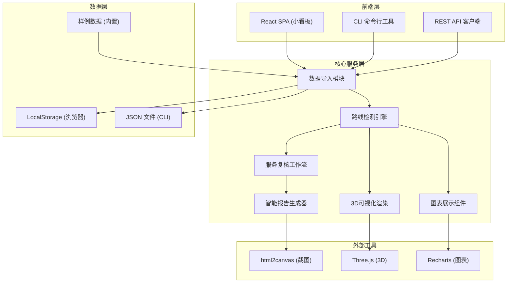
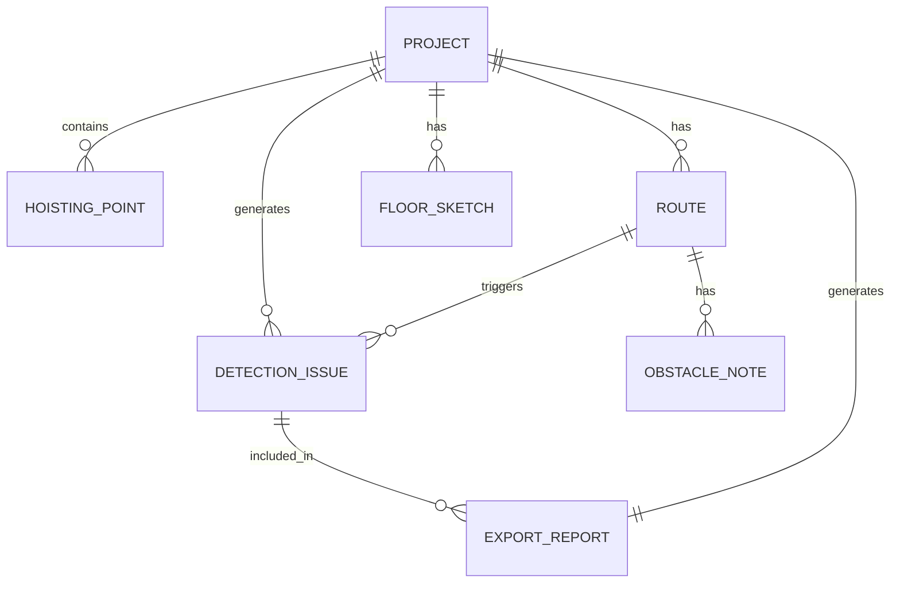

## 1. 架构设计



## 2. 技术描述

- **前端框架**: React@18 + TypeScript
- **构建工具**: Vite@5
- **样式方案**: TailwindCSS@3 + CSS Variables
- **3D渲染**: Three@0.160 + @react-three/fiber + @react-three/drei
- **图表库**: Recharts@2
- **截图导出**: html2canvas@1.4
- **状态管理**: Zustand@4 (轻量状态管理)
- **路由**: React Router@6
- **CLI工具**: Commander@11 (可选)
- **后端**: 无服务端架构，纯前端实现 + LocalStorage 持久化

## 3. 路由定义

| 路由 | 页面 | 用途 |
|-------|------|------|
| / | 项目总览页 | 展示所有项目列表、快速创建项目 |
| /project/:id | 项目详情页 | 3D展示、路线检测、服务复核主工作台 |
| /project/:id/report | 报告导出页 | 智能报告预览、导出截图 |
| /import | 数据导入页 | 批量导入数据、样例数据加载 |

## 4. API 定义（前端状态接口）

```typescript
// 项目数据模型
interface Project {
  id: string;
  name: string;
  createdAt: string;
  updatedAt: string;
  status: 'normal' | 'warning' | 'pending_review';
  stage: 'import' | 'detection' | 'review' | 'completed';
}

// 吊点数据
interface HoistingPoint {
  id: string;
  name: string;
  x: number;
  y: number;
  z: number;
  load: number;
  status: 'normal' | 'warning';
}

// 路线数据
interface Route {
  id: string;
  name: string;
  fromPoint: string;
  toPoint: string;
  length: number;
  isSupplementary: boolean;
  recalculated: boolean;
  hasWarning: boolean;
}

// 障碍物备注
interface ObstacleNote {
  id: string;
  routeId: string;
  content: string;
  imageUrl?: string;
  createdAt: string;
}

// 楼层剖面草图
interface FloorSketch {
  id: string;
  projectId: string;
  floor: number;
  imageUrl: string;
  description: string;
  uploadedAt: string;
}

// 检测问题
interface DetectionIssue {
  id: string;
  type: 'route_not_recalculated';
  routeId: string;
  severity: 'warning' | 'error';
  description: string;
  status: 'open' | 'supplemented' | 'resolved';
  nextAction: 'contact_customer' | 'contact_designer';
  missingMaterials: string[];
}

// 导出报告
interface ExportReport {
  projectId: string;
  issues: DetectionIssue[];
  summary: string;
  nextSteps: string[];
  generatedAt: string;
}
```

## 5. 核心服务模块

### 5.1 路线检测引擎
```typescript
class RouteDetectionEngine {
  detectSupplementaryRoutes(routes: Route[]): DetectionIssue[] {
    return routes
      .filter(r => r.isSupplementary && !r.recalculated)
      .map(r => ({
        id: generateId(),
        type: 'route_not_recalculated',
        routeId: r.id,
        severity: 'warning',
        description: `补录路线 ${r.name} 没有重新计算长度`,
        status: 'open',
        nextAction: 'contact_designer',
        missingMaterials: ['楼层剖面草图', '复核确认记录']
      }));
  }
}
```

### 5.2 服务复核工作流
```typescript
class ReviewWorkflow {
  async supplementSketch(issueId: string, sketch: FloorSketch): Promise<DetectionIssue> {
    // 更新问题状态为 supplemented，但不自动 resolved
    // 必须等待客户复核
  }
  
  async customerReview(issueId: string, approved: boolean): Promise<DetectionIssue> {
    // 客户复核确认后才能变更状态
  }
}
```

## 6. 数据模型

### 6.1 ER 图



### 6.2 数据持久化方案

**LocalStorage 键定义**:
- `stage-safety:projects` - 项目列表
- `stage-safety:project:{id}:points` - 吊点数据
- `stage-safety:project:{id}:routes` - 路线数据
- `stage-safety:project:{id}:sketches` - 楼层草图
- `stage-safety:project:{id}:issues` - 检测问题
- `stage-safety:project:{id}:obstacles` - 障碍物备注

### 6.3 样例数据

内置3个样例项目，覆盖不同场景：
1. `demo-project-1` - 完整正常项目（无问题）
2. `demo-project-2` - 含补录路线未计算问题（标准演示用例）
3. `demo-project-3` - 多楼层多问题项目（复杂场景）

## 7. 命令行接口（CLI）

```bash
# 检测项目问题
stage-safety detect --input ./data/project.json

# 导出报告
stage-safety export --project demo-2 --output ./report.png

# 列出所有样例
stage-safety examples list

# 加载样例到Web端
stage-safety examples load demo-2 --serve
```
