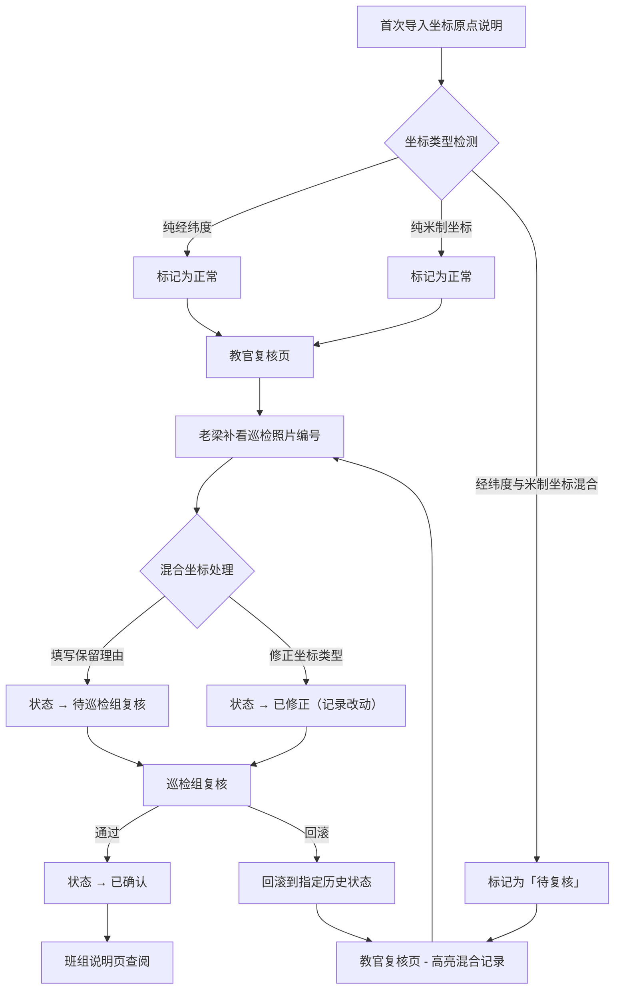

## 1. 产品概述

校园建筑日照阴影审计追踪系统——面向校园巡检组、培训教官和现场班组，对建筑日照阴影数据中坐标原点说明进行全生命周期管理，确保经纬度与米制坐标混用场景下数据不丢失、不静默归正常，每一步操作留有证据链。

- 解决核心问题：坐标原点说明从导入到班组查阅全流程可追溯，混合坐标类型记录不被自动吞掉
- 目标用户：培训教官（老梁）、巡检组、现场班组

## 2. 核心功能

### 2.1 用户角色

| 角色 | 进入方式 | 核心权限 |
|------|----------|----------|
| 培训教官（老梁） | 账号登录 | 导入数据、补看巡检照片编号、标记混合坐标保留理由、推进流程状态 |
| 巡检组 | 账号登录 | 复核混合坐标记录、查看完整证据链、回滚操作 |
| 现场班组 | 账号登录 | 查看说明总览与明细、点开混合坐标查看保留理由 |

### 2.2 功能模块

1. **数据导入页**：首次导入坐标原点说明，自动检测混合坐标类型，记录原始行号
2. **教官复核页**：老梁补看巡检照片编号，对混合坐标标记保留理由，不自动归正常
3. **班组说明页**：现场班组查看说明总览，点开混合坐标记录查看保留理由与证据
4. **审计追踪页**：全局查看所有记录的操作历史、原始行号、人工改动、当前处理状态
5. **边界规则页**：展示系统内置的坐标判断、修改、回滚规则，与 README 同源

### 2.3 页面详情

| 页面名称 | 模块名称 | 功能描述 |
|----------|----------|----------|
| 数据导入页 | 文件上传 | 支持 CSV/Excel 导入坐标原点说明数据 |
| 数据导入页 | 坐标类型检测 | 自动识别经纬度、米制坐标、混合坐标，标注原始行号 |
| 数据导入页 | 导入预览 | 展示检测结果，混合坐标高亮标记，状态为"待复核" |
| 教官复核页 | 照片编号关联 | 老梁补看巡检照片编号，与坐标记录关联 |
| 教官复核页 | 保留理由填写 | 对混合坐标记录填写保留理由，不自动归正常 |
| 教官复核页 | 状态推进 | 将记录从"待复核"推进到"已复核"或"待巡检组复核" |
| 班组说明页 | 说明总览 | 展示所有坐标原点说明的汇总视图 |
| 班组说明页 | 混合坐标明细 | 点击混合坐标记录，展开查看老梁的保留理由、原始行号、照片编号 |
| 审计追踪页 | 操作时间线 | 每条记录的完整操作历史：谁、何时、做了什么 |
| 审计追踪页 | 证据回溯 | 查看原始行号、人工改动内容、当前处理状态 |
| 审计追踪页 | 回滚操作 | 巡检组可将记录回滚到指定历史状态 |
| 边界规则页 | 规则展示 | 展示混合坐标判断规则、修改规则、回滚规则 |
| 边界规则页 | 规则与代码同步 | 规则来源与代码中硬编码规则一致，与 README 同源 |

## 3. 核心流程

三步工作流：首次导入 → 教官复核 → 班组查阅。混合坐标记录不自动归正常，留给巡检组复核。

## 4. 用户界面设计

### 4.1 设计风格

- 主色调：深青蓝 #1a3a4a（工业/建筑感），辅色：琥珀橙 #e8943a（警示/高亮）
- 按钮风格：圆角矩形，带轻微阴影，状态色区分（正常/待复核/已确认）
- 字体：标题用 Noto Sans SC Bold，正文用 Noto Sans SC Regular
- 布局：左侧导航栏 + 右侧内容区，表格为主、卡片辅助
- 图标风格：线性图标，与建筑/工程主题呼应

### 4.2 页面设计概览

| 页面名称 | 模块名称 | UI 元素 |
|----------|----------|---------|
| 数据导入页 | 文件上传 | 拖拽区域、进度条、成功/失败状态 |
| 数据导入页 | 检测结果表格 | 数据表格、行号列、类型标签（绿色正常/橙色混合）、状态徽章 |
| 教官复核页 | 记录列表 | 可排序表格、照片编号输入框、保留理由文本框、状态选择器 |
| 教官复核页 | 混合坐标高亮 | 橙色边框行、展开详情面板 |
| 班组说明页 | 总览卡片 | 统计卡片（正常数/混合数/待复核数） |
| 班组说明页 | 明细弹窗 | 点击展开侧滑面板，显示保留理由、原始行号、照片编号、操作历史 |
| 审计追踪页 | 时间线 | 竖向时间线组件，每步显示操作人、时间、动作、备注 |
| 审计追踪页 | 回滚按钮 | 确认弹窗，选择回滚目标状态 |
| 边界规则页 | 规则卡片 | 分组展示判断规则、修改规则、回滚规则，每条规则附代码引用 |

### 4.3 响应式设计

- 桌面优先，最小宽度 1280px
- 表格在窄屏下支持横向滚动
- 侧滑面板在移动端改为全屏弹窗

### 4.4 动效

- 导入进度：脉冲动画
- 混合坐标行：呼吸式边框高亮
- 状态变更：渐变过渡
- 时间线节点：依次淡入
