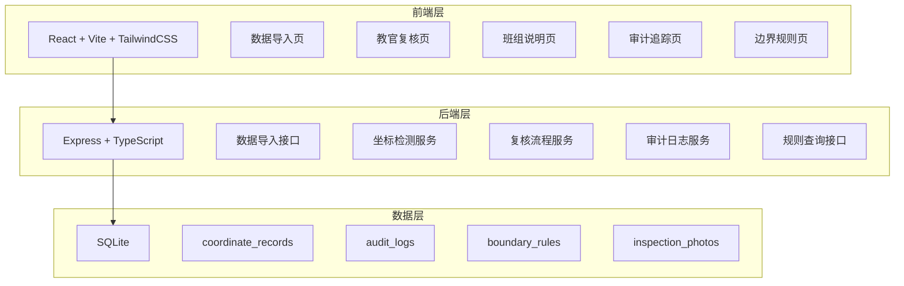
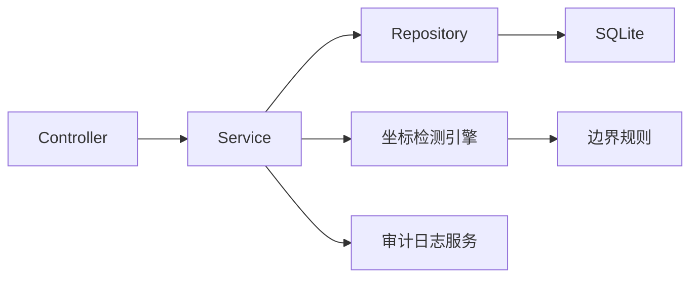
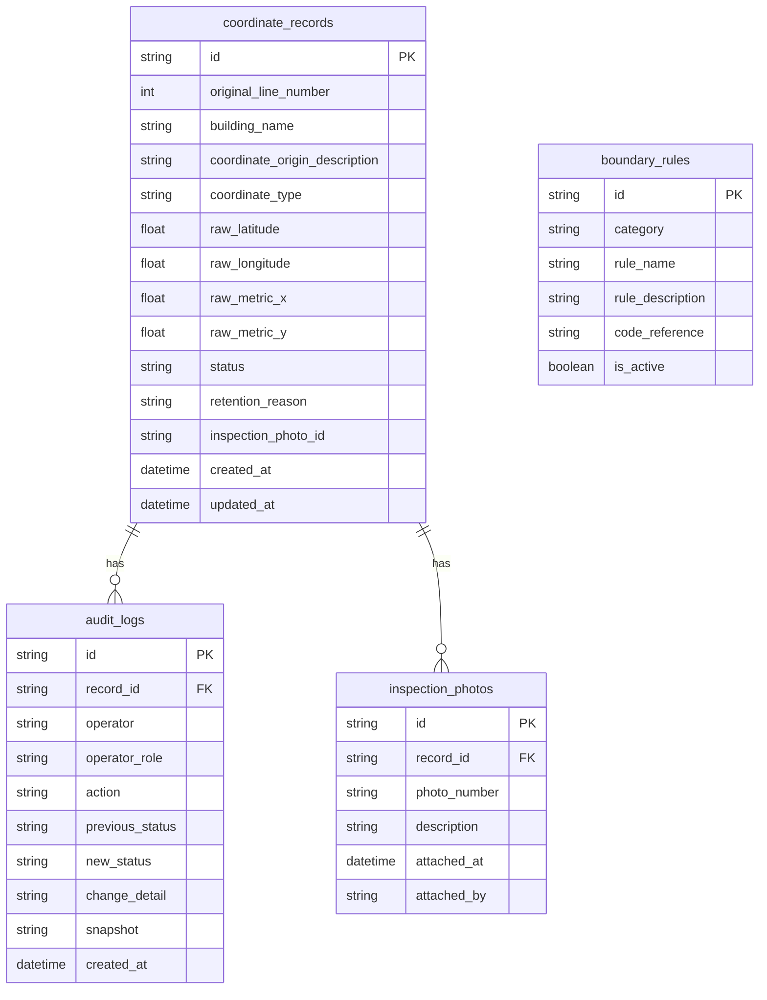

## 1. 架构设计



## 2. 技术说明

- 前端：React@18 + TailwindCSS@3 + Vite
- 初始化工具：Vite
- 后端：Express@4 + TypeScript
- 数据库：SQLite（better-sqlite3，零配置，数据文件随项目走）
- 坐标检测：自定义规则引擎，规则与代码和 README 三处同源

## 3. 路由定义

| 路由 | 用途 |
|------|------|
| / | 首页/仪表盘，显示各状态记录统计 |
| /import | 数据导入页，上传坐标原点说明文件 |
| /review | 教官复核页，老梁补看照片编号、填写保留理由 |
| /briefing | 班组说明页，总览与混合坐标明细 |
| /audit | 审计追踪页，操作时间线与回滚 |
| /rules | 边界规则页，展示判断/修改/回滚规则 |

## 4. API 定义

```typescript
interface CoordinateRecord {
  id: string
  original_line_number: number
  building_name: string
  coordinate_origin_description: string
  coordinate_type: "longitude_latitude" | "metric" | "mixed"
  raw_latitude: number | null
  raw_longitude: number | null
  raw_metric_x: number | null
  raw_metric_y: number | null
  status: "pending_review" | "under_review" | "pending_inspection" | "corrected" | "confirmed"
  retention_reason: string | null
  inspection_photo_id: string | null
  created_at: string
  updated_at: string
}

interface AuditLog {
  id: string
  record_id: string
  operator: string
  operator_role: "instructor" | "inspector" | "crew"
  action: "import" | "review" | "retain" | "correct" | "confirm" | "rollback" | "update_briefing"
  previous_status: string
  new_status: string
  change_detail: string
  snapshot: string
  created_at: string
}

interface BoundaryRule {
  id: string
  category: "detection" | "correction" | "rollback"
  rule_name: string
  rule_description: string
  code_reference: string
  is_active: boolean
}

interface ImportRequest {
  file: File
  operator: string
}

interface ImportResponse {
  total_rows: number
  normal_count: number
  mixed_count: number
  records: CoordinateRecord[]
}

interface ReviewRequest {
  record_id: string
  operator: string
  inspection_photo_id: string | null
  retention_reason: string | null
  action: "retain" | "correct"
  corrected_type?: "longitude_latitude" | "metric"
}

interface RollbackRequest {
  record_id: string
  target_audit_log_id: string
  operator: string
  reason: string
}
```

### API 端点

| 方法 | 路径 | 说明 |
|------|------|------|
| POST | /api/import | 导入坐标原点说明文件 |
| GET | /api/records | 获取所有记录（支持筛选） |
| GET | /api/records/:id | 获取单条记录详情 |
| POST | /api/review | 教官提交复核结果 |
| GET | /api/records/:id/audit | 获取记录的审计日志 |
| POST | /api/rollback | 回滚记录到指定状态 |
| GET | /api/rules | 获取边界规则列表 |
| GET | /api/stats | 获取统计概览 |

## 5. 服务端架构



## 6. 数据模型

### 6.1 数据模型定义



### 6.2 数据定义语言

```sql
CREATE TABLE coordinate_records (
  id TEXT PRIMARY KEY,
  original_line_number INTEGER NOT NULL,
  building_name TEXT NOT NULL,
  coordinate_origin_description TEXT NOT NULL,
  coordinate_type TEXT NOT NULL CHECK(coordinate_type IN ('longitude_latitude', 'metric', 'mixed')),
  raw_latitude REAL,
  raw_longitude REAL,
  raw_metric_x REAL,
  raw_metric_y REAL,
  status TEXT NOT NULL DEFAULT 'pending_review' CHECK(status IN ('pending_review', 'under_review', 'pending_inspection', 'corrected', 'confirmed')),
  retention_reason TEXT,
  inspection_photo_id TEXT,
  created_at TEXT NOT NULL DEFAULT (datetime('now')),
  updated_at TEXT NOT NULL DEFAULT (datetime('now'))
);

CREATE TABLE audit_logs (
  id TEXT PRIMARY KEY,
  record_id TEXT NOT NULL REFERENCES coordinate_records(id),
  operator TEXT NOT NULL,
  operator_role TEXT NOT NULL CHECK(operator_role IN ('instructor', 'inspector', 'crew')),
  action TEXT NOT NULL CHECK(action IN ('import', 'review', 'retain', 'correct', 'confirm', 'rollback', 'update_briefing')),
  previous_status TEXT NOT NULL,
  new_status TEXT NOT NULL,
  change_detail TEXT NOT NULL,
  snapshot TEXT NOT NULL,
  created_at TEXT NOT NULL DEFAULT (datetime('now'))
);

CREATE TABLE boundary_rules (
  id TEXT PRIMARY KEY,
  category TEXT NOT NULL CHECK(category IN ('detection', 'correction', 'rollback')),
  rule_name TEXT NOT NULL,
  rule_description TEXT NOT NULL,
  code_reference TEXT NOT NULL,
  is_active INTEGER NOT NULL DEFAULT 1
);

CREATE TABLE inspection_photos (
  id TEXT PRIMARY KEY,
  record_id TEXT NOT NULL REFERENCES coordinate_records(id),
  photo_number TEXT NOT NULL,
  description TEXT,
  attached_at TEXT NOT NULL DEFAULT (datetime('now')),
  attached_by TEXT NOT NULL
);

CREATE INDEX idx_records_status ON coordinate_records(status);
CREATE INDEX idx_records_type ON coordinate_records(coordinate_type);
CREATE INDEX idx_audit_record ON audit_logs(record_id);
CREATE INDEX idx_audit_created ON audit_logs(created_at);
CREATE INDEX idx_photos_record ON inspection_photos(record_id);
```
