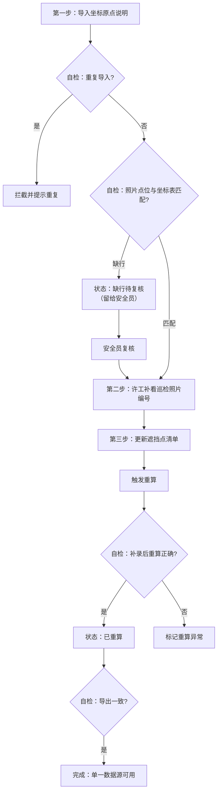

## 1. 产品概述

桥梁裂缝三维标注系统，解决桥梁巡检中裂缝标注数据不一致、异常记录追溯难、多端展示不同步的问题。面向安全员、设备工程师两类角色，提供可解释、可追溯、可复现的裂缝三维标注结果。

- 核心价值：用单一数据源确保导出明细、页面展示、接口返回完全一致，异常状态全程留痕可复核
- 目标用户：安全员（看结果、追异常）、设备工程师（导数据、补信息、作处理）

---

## 2. 核心功能

### 2.1 用户角色

| 角色 | 注册方式 | 核心权限 |
|------|----------|----------|
| 安全员 | 系统内置 | 查看标注结果、复核异常记录、查看追溯链路 |
| 设备工程师（许工） | 系统内置 | 导入坐标原点说明、补录巡检照片编号、更新遮挡点清单、触发重算、导出数据 |

### 2.2 功能模块

1. **标注总览页**：三维标注结果展示、异常状态标记、数据一致性校验结果
2. **坐标原点说明管理**：原始行号追踪、人工改动记录、处理状态流转
3. **自检中心**：重复导入检测、坐标表缺行检测、补录重算校验、导出一致性验证
4. **三步流程工作台**：导入→补看照片编号→更新遮挡点，带状态流转
5. **复盘记录**：操作日志、可重跑命令、完整追溯链路

### 2.3 页面详情

| 页面名称 | 模块名称 | 功能描述 |
|---------|----------|----------|
| 标注总览页 | 三维结果展示 | 裂缝位置3D可视化、坐标信息、照片点位关联 |
| 标注总览页 | 异常状态面板 | 突出显示"照片有点位但坐标表缺行"记录，不自动归正常 |
| 标注总览页 | 单一数据源状态 | 显示当前读取的数据源版本、导出/页面/接口一致性校验结果 |
| 坐标原点说明页 | 行号追踪表格 | 展示原始行号、当前行号、改动内容、改动人、改动时间 |
| 坐标原点说明页 | 处理状态标签 | 待导入→已导入→缺行待复核→已补录→已重算→已完成 |
| 自检中心页 | 四项自检卡片 | 重复导入检测、缺行检测、补录重算校验、导出一致性验证 |
| 三步流程页 | 流程状态机 | 第一步导入→第二步补看照片编号→第三步更新遮挡点 |
| 复盘记录页 | 操作时间线 | 所有操作按时间排序，支持过滤筛选 |
| 复盘记录页 | 可重跑命令 | 每条关键操作生成可复制的命令行，支持一键重新执行 |

---

## 3. 核心流程

### 3.1 正常流程
设备工程师许工导入坐标原点说明文件 → 系统自动检测照片点位与坐标表匹配情况 → 许工补看巡检照片编号 → 许工更新遮挡点清单 → 系统重算三维标注 → 安全员查看可解释的标注结果

### 3.2 异常流程（照片有点位但坐标表缺一行）
导入坐标原点说明 → 系统检测到"照片有点位但坐标表缺行" → 状态标记为"缺行待复核"，**不自动归正常** → 安全员复核确认 → 许工补录缺失行 → 触发重算 → 状态更新为"已补录→已重算"

### 3.3 三步流程图

---

## 4. 用户界面设计

### 4.1 设计风格
- 主色调：工程蓝 `#1E3A8A`，代表专业可靠
- 辅助色：预警橙 `#D97706`（缺行待复核）、成功绿 `#059669`（正常）、警示红 `#DC2626`（异常）
- 按钮风格：直角、2px边框、轻微阴影，工业感
- 字体：等宽字体 `JetBrains Mono` 用于数据展示，`Noto Sans SC` 用于正文
- 布局风格：左侧导航 + 右侧内容区，卡片式模块，突出数据表格
- 图标：使用线条型工程图标，避免花哨

### 4.2 页面设计概览

| 页面名称 | 模块名称 | UI元素 |
|---------|----------|--------|
| 标注总览页 | 三维结果展示 | 左侧3D画布、右侧数据面板、底部异常预警条 |
| 标注总览页 | 异常状态面板 | 橙色高亮卡片、闪烁预警边框、"待安全员复核"标签 |
| 坐标原点说明页 | 行号追踪表格 | 斑马线表格、原始行号列固定、改动记录悬停显示diff |
| 自检中心页 | 四项自检卡片 | 四色卡片矩阵、每项带检测时间、结果状态、查看详情按钮 |
| 三步流程页 | 流程状态机 | 横向时间轴、当前步骤高亮、已完成步骤打勾、待复核步骤橙色闪烁 |
| 复盘记录页 | 操作时间线 | 垂直时间轴、每条记录带操作人、时间、命令复制按钮 |

### 4.3 响应式
- 桌面端优先（1920×1080），左侧固定导航240px
- 平板端（≥768px）：导航可折叠，表格支持横向滚动
- 移动端（<768px）：底部导航，卡片堆叠展示

### 4.4 数据可追溯设计
- 每个坐标点关联：原始行号 → 导入时间 → 改动记录 → 处理状态 → 复核人 → 重算版本
- 点击任意数据单元格可展开完整追溯链路
- "照片有点位但坐标表缺行"的记录在所有展示位置（页面、导出、接口）统一标记为橙色边框

---

## 5. 关键业务规则

### 5.1 单一数据源规则
- 所有展示（页面）、导出（Excel/CSV）、接口（API）必须读取同一份 `canonical_result` 数据
- 修改数据必须通过"补录→重算→生成新版本"流程，禁止直接修改展示层

### 5.2 异常处理规则
- "照片有点位但坐标表缺行"的记录必须经过安全员复核才能进入下一步
- 异常记录在三处展示位置必须表现一致：橙色背景、"缺行待复核"标签、完整追溯信息

### 5.3 留痕规则
- 坐标原点说明的每一行必须记录：原始行号、当前行号、是否人工改动、改动前后值、处理状态、操作人、操作时间
- 所有关键操作（导入、补录、重算、导出）生成可重跑命令
