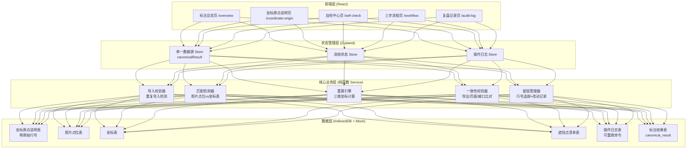
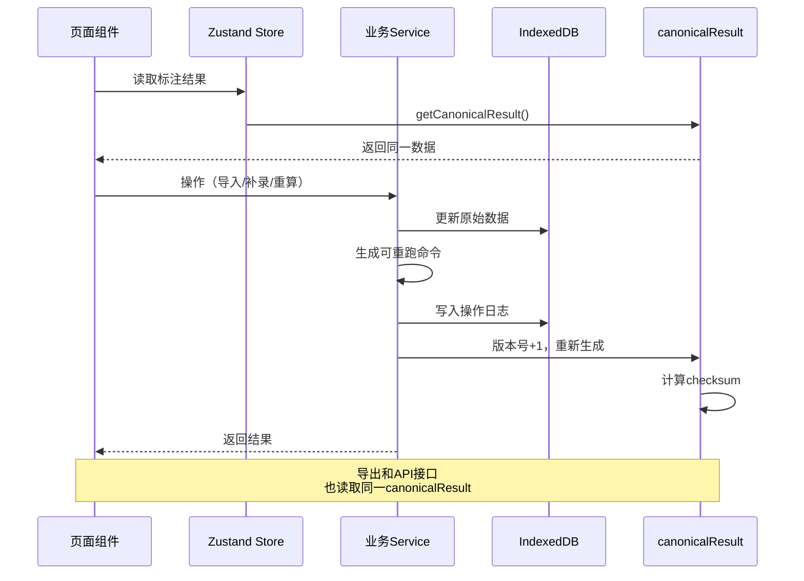
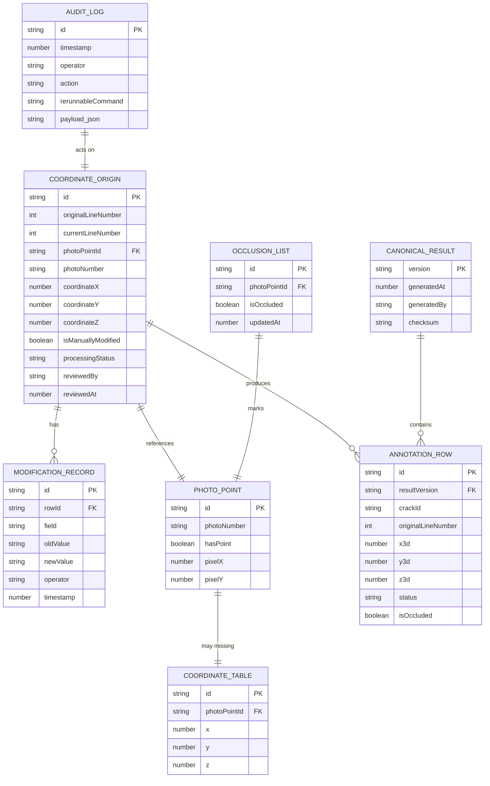

## 1. 架构设计



---

## 2. 技术描述

- **前端框架**: React@18 + TypeScript
- **构建工具**: Vite@5
- **样式方案**: TailwindCSS@3
- **状态管理**: Zustand@4（单一数据源，确保页面/导出/接口一致）
- **路由**: React Router@6
- **数据持久化**: IndexedDB（dexie@3）+ 本地Mock数据
- **UI组件**: 自定义工业风组件，不使用第三方UI库
- **图标**: Lucide React（线条型图标）
- **导出**: SheetJS (xlsx@0.18) + CSV原生导出
- **三维可视化**: 简化版SVG伪3D展示（避免引入three.js增加复杂度）

**技术选型说明**：
- 采用纯前端架构，使用IndexedDB模拟后端，确保可独立运行
- Zustand管理单一数据源`canonicalResult`，所有读取操作必须经过此Store
- 核心业务逻辑封装为纯函数，便于测试和生成可重跑命令

---

## 3. 路由定义

| 路由 | 页面 | 用途 |
|------|------|------|
| `/` | 重定向到 `/overview` | 默认入口 |
| `/overview` | 标注总览页 | 展示三维标注结果、异常状态、一致性校验 |
| `/coordinate-origin` | 坐标原点说明页 | 行号追踪、改动记录、处理状态管理 |
| `/self-check` | 自检中心页 | 四项自检：重复导入、缺行检测、补录重算、导出一致 |
| `/workflow` | 三步流程页 | 导入→补看照片编号→更新遮挡点，状态机流转 |
| `/audit-log` | 复盘记录页 | 操作时间线、可重跑命令、完整追溯 |

---

## 4. API 定义（模拟层）

### 4.1 类型定义

```typescript
// 坐标原点说明行 - 核心数据结构
interface CoordinateOriginRow {
  id: string;
  originalLineNumber: number;      // 原始行号（永不改变）
  currentLineNumber: number;       // 当前行号
  photoPointId: string;            // 照片点位ID
  photoNumber?: string;            // 巡检照片编号（许工补录）
  coordinateX?: number;            // 坐标X
  coordinateY?: number;            // 坐标Y
  coordinateZ?: number;            // 坐标Z
  isManuallyModified: boolean;     // 是否人工改动
  modificationHistory: ModificationRecord[];
  processingStatus: ProcessingStatus;
  reviewedBy?: string;             // 复核人（安全员）
  reviewedAt?: number;             // 复核时间
  createdAt: number;
  updatedAt: number;
}

type ProcessingStatus = 
  | 'pending_import'      // 待导入
  | 'imported'            // 已导入
  | 'missing_row'         // 缺行待复核（照片有定位但坐标表缺一行）
  | 'reviewed'            // 安全员已复核
  | 'supplemented'        // 已补录
  | 'recalculated'        // 已重算
  | 'completed';          // 已完成

interface ModificationRecord {
  field: string;
  oldValue: any;
  newValue: any;
  operator: string;       // '许工' | '安全员'
  timestamp: number;
}

// 照片点位
interface PhotoPoint {
  id: string;
  photoNumber: string;
  hasPoint: boolean;      // 照片是否有点位
  pixelX: number;
  pixelY: number;
}

// 标注结果 - 单一数据源
interface CanonicalResult {
  version: string;
  generatedAt: number;
  generatedBy: string;
  rows: AnnotationRow[];
  checksum: string;       // 用于一致性校验
}

interface AnnotationRow {
  id: string;
  crackId: string;
  originalLineNumber: number;
  photoNumber: string;
  x3d: number;
  y3d: number;
  z3d: number;
  status: ProcessingStatus;
  isOccluded: boolean;    // 是否遮挡
  traceInfo: TraceInfo;   // 追溯信息
}

interface TraceInfo {
  importTime: number;
  modificationRecords: ModificationRecord[];
  reviewRecord?: {
    reviewer: string;
    time: number;
    comment: string;
  };
  recalculationVersions: string[];
}

// 自检结果
interface SelfCheckResult {
  type: 'duplicate_import' | 'missing_row' | 'recalculation' | 'export_consistency';
  passed: boolean;
  checkedAt: number;
  details: any;
}

// 操作日志 - 可重跑命令
interface AuditLog {
  id: string;
  timestamp: number;
  operator: string;
  action: string;
  rerunnableCommand: string;  // 可重跑命令
  payload: any;
  result: any;
}
```

### 4.2 接口规范（模拟Service）

```typescript
// 导入坐标原点说明
function importCoordinateOrigin(file: File): Promise<{
  success: boolean;
  duplicateDetected: boolean;
  missingRows: string[];      // 照片有点位但坐标表缺行的photoPointId
  importedRows: CoordinateOriginRow[];
}>;

// 补录巡检照片编号
function supplementPhotoNumber(rowId: string, photoNumber: string): Promise<{
  success: boolean;
  updatedRow: CoordinateOriginRow;
}>;

// 更新遮挡点清单
function updateOcclusionList(photoPointIds: string[]): Promise<{
  success: boolean;
  updatedCount: number;
}>;

// 触发重算
function triggerRecalculation(): Promise<{
  success: boolean;
  newVersion: string;
  result: CanonicalResult;
}>;

// 安全员复核缺行记录
function reviewMissingRow(rowId: string, comment: string): Promise<{
  success: boolean;
  updatedRow: CoordinateOriginRow;
}>;

// 导出数据（确保与页面/接口一致）
function exportData(format: 'xlsx' | 'csv'): Promise<Blob>;

// 一致性校验
function checkConsistency(): Promise<{
  pageMatchesApi: boolean;
  pageMatchesExport: boolean;
  apiMatchesExport: boolean;
  allConsistent: boolean;
  details: any;
}>;

// 获取可重跑命令
function getRerunnableCommand(logId: string): string;
```

---

## 5. 核心数据流向



---

## 6. 数据模型

### 6.1 ER图



### 6.2 初始化数据（Mock）

```typescript
// 预置模拟数据，包含一个"照片有点位但坐标表缺一行"的场景
const mockPhotoPoints: PhotoPoint[] = [
  { id: 'pp001', photoNumber: 'P2024-001', hasPoint: true, pixelX: 120, pixelY: 80 },
  { id: 'pp002', photoNumber: 'P2024-002', hasPoint: true, pixelX: 250, pixelY: 160 },
  { id: 'pp003', photoNumber: 'P2024-003', hasPoint: true, pixelX: 180, pixelY: 220 },  // 这个坐标表缺行
  { id: 'pp004', photoNumber: 'P2024-004', hasPoint: true, pixelX: 310, pixelY: 95 },
];

const mockCoordinateTable = [
  { photoPointId: 'pp001', x: 10.5, y: 2.3, z: 5.1 },
  { photoPointId: 'pp002', x: 12.8, y: 2.5, z: 5.3 },
  // 故意缺 pp003
  { photoPointId: 'pp004', x: 15.2, y: 2.1, z: 4.9 },
];
```

---

## 7. 关键实现要点

### 7.1 单一数据源实现
- 所有数据读取必须通过 `useCanonicalResult()` hook
- 写入操作必须走 `updateCanonicalResult()` action，自动更新版本号和checksum
- 导出函数和API接口直接复用同一数据获取逻辑

### 7.2 异常状态强制保留
- `missing_row` 状态的记录必须经过 `reviewMissingRow()` 才能流转
- UI层渲染时检测到 `processingStatus === 'missing_row'`，强制应用橙色样式，不自动过滤

### 7.3 可重跑命令生成
- 每个关键操作生成类似CLI风格的命令字符串：
  ```
  bridge-crack import --file="坐标原点说明.xlsx" --operator="许工"
  bridge-crack supplement --row-id="co003" --photo-number="P2024-003"
  bridge-crack recalculate --version="v2"
  ```
- 命令存储在 `AuditLog.rerunnableCommand` 字段，可一键复制

### 7.4 自检四项触发时机
- 重复导入检测：导入时比对文件hash
- 缺行检测：导入时遍历 `PhotoPoint` 与 `CoordinateTable` 匹配
- 补录重算校验：重算后比对新版本与预期结果
- 导出一致性：导出时同时计算页面数据、导出数据、接口数据的hash并比对
