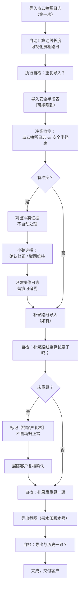

## 1. 产品概述

博物馆展柜动线模拟工具，服务于航测内业团队与展陈客户的协作场景，解决安全半径表晚到导致的返工问题，将数据冲突和待复核环节显性化，避免业务风险。

- 核心价值：把返工留在明面上，冲突不自动拍板，留痕可追溯
- 目标用户：航测内业小魏（操作方）、展陈客户（复核方）
- 解决痛点：安全半径表晚到→原判断失效→隐性返工→责任不清

---

## 2. 核心功能

### 2.1 用户角色

| 角色 | 操作场景 | 核心权限 |
|------|----------|----------|
| 航测内业小魏 | 导入数据、执行自检、发起冲突确认 | 全功能操作、导出成果 |
| 展陈客户 | 复核补录路线、确认冲突处理 | 复核标记、确认/驳回操作 |

### 2.2 功能模块

1. **三步主流程**：点云抽稀日志导入 → 补看安全半径表 → 导出截图
2. **冲突检测与裁决**：自动对比点云抽稀日志与安全半径表，列出证据待人工确认
3. **四大自检**：重复导入检测、补录路线未重算长度检测、补录后重算、导出一致性校验
4. **历史记录对比**：导出截图与历史版本自动比对，标注差异
5. **测试材料库**：内置正常/错口径/补录三种测试用例

### 2.3 页面详情

| 页面名称 | 模块名称 | 功能描述 |
|----------|----------|----------|
| 主工作台 | 步骤导航 | 三步流程进度条，当前步骤高亮，已完成步骤可回溯 |
| 主工作台 | 导入区域 | 支持点云抽稀日志（.txt/.json）、安全半径表（.csv/.xlsx）拖拽导入 |
| 主工作台 | 数据预览 | 点云路线可视化展柜动线，安全半径用彩色圆圈标注 |
| 主工作台 | 自检面板 | 四大自检项实时状态，异常项高亮标红，一键执行全部自检 |
| 冲突裁决页 | 冲突列表 | 逐条列出矛盾点，展示双方数据证据，标注风险等级 |
| 冲突裁决页 | 证据对比 | 左右分栏对比点云抽稀日志 vs 安全半径表的具体数值 |
| 冲突裁决页 | 操作区 | "确认（按安全半径表修正）" / "驳回（维持原数据）" 双按钮，必填备注 |
| 复核标记区 | 待复核列表 | 补录路线未重算长度项单独列出，标记"待客户复核" |
| 复核标记区 | 复核操作 | 客户确认后才能标记为"正常"，否则一直挂起 |
| 导出与历史 | 截图导出 | 带时间戳和水印的动线图导出，文件名含版本号 |
| 导出与历史 | 历史对比 | 当前导出 vs 历史记录的差异高亮，自动生成变更说明 |

---

## 3. 核心流程

### 3.1 主流程描述

航测内业小魏导入点云抽稀日志，系统自动计算动线长度并可视化；
随后安全半径表到达（可能晚到），导入后系统自动检测冲突；
若有冲突，列出证据不自动处理，小魏选择确认或驳回；
补录路线如果没有重新计算长度，系统标记"待客户复核"，不自动归正常；
最后导出截图，系统自动与历史记录对比，确保一致性。

### 3.2 流程图

---

## 4. 用户界面设计

### 4.1 设计风格

**专业工业风 + 协作友好**：
- 主色：测绘蓝 `#1e40af`（专业感）+ 警示橙 `#f97316`（待复核/冲突）+ 通过绿 `#10b981`（正常）
- 按钮风格：方角矩形，4px圆角，2px边框，点击有明显下沉效果
- 字体：思源黑体（正文）+ JetBrains Mono（数据/编号），保留专业术语
- 布局：左侧步骤导航 + 中间主操作区 + 右侧自检/历史面板
- 图标：采用测绘行业通用图标，避免过度卡通化

**关键交互细节**：
- 冲突证据用红框高亮，数据差值用红字标注
- "待客户复核"项有橙色闪烁边框，不允许误操作标记为正常
- 所有确认/驳回操作强制填写备注，留痕
- 导出截图自动加盖时间戳和操作人水印

### 4.2 页面设计概述

| 页面名称 | 模块名称 | UI 元素 |
|----------|----------|---------|
| 主工作台 | 步骤导航 | 竖向三步进度条，带完成勾选/待处理圆点/当前步骤发光效果 |
| 主工作台 | 动线可视化 | SVG 展柜布局，路线用贝塞尔曲线，安全半径用半透明圆圈，hover 显示数据 |
| 主工作台 | 自检面板 | 卡片式布局，每项带状态图标：✅正常 / ⚠️警告 / ❌错误 / ⏳待复核 |
| 冲突裁决页 | 证据对比 | 左右两栏，差异行背景标红，中间箭头指向差值 |
| 导出与历史 | 对比视图 | 半透明叠加对比，差异区域用动态虚线框标注 |

### 4.3 响应式

- 桌面端优先（1440px+），三栏布局
- 平板端折叠右侧面板为抽屉
- 移动端保留核心导入和导出功能，可视化区域简化
- 拖拽导入支持触摸屏长按触发

### 4.4 场景化动效

- 冲突出现时，红框从数据点向外扩散动画，强调问题
- 待复核项每隔3秒轻微闪烁一次橙色边框，提醒注意
- 步骤切换时，内容区从右侧滑入，进度条数字递增动画
- 导出成功时，截图缩略图从预览区"飘"向历史记录列表
