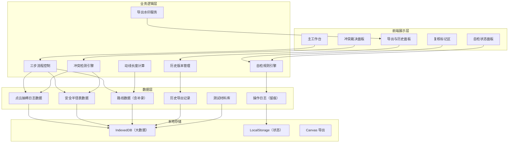
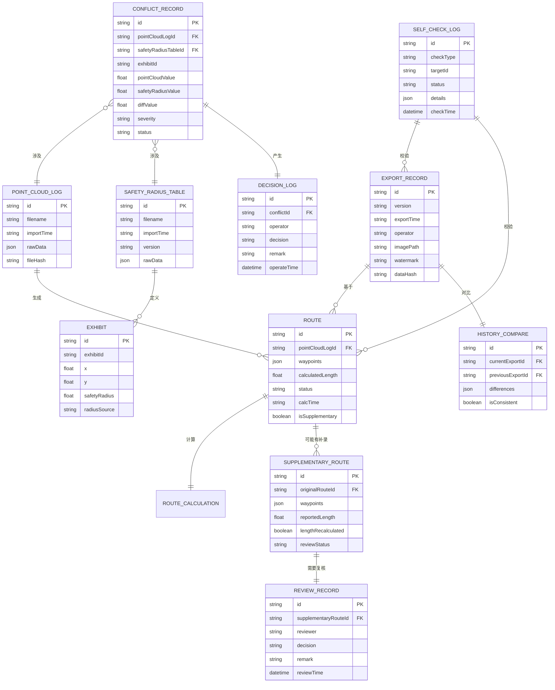

## 1. 架构设计



---

## 2. 技术描述

- **前端框架**：React@18 + TypeScript + Vite@5
- **样式方案**：TailwindCSS@3 + CSS 变量（主题系统）
- **状态管理**：Zustand（轻量，支持时间旅行调试）
- **可视化**：SVG 原生 + D3.js（贝塞尔曲线、动线计算）
- **文件解析**：PapaParse（CSV）+ SheetJS（Excel）+ 原生 FileReader
- **导出方案**：html2canvas（截图）+ Canvas API（水印）
- **本地存储**：IndexedDB（Dexie.js 封装）+ LocalStorage
- **图标方案**：Lucide React（专业线性图标）
- **动效方案**：Framer Motion（场景化动画）

---

## 3. 路由定义

| 路由 | 页面 | 核心功能 |
|------|------|----------|
| `/` | 主工作台 | 三步流程、导入、可视化、自检 |
| `/conflicts` | 冲突裁决 | 冲突列表、证据对比、确认/驳回 |
| `/review` | 待复核区 | 补录路线复核、客户确认 |
| `/export` | 导出与历史 | 截图导出、历史对比、版本管理 |

---

## 4. 核心数据模型

### 4.1 数据模型 ER 图



### 4.2 核心数据结构（TypeScript）

```typescript
// 点云抽稀日志
interface PointCloudLog {
  id: string;
  filename: string;
  importTime: string;
  fileHash: string;
  exhibits: ExhibitData[];
  route: Waypoint[];
}

// 展柜数据
interface ExhibitData {
  exhibitId: string;
  x: number;
  y: number;
  pointCloudRadius: number;
  safetyRadius?: number;
}

// 路径点
interface Waypoint {
  x: number;
  y: number;
  timestamp?: string;
}

// 路线
interface Route {
  id: string;
  waypoints: Waypoint[];
  calculatedLength: number;
  isSupplementary: boolean;
  lengthRecalculated: boolean;
  reviewStatus: 'pending' | 'approved' | 'rejected';
}

// 冲突记录
interface ConflictRecord {
  id: string;
  exhibitId: string;
  pointCloudValue: number;
  safetyRadiusValue: number;
  diffValue: number;
  severity: 'high' | 'medium' | 'low';
  status: 'pending' | 'confirmed' | 'rejected';
  evidence: {
    pointCloudSource: string;
    safetyRadiusSource: string;
  };
}

// 自检项
interface SelfCheckItem {
  id: string;
  type: 'duplicate_import' | 'length_not_recalculated' | 'supplementary_recalc' | 'export_consistency';
  status: 'pass' | 'fail' | 'warning' | 'pending_review';
  message: string;
  details: any;
}
```

---

## 5. 自检规则引擎

### 5.1 重复导入检测
```
规则：同文件Hash已存在 → 触发警告
校验点：
  1. 计算导入文件 MD5 Hash
  2. 与历史导入记录对比
  3. 若存在相同Hash，列出导入时间和操作人
  4. 不阻止导入，但必须确认"确实需要重复导入"
```

### 5.2 补录路线未重算长度检测
```
规则：补录路线 reportedLength ≠ calculatedLength → 标记待复核
校验点：
  1. 导入补录路线时，系统自动重新计算长度
  2. 对比上报长度与计算长度差值
  3. 差值 > 0.5m → 标记【待客户复核】
  4. 禁止自动标记为正常，必须客户确认
```

### 5.3 补录后重算检测
```
规则：补录后必须重新执行全线长度计算
校验点：
  1. 检测补录操作时间戳
  2. 检测全线重算时间戳
  3. 重算时间 < 补录时间 → 触发错误
  4. 提供"一键重算"按钮
```

### 5.4 导出一致性检测
```
规则：导出数据必须与当前状态一致
校验点：
  1. 导出前计算所有数据 Hash
  2. 与历史最近一次导出的 Hash 对比
  3. 列出所有变更项（路线、半径、长度）
  4. 生成变更说明，确认后才可导出
```
