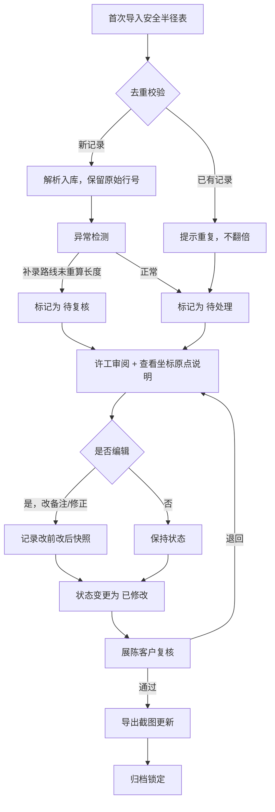

## 1. 产品概述

"隧道照明暗区巡检"管理系统，面向设备工程师许工等现场人员，用于安全半径表的导入、审阅、变更追踪和导出，确保巡检数据从原始导入到最终归档的每一步都可追溯、可回滚、不可篡改汇总数覆盖细节。

- 核心问题：安全半径表人工改动无痕迹、补录路线未重新计算长度被汇总数掩盖、重复导入导致数量翻倍
- 目标用户：设备工程师（许工）、展陈客户（复核方）

## 2. 核心功能

### 2.1 用户角色

| 角色 | 进入方式 | 核心权限 |
|------|----------|----------|
| 设备工程师 | 工号登录 | 导入安全半径表、审阅坐标原点说明、编辑备注、标记处理状态 |
| 展陈客户 | 工号登录 | 查看变更历史、复核待审核项、确认归档 |

### 2.2 功能模块

1. **导入工作台**：安全半径表首次导入、去重校验、补录路线长度异常检测
2. **审阅工作台**：安全半径表逐行审阅、原始行号展示、人工改动标注、坐标原点说明查看
3. **变更历史**：改前改后对比、按字段差异高亮、回滚操作
4. **导出与归档**：截图更新导出、归档锁定、汇总报告

### 2.3 页面详情

| 页面名称 | 模块名称 | 功能描述 |
|----------|----------|----------|
| 导入工作台 | 文件上传区 | 支持 CSV/XLSX 上传，自动解析安全半径表，显示原始行号 |
| 导入工作台 | 去重校验区 | 检测重复导入，按原始行号+关键字段匹配，提示已有记录而非翻倍 |
| 导入工作台 | 异常检测区 | 检测"补录路线没有重新计算长度"等边界情况，标记为"待复核"而非"正常" |
| 审阅工作台 | 安全半径表视图 | 展示原始行号、当前值、改动标记、处理状态（待处理/已修改/待复核/已归档） |
| 审阅工作台 | 坐标原点说明面板 | 侧边展示坐标原点说明文档，辅助工程师理解数据含义 |
| 审阅工作台 | 编辑备注 | 修改单条备注时触发变更记录，保存改前改后快照 |
| 变更历史 | 改前改后对比 | 按字段逐项对比，差异高亮，显示改动人、改动时间 |
| 变更历史 | 回滚操作 | 选中历史版本一键回滚，回滚本身也记入历史 |
| 导出与归档 | 截图导出 | 将当前安全半径表视图导出为截图 |
| 导出与归档 | 归档锁定 | 展陈客户确认后锁定数据，后续改动需解锁 |

## 3. 核心流程

**第一次导入 → 补看坐标原点说明 → 导出截图更新** 三步主流程：

1. 设备工程师许工首次导入安全半径表，系统自动检测去重和异常
2. 许工在审阅工作台逐行查看，参考坐标原点说明修正数据
3. 许工编辑备注或修正数据，系统自动记录改前改后
4. 如遇"补录路线没有重新计算长度"，系统标记为"待复核"，不自动归为正常
5. 展陈客户在变更历史中复核，确认后触发截图导出更新
6. 归档锁定

## 4. 用户界面设计

### 4.1 设计风格

- **主色调**：深灰底 (#1a1a2e) + 琥珀色强调 (#e2a04a) — 隧道暗区工业感
- **辅助色**：钢蓝 (#4a7c9b) 用于信息提示，暗红 (#c44536) 用于异常/待复核标记
- **字体**：JetBrains Mono（数据表格）+ Noto Sans SC（中文界面）
- **按钮风格**：圆角矩形、微阴影、状态色填充
- **布局**：左侧导航栏 + 右侧内容区，表格为主视图
- **图标**：Lucide Icons，线性风格

### 4.2 页面设计概览

| 页面名称 | 模块名称 | UI 元素 |
|----------|----------|---------|
| 导入工作台 | 文件上传区 | 拖拽上传框、文件类型图标、进度条、原始行号预览表格 |
| 导入工作台 | 去重校验区 | 黄色警告卡片、已有记录行号列表、跳过/覆盖选项 |
| 导入工作台 | 异常检测区 | 红色标签"待复核"、异常原因说明、手工处理按钮 |
| 审阅工作台 | 安全半径表视图 | 行号列(灰色底)、改动标记列(琥珀色圆点)、状态徽章、悬停展开详情 |
| 审阅工作台 | 坐标原点说明面板 | 右侧抽屉式面板、文档大纲、关键字高亮 |
| 审阅工作台 | 编辑备注 | 行内编辑弹窗、改前值(删除线)/改后值对比 |
| 变更历史 | 改前改后对比 | 左右分栏对比、差异高亮(绿色新增/红色删除)、时间线 |
| 变更历史 | 回滚操作 | 回滚确认弹窗、回滚后自动生成历史记录 |
| 导出与归档 | 截图导出 | 预览区、下载按钮、PNG/PDF选项 |
| 导出与归档 | 归档锁定 | 锁定图标、解锁需展陈客户确认 |

### 4.3 响应式策略

- 桌面优先（1440px+）：表格全字段展示，侧边抽屉
- 平板（768px-1440px）：表格可折叠列，面板覆盖式
- 移动端（<768px）：卡片式列表，关键操作浮窗

### 4.4 3D 场景

不适用
