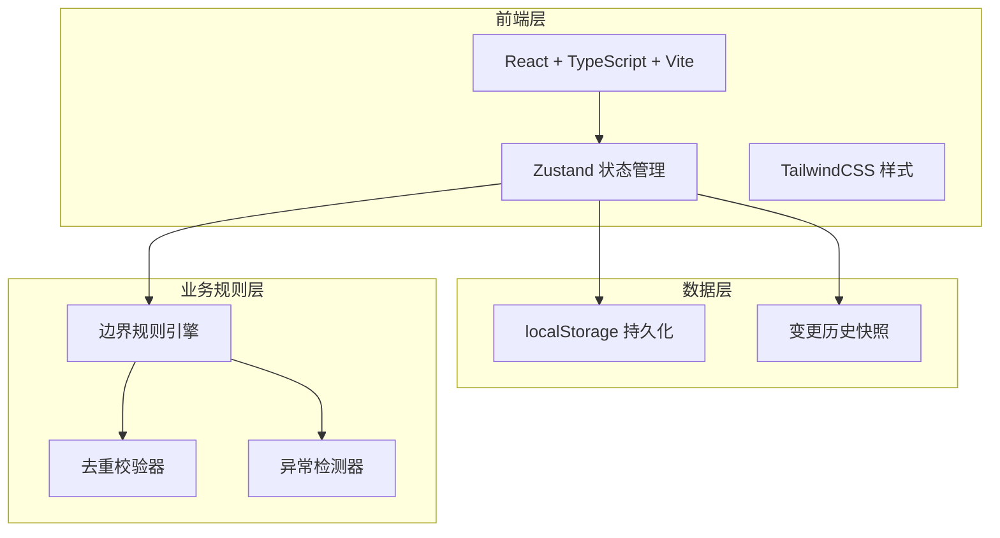
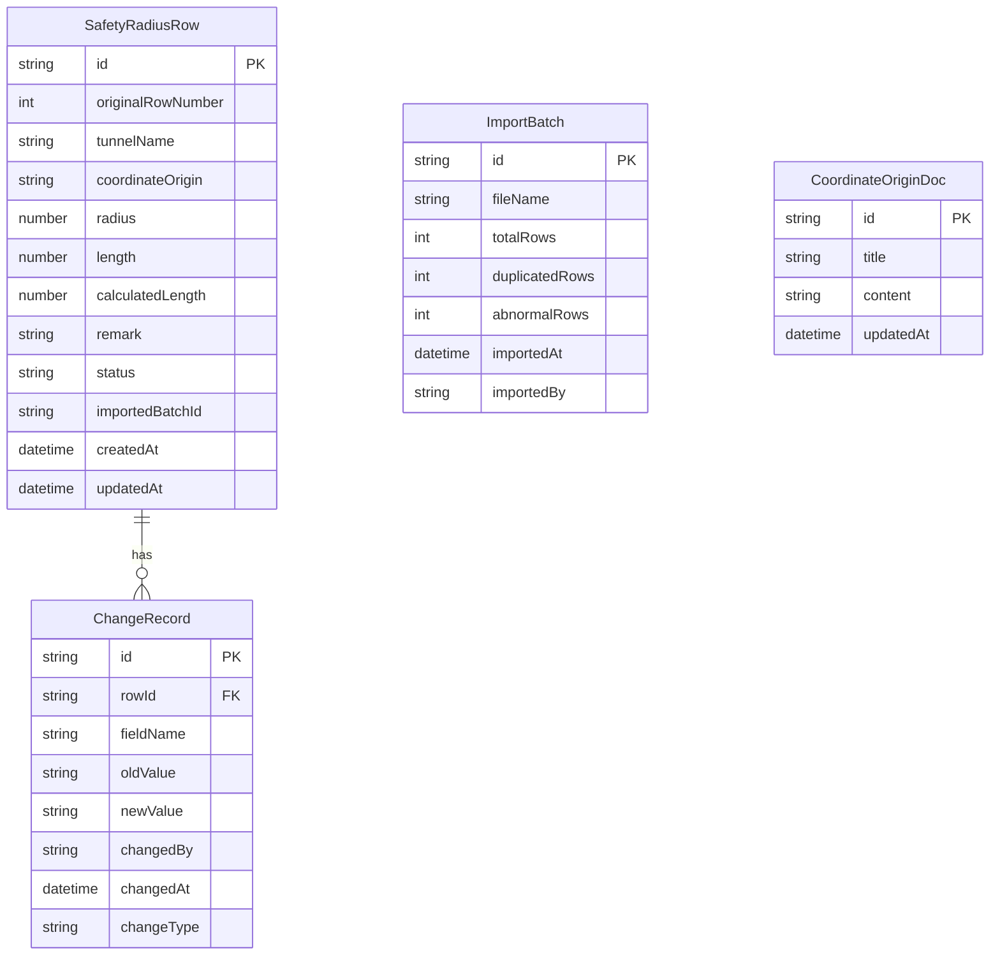

## 1. 架构设计



## 2. 技术说明

- 前端：React@18 + TypeScript + TailwindCSS@3 + Vite
- 初始化工具：vite-init
- 后端：无（纯前端，数据持久化到 localStorage）
- 数据库：无（使用 localStorage + 内存状态管理）

## 3. 路由定义

| 路由 | 用途 |
|------|------|
| `/` | 重定向到导入工作台 |
| `/import` | 导入工作台：安全半径表上传、去重、异常检测 |
| `/review` | 审阅工作台：安全半径表逐行审阅、坐标原点说明、编辑备注 |
| `/history` | 变更历史：改前改后对比、回滚操作 |
| `/export` | 导出与归档：截图导出、归档锁定 |

## 4. 数据模型

### 4.1 数据模型定义



### 4.2 数据定义

**SafetyRadiusRow 状态枚举**：
- `pending`：待处理（首次导入默认状态）
- `modified`：已修改（工程师编辑后）
- `review`：待复核（检测到异常或编辑后需客户确认）
- `archived`：已归档（展陈客户确认后锁定）

**ChangeRecord.changeType 枚举**：
- `edit`：人工编辑
- `rollback`：回滚操作
- `auto_detect`：自动检测异常标记

**边界规则**：
- `补录路线没有重新计算长度`：当 `length !== calculatedLength` 且状态非 `archived` 时，标记为 `review`
- 重复导入去重：按 `originalRowNumber + tunnelName + coordinateOrigin` 组合键匹配，已存在则跳过
- 回滚规则：回滚操作生成新 ChangeRecord（changeType=rollback），不删除历史记录

### 4.3 TypeScript 类型定义

```typescript
interface SafetyRadiusRow {
  id: string;
  originalRowNumber: number;
  tunnelName: string;
  coordinateOrigin: string;
  radius: number;
  length: number;
  calculatedLength: number;
  remark: string;
  status: 'pending' | 'modified' | 'review' | 'archived';
  importedBatchId: string;
  createdAt: string;
  updatedAt: string;
}

interface ChangeRecord {
  id: string;
  rowId: string;
  fieldName: string;
  oldValue: string;
  newValue: string;
  changedBy: string;
  changedAt: string;
  changeType: 'edit' | 'rollback' | 'auto_detect';
}

interface ImportBatch {
  id: string;
  fileName: string;
  totalRows: number;
  duplicatedRows: number;
  abnormalRows: number;
  importedAt: string;
  importedBy: string;
}

interface CoordinateOriginDoc {
  id: string;
  title: string;
  content: string;
  updatedAt: string;
}
```
