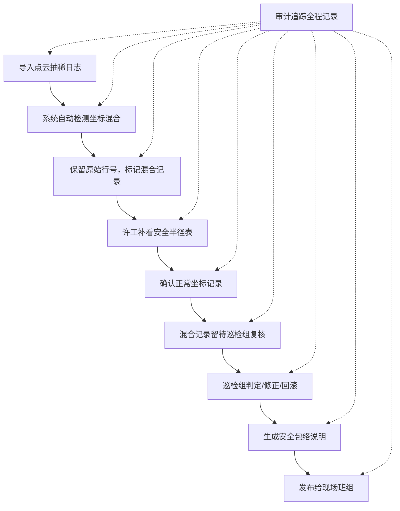

## 1. 产品概述

工厂机械臂安全包络系统，用于解决经纬度与米制坐标混合场景下的安全区域计算与审计追踪问题。目标用户为设备工程师（许工）、巡检组和现场班组。

- 核心问题：点云抽稀日志与安全半径表的数据可信度校验，坐标混合场景下的一致性处理
- 核心价值：确保导出明细、页面展示、接口返回读取同一份结果，保留完整审计证据链

## 2. 核心功能

### 2.1 用户角色
| 角色 | 说明 | 核心权限 |
|------|------|----------|
| 设备工程师（许工） | 负责导入数据、复核安全半径表 | 导入日志、编辑修正、提交复核 |
| 巡检组 | 负责复核坐标混合等异常情况 | 复核异常、批准发布、查看审计 trail |
| 现场班组 | 查看最终发布的安全包络说明 | 查看已发布的安全包络 |
| 系统管理员 | 配置边界规则 | 管理边界规则配置 |

### 2.2 功能模块
1. **安全包络列表页**：记录列表、状态筛选、搜索、导出
2. **安全包络详情页**：完整数据展示、三步工作流进度、审计追踪、坐标混合标记
3. **点云抽稀日志导入**：文件上传、原始行号保留、坐标混合自动检测
4. **三步工作流**：导入→许工复核→发布给现场班组
5. **边界规则管理**：坐标混合判定规则、修改规则、回滚规则
6. **审计追踪**：原始行号、人工改动记录、状态变更历史

### 2.3 页面详情
| 页面名称 | 模块名称 | 功能描述 |
|-----------|-------------|---------------------|
| 安全包络列表页 | 数据表格 | 展示所有安全包络记录，支持按状态/日期筛选 |
| 安全包络列表页 | 搜索筛选 | 按机械臂编号、日期范围、处理状态搜索 |
| 安全包络列表页 | 导出功能 | 导出明细Excel/CSV，与页面/接口数据一致 |
| 安全包络详情页 | 基础信息 | 机械臂编号、计算日期、安全半径版本 |
| 安全包络详情页 | 坐标数据区 | 展示所有坐标点，标记经纬度/米制/混合类型 |
| 安全包络详情页 | 三步工作流 | 可视化展示当前流程节点，支持流程推进 |
| 安全包络详情页 | 审计追踪 | 原始行号、改动记录、操作人、时间戳 |
| 安全包络详情页 | 异常处理区 | 坐标混合记录列表，标注"待巡检组复核"状态 |
| 导入弹窗 | 文件上传 | 支持点云抽稀日志CSV/TXT上传 |
| 导入弹窗 | 数据预览 | 导入前预览数据，自动检测坐标混合 |
| 边界规则页 | 规则列表 | 展示所有判定/修改/回滚规则 |
| 边界规则页 | 规则编辑 | 编辑坐标混合判定阈值、处理规则 |

## 3. 核心流程

### 主流程描述
1. 设备工程师许工导入点云抽稀日志，系统自动保留原始行号，检测坐标混合
2. 系统标记坐标混合记录为"待复核"，不自动归一化
3. 许工补看安全半径表，对非混合记录进行确认，混合记录转交巡检组
4. 巡检组复核坐标混合记录，判定归属、进行修正或回滚
5. 所有记录确认后，发布给现场班组查看
6. 全过程保留原始行号、人工改动、状态变更的审计记录

## 4. 用户界面设计

### 4.1 设计风格
- 工业工程风格，以功能性优先
- 主色调：深灰蓝（#1e3a5f）+ 警示橙（#f59e0b）+ 安全绿（#10b981）
- 中性色：锌灰色系（zinc）
- 按钮风格：方正直角、轻微立体、状态颜色区分明显
- 字体：等宽字体用于数据展示（JetBrains Mono），中文使用思源黑体
- 布局：左侧导航 + 右侧内容区，数据密集型表格布局
- 图标：工业设备风格，使用lucide-react图标，状态图标醒目

### 4.2 页面设计概述
| 页面名称 | 模块名称 | UI元素 |
|-----------|-------------|-------------|
| 安全包络列表页 | 顶部操作区 | 导入按钮、搜索框、筛选下拉、导出按钮 |
| 安全包络列表页 | 数据表格 | 固定表头、斑马纹、状态颜色标签、行悬停高亮 |
| 安全包络详情页 | 流程进度条 | 三步节点指示器，当前节点高亮 |
| 安全包络详情页 | 坐标数据区 | 表格展示，混合坐标行用橙色背景标记 |
| 安全包络详情页 | 审计面板 | 可折叠时间线，展示每次变更 |
| 安全包络详情页 | 异常处理区 | 卡片式布局，每条异常带操作按钮 |
| 导入弹窗 | 上传区 | 拖拽上传、文件预览、检测结果统计 |
| 边界规则页 | 规则卡片 | 每条规则含条件、动作、代码引用 |

### 4.3 响应式
- 桌面端优先设计（1280px+），适配工程师多显示器工作场景
- 平板端（768px-1279px）：侧边栏可折叠，表格支持横向滚动
- 移动端（<768px）：卡片式列表展示，关键数据优先
- 表格区域支持触摸滚动，操作按钮尺寸适配触摸

## 5. 关键业务规则

### 5.1 坐标混合判定规则
- 判定：同一条记录中同时出现经纬度格式（如 121.4737°E, 31.2304°N）和米制格式（如 x=12.5m, y=8.3m）
- 阈值：经纬度数值范围判断（经度-180~180，纬度-90~90），米制数值带单位或超出经纬度范围
- 处理：自动标记为"待巡检组复核"，不自动转换或修正

### 5.2 数据一致性规则
- 页面展示、API接口、导出文件 三者必须读取同一数据源
- 任何修改操作必须先更新数据源，再同步刷新三处展示
- 导出文件包含原始行号列和状态列，便于对账

### 5.3 审计追踪规则
- 每条记录必须保留：原始行号、原始值、修改后值、操作人、操作时间、操作类型
- 状态变更历史不可删除，支持回滚到任一历史状态
- 坐标混合记录的每次处理（判定/修正/回滚）必须留下备注说明
