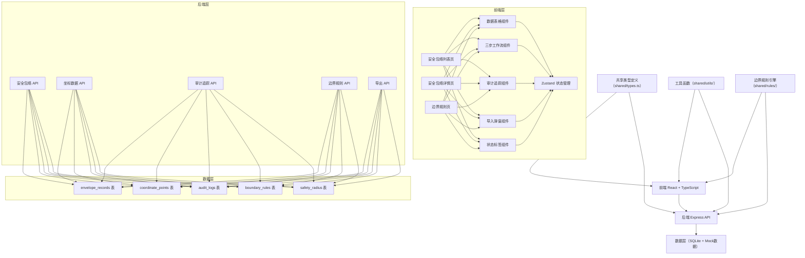
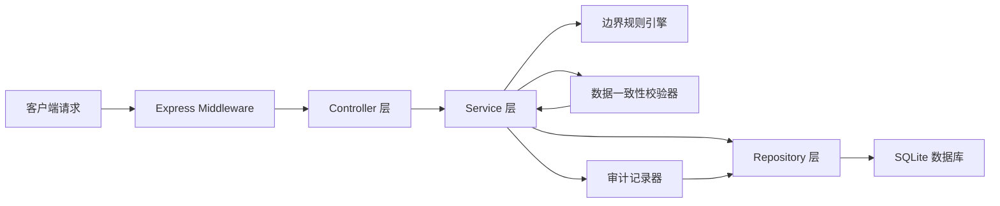
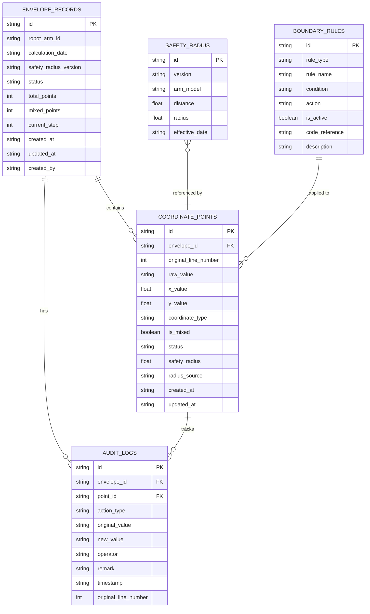

## 1. 架构设计



## 2. 技术描述

- **前端**：React@18 + TypeScript + TailwindCSS@3 + Vite
- **后端**：Express@4 + TypeScript
- **状态管理**：Zustand
- **路由**：react-router-dom
- **图标**：lucide-react
- **数据库**：SQLite（better-sqlite3）
- **初始化工具**：vite-init
- **数据一致性保证**：前后端共用同一数据源，导出功能直接调用API获取相同数据

## 3. 路由定义

| 路由 | 页面 | 权限 |
|-------|---------|------|
| / | 安全包络列表页 | 所有登录用户 |
| /envelope/:id | 安全包络详情页 | 所有登录用户 |
| /rules | 边界规则管理页 | 系统管理员 |
| /published | 已发布说明（现场班组） | 现场班组 |

## 4. API 定义

### TypeScript 类型定义

```typescript
// shared/types.ts
export type CoordinateType = 'LAT_LNG' | 'METRIC' | 'MIXED';
export type ProcessingStatus = 'IMPORTED' | 'ENGINEER_REVIEW' | 'INSPECTION_REVIEW' | 'PUBLISHED' | 'REJECTED' | 'ROLLBACK';
export type AuditActionType = 'IMPORT' | 'EDIT' | 'STATUS_CHANGE' | 'REVIEW' | 'CORRECT' | 'ROLLBACK';

export interface CoordinatePoint {
  id: string;
  envelopeId: string;
  originalLineNumber: number;
  rawValue: string;
  xValue: number;
  yValue: number;
  coordinateType: CoordinateType;
  isMixed: boolean;
  status: ProcessingStatus;
  safetyRadius: number | null;
  radiusSource: 'LOG' | 'TABLE' | 'MANUAL' | null;
  createdAt: string;
  updatedAt: string;
}

export interface EnvelopeRecord {
  id: string;
  robotArmId: string;
  calculationDate: string;
  safetyRadiusVersion: string;
  status: ProcessingStatus;
  totalPoints: number;
  mixedPoints: number;
  currentStep: number;
  createdAt: string;
  updatedAt: string;
  createdBy: string;
}

export interface AuditLog {
  id: string;
  envelopeId: string;
  pointId: string | null;
  actionType: AuditActionType;
  originalValue: string | null;
  newValue: string | null;
  operator: string;
  remark: string;
  timestamp: string;
  originalLineNumber: number | null;
}

export interface BoundaryRule {
  id: string;
  ruleType: 'DETECTION' | 'CORRECTION' | 'ROLLBACK';
  ruleName: string;
  condition: string;
  action: string;
  isActive: boolean;
  codeReference: string;
  description: string;
}

export interface SafetyRadiusTable {
  id: string;
  version: string;
  armModel: string;
  distance: number;
  radius: number;
  effectiveDate: string;
}

// API Request/Response
export interface ImportLogRequest {
  file: File;
  robotArmId: string;
  safetyRadiusVersion: string;
}

export interface ApiResponse<T> {
  success: boolean;
  data: T;
  message?: string;
}
```

### API 端点
| 方法 | 路径 | 描述 |
|------|------|------|
| GET | /api/envelopes | 获取安全包络列表 |
| GET | /api/envelopes/:id | 获取单个安全包络详情 |
| POST | /api/envelopes/import | 导入点云抽稀日志 |
| PUT | /api/envelopes/:id/step | 推进工作流步骤 |
| GET | /api/envelopes/:id/points | 获取坐标点列表 |
| PUT | /api/points/:id | 修改坐标点 |
| POST | /api/points/:id/review | 复核坐标点（巡检组） |
| POST | /api/points/:id/rollback | 回滚坐标点 |
| GET | /api/envelopes/:id/audit | 获取审计日志 |
| GET | /api/envelopes/:id/export | 导出明细（CSV/Excel） |
| GET | /api/rules | 获取边界规则列表 |
| PUT | /api/rules/:id | 更新边界规则 |
| GET | /api/safety-radius | 获取安全半径表 |

## 5. 服务器架构图



## 6. 数据模型

### 6.1 数据模型 ER 图



### 6.2 DDL 语句

```sql
-- 安全包络主记录表
CREATE TABLE envelope_records (
  id TEXT PRIMARY KEY,
  robot_arm_id TEXT NOT NULL,
  calculation_date TEXT NOT NULL,
  safety_radius_version TEXT NOT NULL,
  status TEXT NOT NULL DEFAULT 'IMPORTED',
  total_points INTEGER NOT NULL DEFAULT 0,
  mixed_points INTEGER NOT NULL DEFAULT 0,
  current_step INTEGER NOT NULL DEFAULT 1,
  created_at TEXT NOT NULL,
  updated_at TEXT NOT NULL,
  created_by TEXT NOT NULL
);

CREATE INDEX idx_envelope_status ON envelope_records(status);
CREATE INDEX idx_envelope_robot ON envelope_records(robot_arm_id);
CREATE INDEX idx_envelope_date ON envelope_records(calculation_date);

-- 坐标点明细表
CREATE TABLE coordinate_points (
  id TEXT PRIMARY KEY,
  envelope_id TEXT NOT NULL REFERENCES envelope_records(id),
  original_line_number INTEGER NOT NULL,
  raw_value TEXT NOT NULL,
  x_value REAL NOT NULL,
  y_value REAL NOT NULL,
  coordinate_type TEXT NOT NULL,
  is_mixed INTEGER NOT NULL DEFAULT 0,
  status TEXT NOT NULL DEFAULT 'IMPORTED',
  safety_radius REAL,
  radius_source TEXT,
  created_at TEXT NOT NULL,
  updated_at TEXT NOT NULL
);

CREATE INDEX idx_point_envelope ON coordinate_points(envelope_id);
CREATE INDEX idx_point_mixed ON coordinate_points(is_mixed);
CREATE INDEX idx_point_status ON coordinate_points(status);
CREATE INDEX idx_point_line ON coordinate_points(original_line_number);

-- 审计日志表
CREATE TABLE audit_logs (
  id TEXT PRIMARY KEY,
  envelope_id TEXT NOT NULL REFERENCES envelope_records(id),
  point_id TEXT REFERENCES coordinate_points(id),
  action_type TEXT NOT NULL,
  original_value TEXT,
  new_value TEXT,
  operator TEXT NOT NULL,
  remark TEXT,
  timestamp TEXT NOT NULL,
  original_line_number INTEGER
);

CREATE INDEX idx_audit_envelope ON audit_logs(envelope_id);
CREATE INDEX idx_audit_point ON audit_logs(point_id);
CREATE INDEX idx_audit_timestamp ON audit_logs(timestamp);

-- 边界规则表
CREATE TABLE boundary_rules (
  id TEXT PRIMARY KEY,
  rule_type TEXT NOT NULL,
  rule_name TEXT NOT NULL,
  condition TEXT NOT NULL,
  action TEXT NOT NULL,
  is_active INTEGER NOT NULL DEFAULT 1,
  code_reference TEXT NOT NULL,
  description TEXT
);

-- 安全半径表
CREATE TABLE safety_radius (
  id TEXT PRIMARY KEY,
  version TEXT NOT NULL,
  arm_model TEXT NOT NULL,
  distance REAL NOT NULL,
  radius REAL NOT NULL,
  effective_date TEXT NOT NULL
);

CREATE INDEX idx_radius_version ON safety_radius(version);
CREATE INDEX idx_radius_arm ON safety_radius(arm_model);

-- 初始化边界规则数据
INSERT INTO boundary_rules (id, rule_type, rule_name, condition, action, is_active, code_reference, description) VALUES
('rule_001', 'DETECTION', '经纬度格式检测', '数值在经度-180~180、纬度-90~90范围内，或包含°E/°N/W/S标记', '标记为 LAT_LNG 类型', 1, 'src/shared/rules/coordinateRules.ts:15-30', '检测坐标是否为经纬度格式'),
('rule_002', 'DETECTION', '米制格式检测', '数值带有m/米单位标记，或数值超出经纬度正常范围', '标记为 METRIC 类型', 1, 'src/shared/rules/coordinateRules.ts:32-48', '检测坐标是否为米制格式'),
('rule_003', 'DETECTION', '坐标混合检测', '同一条记录中同时检测到经纬度格式和米制格式', '标记 is_mixed=1，status=INSPECTION_REVIEW', 1, 'src/shared/rules/coordinateRules.ts:50-72', '检测坐标混合情况，留待巡检组复核'),
('rule_004', 'CORRECTION', '坐标归一化规则', '巡检组确认坐标类型后', '统一转换为米制坐标或经纬度坐标', 1, 'src/shared/rules/coordinateRules.ts:74-95', '经巡检组复核后进行坐标归一化'),
('rule_005', 'ROLLBACK', '回滚规则', '任一历史状态均可回滚', '恢复到指定历史状态，保留回滚审计记录', 1, 'src/shared/rules/rollbackRules.ts:10-40', '支持回滚到任一历史状态'),
('rule_006', 'DETECTION', '安全半径校验', '点云日志中的半径值与安全半径表差值>5%', '标记为需人工确认，radius_source=MANUAL', 1, 'src/shared/rules/safetyRadiusRules.ts:20-45', '校验点云日志与安全半径表的可信度');
```
