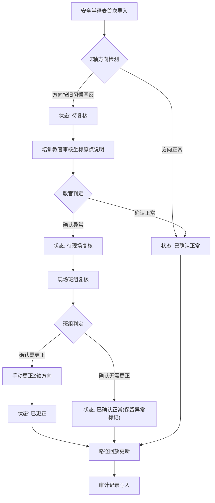

## 1. 产品概述

水库闸门开度展示系统是为现场班组与培训教官提供的闸门开度数据管理工具，解决安全半径表导入后口径不一致、Z 轴方向按旧习惯写反等常见错口径问题，确保导出明细、页面展示和接口返回始终读取同一份结果数据。

- 目标用户：培训教官（如老梁）、现场班组人员
- 核心价值：审计可追溯、口径单一化、异常不自动消解

## 2. 核心功能

### 2.1 用户角色

| 角色 | 进入方式 | 核心权限 |
|------|----------|----------|
| 培训教官 | 工号登录 | 导入安全半径表、审核坐标原点说明、标记异常、回滚操作 |
| 现场班组 | 工号登录 | 查看开度展示、复核异常记录、确认更正 |

### 2.2 功能模块

1. **安全半径表导入页**：上传安全半径表，自动解析并保留原始行号，标记 Z 轴方向异常
2. **坐标原点说明审核页**：培训教官逐条审核坐标原点说明，对 Z 轴方向按旧习惯写反的记录做标记而非自动修正
3. **闸门开度展示页**：汇总展示闸门开度数据，异常记录醒目标注，支持路径回放
4. **审计追踪页**：展示每条记录的原始行号、人工改动、当前处理状态，支持按状态筛选

### 2.3 页面详情

| 页面名称 | 模块名称 | 功能描述 |
|----------|----------|----------|
| 安全半径表导入页 | 文件上传 | 支持上传安全半径表文件（CSV/Excel），解析后保留原始行号 |
| 安全半径表导入页 | 导入预览 | 解析后展示预览表格，Z 轴方向异常行自动标黄，状态为"待复核" |
| 安全半径表导入页 | 导入确认 | 确认导入后写入统一数据源，所有视图读取同一份数据 |
| 坐标原点说明审核页 | 审核列表 | 展示所有坐标原点说明条目，Z 轴异常条目置顶并标红 |
| 坐标原点说明审核页 | 审核操作 | 教官可标记"确认异常"或"确认正常"，不提供直接修改功能 |
| 坐标原点说明审核页 | 异常标记 | Z 轴方向按旧习惯写反的记录标记为"待现场复核"，不可自动归正常 |
| 闸门开度展示页 | 开度汇总表 | 以表格展示闸门开度数据，异常行醒目标注 |
| 闸门开度展示页 | 路径回放 | 以时间线形式展示数据变更路径，支持回放每一步操作 |
| 闸门开度展示页 | 导出明细 | 导出与页面展示一致的明细数据，确保口径统一 |
| 审计追踪页 | 变更日志 | 展示每条记录的原始行号、人工改动内容、当前处理状态 |
| 审计追踪页 | 状态筛选 | 按状态筛选：待复核、已确认异常、已确认正常、已回滚 |
| 审计追踪页 | 回滚操作 | 支持将错误操作回滚至上一状态，回滚操作本身也记入审计 |

## 3. 核心流程

### 3.1 三步核心工作流

1. **第一步：安全半径表首次导入** — 上传文件，系统解析数据，Z 轴方向异常自动检测并标记为"待复核"
2. **第二步：培训教官补看坐标原点说明** — 教官逐条审核，对 Z 轴方向按旧习惯写反的记录标记"待现场复核"，不自动归正常
3. **第三步：路径回放更新** — 现场班组复核后，更新处理状态，路径回放记录完整变更链路

### 3.2 Z 轴方向异常处理流程

Z 轴方向按旧习惯写反是现场最常见的错口径，处理规则：
- **判**：导入时自动检测 Z 轴正方向是否与规范相反
- **改**：不自动修正，标记为"待现场复核"，由现场班组确认后手动更正
- **回滚**：任何手动更正都可回滚至上一状态，回滚操作记入审计

### 3.3 流程图

## 4. 用户界面设计

### 4.1 设计风格

- **主色调**：深蓝灰 (#1B2A4A) — 工业感、水利行业色
- **辅助色**：钢蓝 (#4682B4)、警示橙 (#E8751A)、安全绿 (#2D8B4E)
- **按钮风格**：圆角矩形，主操作用钢蓝底白字，危险操作用警示橙
- **字体**：标题用 Noto Sans SC Bold，正文用 Noto Sans SC Regular
- **布局风格**：左侧导航 + 右侧内容区，顶部状态栏
- **图标风格**：线性图标，2px 描边，与工业监控风格一致

### 4.2 页面设计概览

| 页面名称 | 模块名称 | UI 元素 |
|----------|----------|---------|
| 安全半径表导入页 | 文件上传 | 虚线拖拽区域，上传按钮，进度条动画 |
| 安全半径表导入页 | 导入预览 | 数据表格，异常行黄色背景，Z轴异常红色徽标 |
| 安全半径表导入页 | 导入确认 | 确认弹窗，异常计数徽标，确认/取消按钮 |
| 坐标原点说明审核页 | 审核列表 | 卡片列表，异常卡片左侧橙色竖条，状态徽标 |
| 坐标原点说明审核页 | 审核操作 | 确认正常(绿)/确认异常(橙)按钮，不可直接编辑 |
| 闸门开度展示页 | 开度汇总表 | 数据表格，异常行橙色左边框，悬浮提示异常原因 |
| 闸门开度展示页 | 路径回放 | 竖向时间线，每步操作节点，展开查看详情 |
| 审计追踪页 | 变更日志 | 时间线视图，操作人/操作时间/变更内容，回滚按钮 |

### 4.3 响应式设计

- 桌面优先设计，最小宽度 1280px
- 平板端简化侧边栏为图标模式
- 表格在小屏幕下支持横向滚动

## 5. 边界规则

### 5.1 Z 轴方向判断规则

| 规则编号 | 规则描述 | 处理方式 |
|----------|----------|----------|
| ZR-001 | Z 轴正方向数值为负（按旧习惯写反） | 标记"待复核"，不自动修正 |
| ZR-002 | Z 轴正方向数值为正（符合规范） | 标记"已确认正常" |
| ZR-003 | Z 轴数值缺失 | 标记"数据缺失"，要求补录 |

### 5.2 数据一致性规则

- 导出明细、页面展示、接口返回三处必须读取同一数据源
- 任何状态变更必须通过统一的状态机，不可绕过
- 回滚操作必须记录回滚原因和操作人

### 5.3 操作权限规则

- 培训教官：可标记异常、确认审核、发起回滚
- 现场班组：可复核异常、确认更正，不可直接修改数据
- 所有操作留痕，不可删除审计记录
