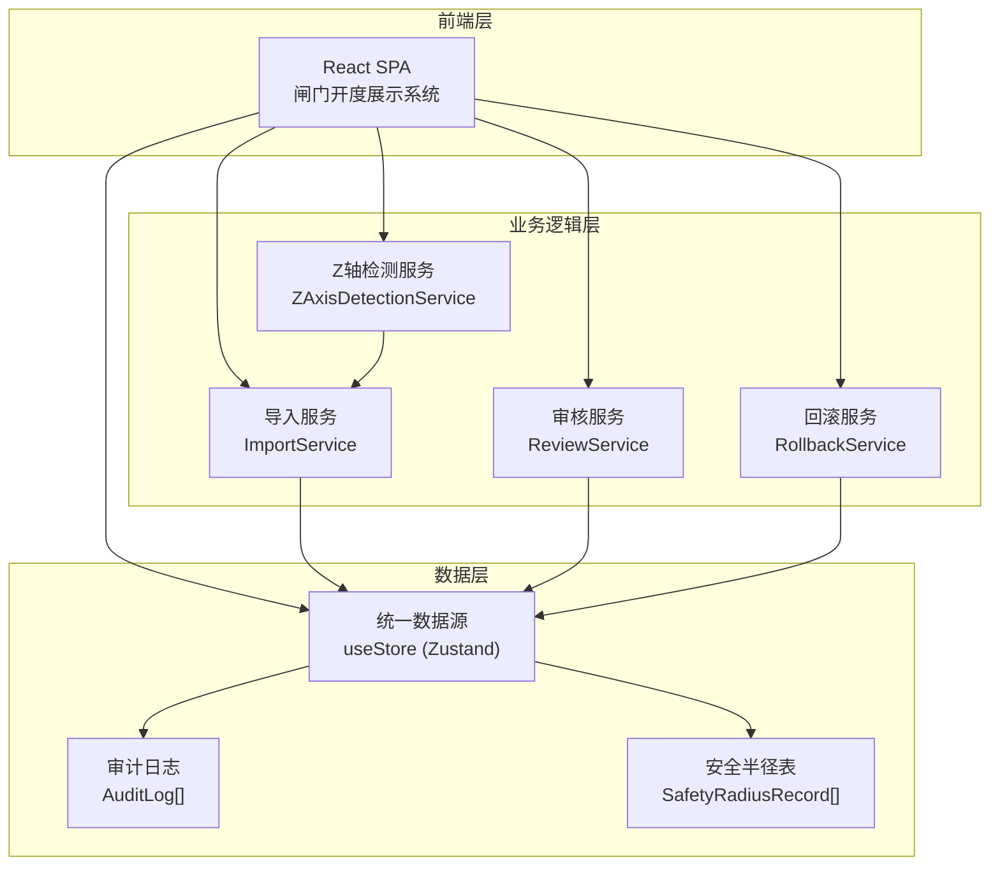
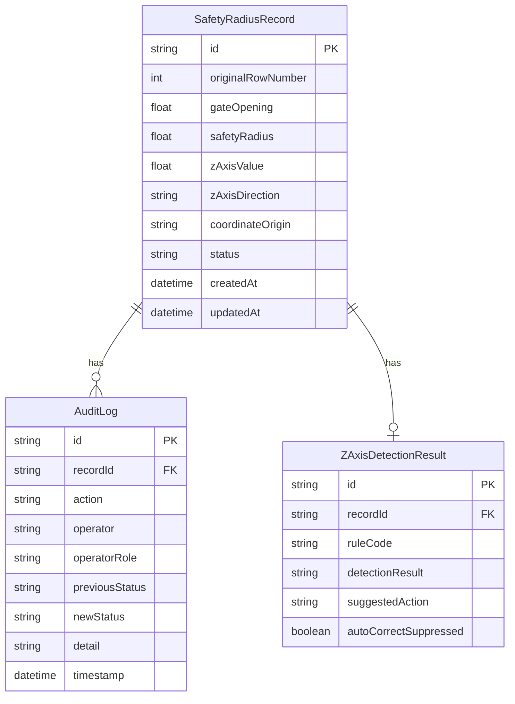
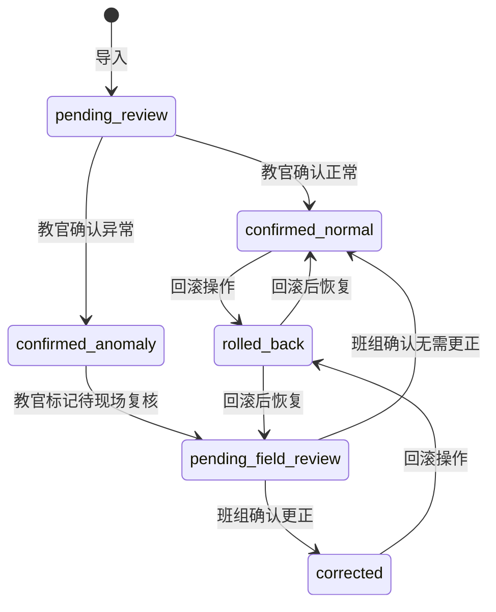

## 1. 架构设计



## 2. 技术说明

- **前端**：React@18 + TypeScript + TailwindCSS@3 + Vite
- **初始化工具**：Vite (react-ts 模板)
- **状态管理**：Zustand — 轻量级全局状态，确保导出明细、页面展示、接口返回读取同一 store
- **后端**：无后端，数据存储在浏览器 localStorage + 内存，模拟完整流程
- **数据库**：无数据库，使用 Zustand persist 中间件持久化到 localStorage
- **UI 组件库**：Headless UI + 自定义组件

## 3. 路由定义

| 路由 | 用途 |
|------|------|
| `/` | 首页：系统概览，快速导航至各功能页 |
| `/import` | 安全半径表导入页：上传、预览、确认导入 |
| `/review` | 坐标原点说明审核页：教官逐条审核 |
| `/display` | 闸门开度展示页：汇总展示 + 路径回放 |
| `/audit` | 审计追踪页：变更日志、状态筛选、回滚操作 |

## 4. 数据模型

### 4.1 数据模型定义



### 4.2 数据定义语言

#### SafetyRadiusRecord

```typescript
interface SafetyRadiusRecord {
  id: string;
  originalRowNumber: number;
  gateOpening: number;
  safetyRadius: number;
  zAxisValue: number;
  zAxisDirection: "positive" | "negative" | "missing";
  coordinateOrigin: string;
  status: "pending_review" | "confirmed_normal" | "confirmed_anomaly" | "pending_field_review" | "corrected" | "rolled_back";
  createdAt: string;
  updatedAt: string;
}
```

#### AuditLog

```typescript
interface AuditLog {
  id: string;
  recordId: string;
  action: "import" | "review_confirm_normal" | "review_confirm_anomaly" | "field_confirm_correct" | "field_confirm_no_change" | "rollback" | "manual_correction";
  operator: string;
  operatorRole: "instructor" | "field_team";
  previousStatus: SafetyRadiusRecord["status"];
  newStatus: SafetyRadiusRecord["status"];
  detail: string;
  timestamp: string;
}
```

#### ZAxisDetectionResult

```typescript
interface ZAxisDetectionResult {
  id: string;
  recordId: string;
  ruleCode: "ZR-001" | "ZR-002" | "ZR-003";
  detectionResult: string;
  suggestedAction: string;
  autoCorrectSuppressed: boolean;
}
```

### 4.3 状态机定义



## 5. 核心服务设计

### 5.1 Z轴检测服务 (ZAxisDetectionService)

```typescript
function detectZAxisDirection(zAxisValue: number | null): {
  ruleCode: "ZR-001" | "ZR-002" | "ZR-003";
  zAxisDirection: "positive" | "negative" | "missing";
  autoCorrectSuppressed: boolean;
} {
  if (zAxisValue === null || zAxisValue === undefined) {
    return { ruleCode: "ZR-003", zAxisDirection: "missing", autoCorrectSuppressed: false };
  }
  if (zAxisValue < 0) {
    return { ruleCode: "ZR-001", zAxisDirection: "negative", autoCorrectSuppressed: true };
  }
  return { ruleCode: "ZR-002", zAxisDirection: "positive", autoCorrectSuppressed: false };
}
```

**关键设计**：`autoCorrectSuppressed` 为 `true` 时，系统不自动修正 Z 轴方向，必须由现场班组手动确认。

### 5.2 统一数据源原则

- 所有组件通过 Zustand store 读取数据
- 导出功能从同一 store 生成数据
- API 模拟层从同一 store 返回数据
- 状态变更通过 store actions 统一处理，确保审计日志同步写入

### 5.3 回滚服务 (RollbackService)

- 回滚操作将记录状态恢复至上一状态
- 回滚操作本身写入审计日志
- 回滚需要填写回滚原因
- 回滚后路径回放时间线自动更新
