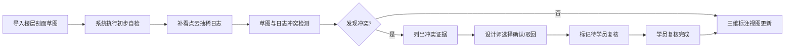
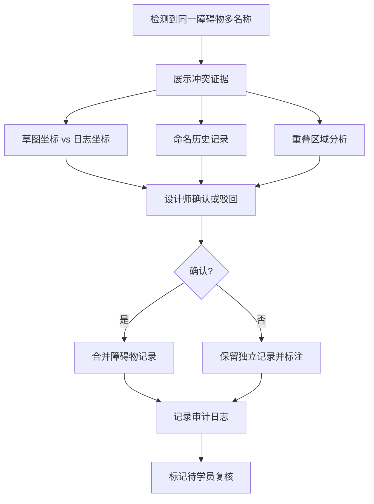

## 1. 产品概述
无人物流车路径沙盘是面向展陈设计师的专业工具，用于管理楼层剖面草图、点云抽稀日志和障碍物标注数据，核心解决"同一障碍物被标多个名字"的常见数据冲突问题。
- 核心目标：确保障碍物标注数据的一致性和可追溯性，支持培训学员复核流程
- 目标用户：展陈设计师（阿景）、培训学员、数据复核人员

## 2. 核心功能

### 2.1 用户角色
| 角色 | 注册方式 | 核心权限 |
|------|----------|----------|
| 展陈设计师 | 系统分配 | 导入草图、补看日志、确认/驳回冲突、导出数据 |
| 培训学员 | 系统分配 | 复核障碍物多名称记录、提交复核意见 |
| 管理员 | 系统分配 | 查看审计日志、管理用户权限 |

### 2.2 功能模块
1. **数据导入页**：楼层剖面草图导入、点云抽稀日志补录、重复导入检测
2. **标注工作台**：三维标注视图、障碍物多名称检测、冲突证据展示
3. **冲突处理页**：冲突列表、确认/驳回操作、复核留痕
4. **自检中心**：重复导入、多名称、补录重算、导出一致性检查
5. **审计追踪页**：变更历史、影响范围分析、导出明细

### 2.3 页面详情
| 页面名称 | 模块名称 | 功能描述 |
|---------|----------|----------|
| 数据导入页 | 草图导入模块 | 支持JSON格式导入、文件拖拽上传、重复导入自动检测 |
| 数据导入页 | 日志补录模块 | 点云抽稀日志上传、与现有草图数据自动比对、冲突预检测 |
| 标注工作台 | 三维视图 | Three.js渲染楼层剖面、障碍物高亮显示、视角控制 |
| 标注工作台 | 冲突检测面板 | 实时检测同一障碍物多名称、列出冲突证据、待复核标记 |
| 冲突处理页 | 冲突列表 | 按类型筛选冲突、显示修改人/时间、批量操作支持 |
| 冲突处理页 | 证据展示 | 草图与日志对比视图、坐标重叠分析、历史标注回溯 |
| 自检中心 | 自检仪表盘 | 四项核心检查进度、异常统计、最近自检时间 |
| 审计追踪页 | 变更记录 | 谁改了什么、为什么改、改完影响哪些结果的完整链路 |

## 3. 核心流程

### 标准三步流程
1. 展陈设计师第一次导入楼层剖面草图
2. 设计师补看点云抽稀日志，系统自动检测冲突
3. 三维标注视图更新，冲突标记高亮，等待学员复核

### 冲突处理流程

## 4. 用户界面设计

### 4.1 设计风格
- **主色调**：工业蓝 (#165DFF) - 体现专业、科技感
- **辅助色**：警示橙 (#FF7D00) - 冲突标记、琥珀绿 (#00B42A) - 正常状态
- **中性色**：深灰 (#1D2129) 背景、浅灰 (#4E5969) 文字
- **按钮风格**：直角边框、2px描边、点击时微下陷效果
- **字体**：JetBrains Mono（代码/数据）+ 思源黑体（正文）
- **布局风格**：左侧导航 + 右侧工作区、卡片式模块、高密度信息展示
- **图标风格**：线性图标、24x24标准尺寸、统一2px线宽

### 4.2 页面设计概述
| 页面名称 | 模块名称 | UI元素 |
|---------|----------|--------|
| 数据导入页 | 导入区域 | 拖拽上传框、文件预览、导入进度条、重复导入警告 |
| 标注工作台 | 三维视图 | 全屏Canvas、障碍物悬浮标签、视角控制按钮组 |
| 标注工作台 | 冲突面板 | 红色冲突卡片、证据折叠面板、确认/驳回按钮组 |
| 自检中心 | 仪表盘 | 四个检查项卡片、进度圆环、异常数字高亮 |
| 审计追踪页 | 时间线 | 垂直时间轴、变更diff对比、影响范围标签 |

### 4.3 响应式
- Desktop-first设计，主工作区最小支持1280px宽度
- 侧边栏可折叠，适配不同屏幕尺寸
- 三维视图区域自适应，保持纵横比
- 触控设备支持手势缩放和旋转

### 4.4 3D场景指导
- **环境**：暗色科技感背景，微弱网格地面
- **光照**：主方向光 + 环境光，障碍物边缘高光
- **相机**：透视相机，默认45度俯视角
- **交互**：鼠标拖拽旋转、滚轮缩放、双击聚焦
- **后处理**：轻微Bloom效果，冲突物体红色外发光
