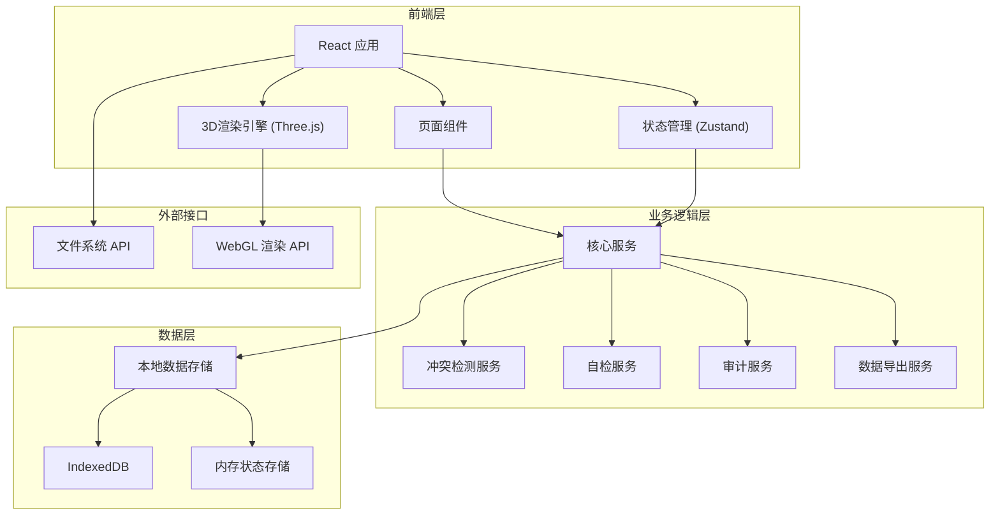
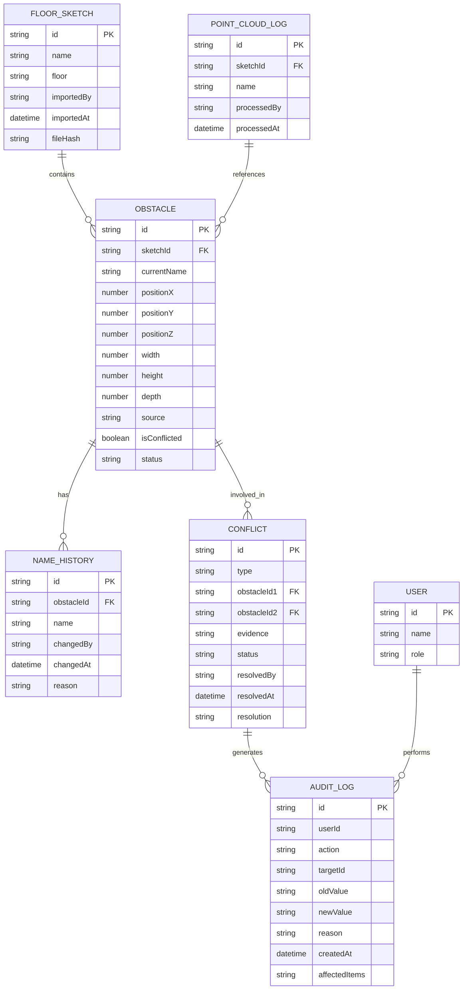
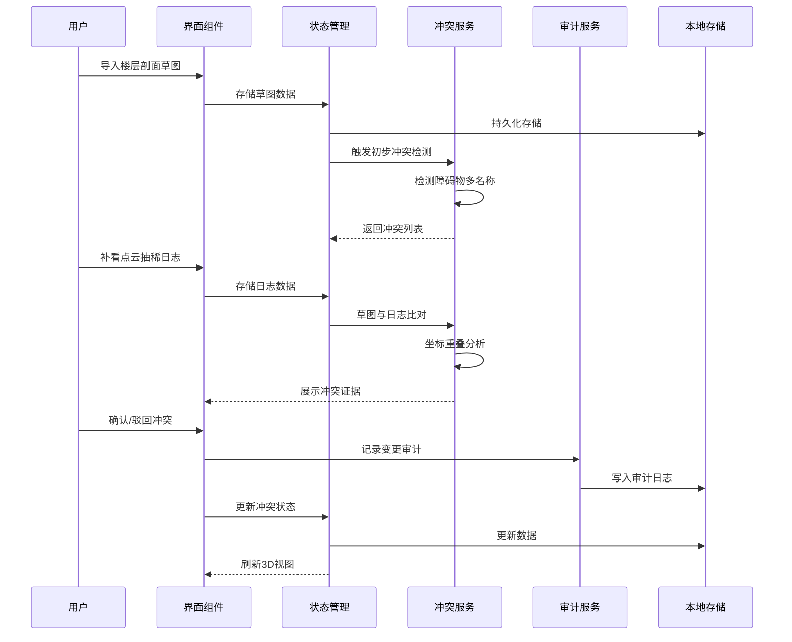

## 1. 架构设计



## 2. 技术描述
- **前端框架**: React@18 + TypeScript@5
- **构建工具**: Vite@5
- **样式方案**: TailwindCSS@3
- **状态管理**: Zustand@4
- **3D渲染**: Three.js@0.160 + @react-three/fiber@8 + @react-three/drei@9
- **本地存储**: IndexedDB (dexie.js@3)
- **图标库**: Lucide React@0.294
- **后端**: 无后端，纯前端应用，数据本地存储

## 3. 路由定义
| 路由 | 用途 |
|------|------|
| / | 数据导入页 - 楼层剖面草图和点云日志导入 |
| /workbench | 标注工作台 - 3D视图 + 冲突处理 |
| /conflicts | 冲突处理页 - 冲突列表和批量处理 |
| /self-check | 自检中心 - 四项核心自检功能 |
| /audit | 审计追踪页 - 变更历史和影响分析 |

## 4. 核心数据模型

### 4.1 数据模型定义



### 4.2 TypeScript 类型定义

```typescript
// 障碍物
interface Obstacle {
  id: string;
  sketchId: string;
  currentName: string;
  position: { x: number; y: number; z: number };
  dimensions: { width: number; height: number; depth: number };
  source: 'sketch' | 'point-cloud' | 'manual';
  isConflicted: boolean;
  status: 'pending' | 'confirmed' | 'rejected' | 'merged';
  nameHistory: NameHistory[];
  createdAt: Date;
  updatedAt: Date;
}

// 命名历史
interface NameHistory {
  id: string;
  name: string;
  changedBy: string;
  changedAt: Date;
  reason: string;
}

// 冲突记录
interface Conflict {
  id: string;
  type: 'duplicate-name' | 'position-overlap' | 'data-inconsistency';
  obstacleIds: string[];
  evidence: ConflictEvidence;
  status: 'pending' | 'confirmed' | 'rejected';
  resolvedBy?: string;
  resolvedAt?: Date;
  resolution?: string;
  requiresReview: boolean;
}

// 冲突证据
interface ConflictEvidence {
  sketchData: any;
  pointCloudData: any;
  overlapPercentage: number;
  nameSimilarity: number;
  coordinateDiff: { x: number; y: number; z: number };
}

// 楼层剖面草图
interface FloorSketch {
  id: string;
  name: string;
  floor: string;
  importedBy: string;
  importedAt: Date;
  fileHash: string;
  obstacles: Obstacle[];
}

// 点云抽稀日志
interface PointCloudLog {
  id: string;
  sketchId: string;
  name: string;
  processedBy: string;
  processedAt: Date;
  data: any;
}

// 审计日志
interface AuditLog {
  id: string;
  userId: string;
  userName: string;
  action: string;
  targetType: string;
  targetId: string;
  oldValue: any;
  newValue: any;
  reason: string;
  createdAt: Date;
  affectedItems: string[];
}

// 自检结果
interface SelfCheckResult {
  id: string;
  type: 'duplicate-import' | 'multiple-names' | 'recalculate' | 'export-consistency';
  status: 'pass' | 'warning' | 'fail';
  message: string;
  details: any;
  checkedAt: Date;
}
```

## 5. 核心服务接口

### 5.1 冲突检测服务
```typescript
interface ConflictDetectionService {
  detectDuplicateNames(obstacles: Obstacle[]): Conflict[];
  detectPositionOverlap(obstacles: Obstacle[]): Conflict[];
  detectSketchPointCloudInconsistency(
    sketch: FloorSketch, 
    pointCloud: PointCloudLog
  ): Conflict[];
  generateEvidence(conflict: Conflict): ConflictEvidence;
}
```

### 5.2 自检服务
```typescript
interface SelfCheckService {
  checkDuplicateImports(sketches: FloorSketch[]): SelfCheckResult;
  checkMultipleNames(obstacles: Obstacle[]): SelfCheckResult;
  checkRecalculateConsistency(obstacles: Obstacle[]): SelfCheckResult;
  checkExportConsistency(data: any): SelfCheckResult;
  runAllChecks(): Promise<SelfCheckResult[]>;
}
```

### 5.3 审计服务
```typescript
interface AuditService {
  logChange(
    userId: string,
    action: string,
    targetType: string,
    targetId: string,
    oldValue: any,
    newValue: any,
    reason: string,
    affectedItems: string[]
  ): void;
  getHistory(targetId: string): AuditLog[];
  getAffectedItems(changeId: string): string[];
}
```

## 6. 数据流设计


