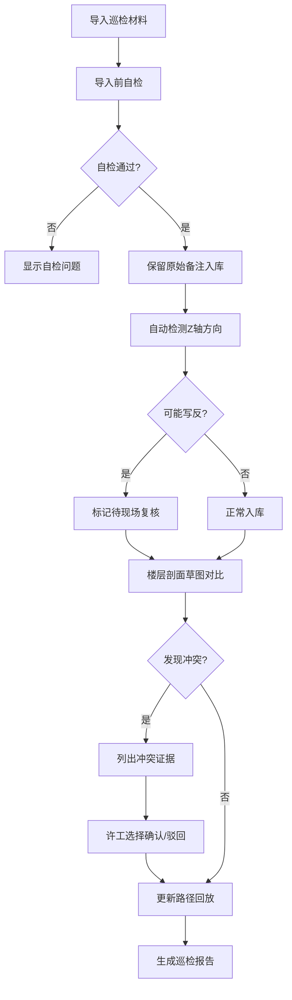

## 1. 产品概述

水下管线巡检标记系统是为设备工程师设计的专业巡检数据管理工具，解决水下管线巡检过程中原始备注保留、路径回放、冲突检测等核心问题。系统不将原始材料洗成干净数据，而是完整保留巡检现场的所有备注信息，供设备工程师和现场班组复核决策。

- 目标用户：设备工程师（许工）、现场班组、巡检数据录入人员
- 核心价值：保留原始巡检备注的完整性，提供冲突检测和复核机制，确保巡检数据的可追溯性和准确性

## 2. 核心功能

### 2.1 用户角色

| 角色 | 登记方式 | 核心权限 |
|------|----------|----------|
| 数据录入员 | 系统分配账号 | 导入巡检数据、查看路径回放 |
| 设备工程师 | 系统分配账号 | 冲突裁决、补录数据、导出报告 |
| 现场班组 | 系统分配账号 | 复核Z轴方向异常、确认巡检标记 |

### 2.2 功能模块

1. **数据导入模块**：支持三种材料导入（正常材料、错口径材料、补录材料），完整保留原始备注
2. **路径回放模块**：三维路径可视化、历史记录对比、时间轴播放
3. **冲突检测模块**：障碍物备注与楼层剖面草图一致性校验、冲突证据列示
4. **异常标记模块**：Z轴方向写反检测、待复核状态管理
5. **自检模块**：重复导入检测、补录后重算、导出一致性校验
6. **报告导出模块**：生成完整巡检报告、包含所有原始备注和复核记录

### 2.3 页面详情

| 页面名称 | 模块名称 | 功能描述 |
|----------|----------|------------|
| 首页仪表盘 | 任务概览 | 显示待处理冲突、待复核异常、巡检任务统计 |
| 数据导入页 | 材料上传 | 拖拽上传三种巡检材料，预览原始数据，执行导入前自检 |
| 路径回放页 | 三维可视化 | 管线路径3D展示、时间轴控制、历史版本对比、障碍物标记 |
| 冲突处理页 | 冲突列表 | 列示障碍物备注与楼层剖面草图冲突证据，提供确认/驳回操作 |
| 异常复核页 | Z轴异常列表 | 显示Z轴方向可能写反的记录，供现场班组复核 |
| 自检中心页 | 自检面板 | 执行重复导入、补录重算、导出一致性等自检项，显示自检报告 |
| 报告导出页 | 报告生成 | 选择巡检任务，生成包含完整原始数据的巡检报告 |

## 3. 核心流程

### 3.1 主流程描述

设备工程师许工按以下三步完成巡检标记处理：
1. **第一次导入**：数据录入员导入"水下管线巡检标记"原始材料，系统执行导入前自检，保留所有原始备注
2. **补看楼层剖面草图**：设备工程师许工查看楼层剖面草图，系统自动检测障碍物备注与草图的冲突，列出冲突证据
3. **路径回放更新**：根据复核结果更新路径回放，Z轴方向写反的记录保持待复核状态，留给现场班组确认

### 3.2 流程图

## 4. 用户界面设计

### 4.1 设计风格

- **主色调**：深海蓝 (#0A2463) 作为主色，代表水下和专业感
- **辅助色**：警示橙 (#E63946) 标记冲突和异常，确认绿 (#2A9D8F) 标记正常状态
- **中性色**：深灰 (#1D3557) 背景，浅灰 (#F1FAEE) 文本
- **按钮风格**：直角矩形、粗边框、工业感设计，hover时边框发光
- **字体**：标题使用 JetBrains Mono（等宽字体，技术感），正文使用 Noto Sans SC
- **布局风格**：工业仪表盘风格，左右分栏，左侧导航+右侧内容，数据网格密集但清晰
- **图标风格**：线性图标，使用Font Awesome的工业/工程类图标

### 4.2 页面设计概述

| 页面名称 | 模块名称 | UI元素 |
|----------|----------|--------|
| 首页仪表盘 | 任务概览 | 统计卡片网格、待办事项列表、快捷操作按钮、数据可视化图表 |
| 数据导入页 | 材料上传 | 拖拽上传区域、材料类型选择（正常/错口径/补录）、原始数据预览表格、自检结果面板 |
| 路径回放页 | 三维可视化 | 3D管线视图、时间轴滑块、历史版本下拉、障碍物标记点、备注悬浮窗 |
| 冲突处理页 | 冲突列表 | 冲突证据对比卡片（左侧障碍物备注、右侧楼层剖面草图）、确认/驳回按钮、裁决理由输入框 |
| 异常复核页 | Z轴异常列表 | 异常记录表格、原始坐标显示、复核按钮、现场班组备注区 |
| 自检中心页 | 自检面板 | 自检项列表（重复导入/Z轴检测/补录重算/导出一致）、执行按钮、自检报告详情 |
| 报告导出页 | 报告生成 | 任务选择器、报告预览、导出格式选择（PDF/Excel）、原始数据包含选项 |

### 4.3 响应式设计

- 采用桌面优先设计，最小支持宽度 1280px
- 路径回放的3D视图区域保持固定比例，侧边栏可折叠
- 数据表格支持横向滚动，适配小屏幕显示
- 触控设备优化：按钮最小高度 44px，重要操作区域增加触控反馈

### 4.4 3D场景指引

- **环境**：深海蓝渐变背景，轻微雾效模拟水下环境
- **光照**：主光源从上方45度照射，辅助光源突出管线轮廓，边缘光增强3D感
- **相机设置**：默认等轴测视角，支持轨道控制、缩放、平移
- **交互**：点击管线段显示详细信息，hover高亮，障碍物标记点闪烁动画
- **后期处理**：轻微Bloom效果，抗锯齿，管线使用半透明材质
- **性能**：管线使用简化几何体，最多同时显示2个历史版本进行对比

## 5. 关键业务规则

### 5.1 原始备注保留规则
- 所有导入的原始材料（包括手写备注、拍照记录、错口径标记）必须完整保留，不得清洗或格式化
- 系统在展示时同时显示原始备注和结构化数据，原始备注使用引用样式标注
- 导出报告时必须包含所有原始备注的扫描件或原文

### 5.2 冲突处理规则
- 障碍物备注与楼层剖面草图冲突时，系统仅列示冲突证据，不自动裁决
- 必须由设备工程师许工手动选择"确认"或"驳回"，并填写裁决理由
- 所有裁决记录永久保留，可追溯操作人和操作时间

### 5.3 Z轴方向处理规则
- 系统检测到Z轴方向可能按旧习惯写反时，仅标记为"待现场复核"
- 不自动修正坐标，必须由现场班组现场确认后才能更新
- 复核记录包含班组人员签字、现场照片、复核时间

### 5.4 自检规则
- 每次导入前必须执行自检，自检不通过不能导入
- 补录材料导入后必须自动触发路径重算
- 导出前执行一致性校验，确保导出数据与系统内数据一致
