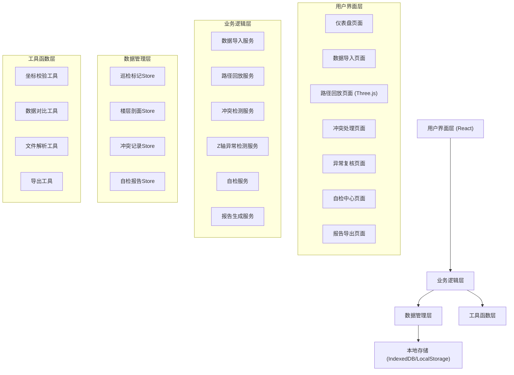
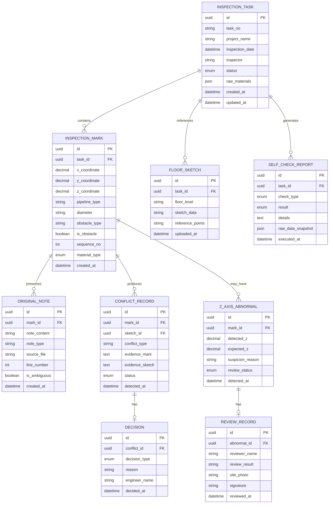

## 1. 架构设计



## 2. 技术描述

- **前端框架**: React@18 + TypeScript
- **构建工具**: Vite@5
- **样式方案**: TailwindCSS@3
- **状态管理**: Zustand (轻量级状态管理)
- **3D可视化**: Three.js + @react-three/fiber + @react-three/drei
- **路由**: React Router@6
- **文件解析**: SheetJS (xlsx) + PapaParse (CSV)
- **数据持久化**: IndexedDB (Dexie.js) + LocalStorage
- **日期处理**: Day.js
- **UI组件库**: HeadlessUI (无样式组件) + Heroicons
- **图表库**: Recharts
- **导出功能**: jsPDF + xlsx
- **图标**: Font Awesome 6 (工业/工程类图标)

## 3. 路由定义

| 路由 | 页面 | 用途 |
|------|------|------|
| / | 仪表盘 | 任务概览、统计信息、快捷入口 |
| /import | 数据导入 | 上传巡检材料、预览原始数据、导入前自检 |
| /replay | 路径回放 | 3D管线可视化、路径回放、历史对比 |
| /conflicts | 冲突处理 | 障碍物备注与草图冲突列表、裁决操作 |
| /abnormal | 异常复核 | Z轴方向异常列表、现场复核操作 |
| /self-check | 自检中心 | 执行自检项、查看自检报告 |
| /report | 报告导出 | 生成巡检报告、导出PDF/Excel |
| /sample | 样例演示 | 新人学习用的完整样例流程 |

## 4. 数据模型

### 4.1 数据模型ER图



### 4.2 TypeScript 类型定义

```typescript
// 核心实体类型
type MaterialType = 'normal' | 'wrong_diameter' | 'supplementary';
type ConflictStatus = 'pending' | 'confirmed' | 'rejected';
type ReviewStatus = 'pending' | 'approved' | 'corrected';
type CheckResult = 'pass' | 'fail' | 'warning';
type TaskStatus = 'draft' | 'imported' | 'conflict_detected' | 'reviewing' | 'completed';

interface InspectionTask {
  id: string;
  taskNo: string;
  projectName: string;
  inspectionDate: string;
  inspector: string;
  status: TaskStatus;
  rawMaterials: RawMaterial[];
  createdAt: string;
  updatedAt: string;
}

interface InspectionMark {
  id: string;
  taskId: string;
  x: number;
  y: number;
  z: number;
  pipelineType: string;
  diameter: string;
  obstacleType?: string;
  isObstacle: boolean;
  sequenceNo: number;
  materialType: MaterialType;
  originalNotes: OriginalNote[];
  createdAt: string;
}

interface OriginalNote {
  id: string;
  markId: string;
  content: string;
  noteType: 'handwritten' | 'photo' | 'typed' | 'ambiguous';
  sourceFile: string;
  lineNumber?: number;
  isAmbiguous: boolean;
  createdAt: string;
}

interface FloorSketch {
  id: string;
  taskId: string;
  floorLevel: string;
  sketchData: string;
  referencePoints: ReferencePoint[];
  uploadedAt: string;
}

interface ConflictRecord {
  id: string;
  markId: string;
  sketchId: string;
  conflictType: 'obstacle_mismatch' | 'position_mismatch' | 'diameter_mismatch';
  evidenceFromMark: string;
  evidenceFromSketch: string;
  status: ConflictStatus;
  decision?: Decision;
  detectedAt: string;
}

interface Decision {
  id: string;
  conflictId: string;
  decisionType: 'confirm' | 'reject';
  reason: string;
  engineerName: string;
  decidedAt: string;
}

interface ZAxisAbnormal {
  id: string;
  markId: string;
  detectedZ: number;
  expectedZ: number;
  suspicionReason: string;
  reviewStatus: ReviewStatus;
  reviewRecord?: ReviewRecord;
  detectedAt: string;
}

interface ReviewRecord {
  id: string;
  abnormalId: string;
  reviewerName: string;
  reviewResult: string;
  sitePhoto?: string;
  signature: string;
  reviewedAt: string;
}

interface SelfCheckReport {
  id: string;
  taskId: string;
  checkType: 'duplicate_import' | 'z_axis_check' | 'recalculation' | 'export_consistency';
  result: CheckResult;
  details: string;
  rawDataSnapshot: any;
  executedAt: string;
}

interface RawMaterial {
  id: string;
  fileType: 'csv' | 'xlsx' | 'json';
  fileName: string;
  materialType: MaterialType;
  uploadedAt: string;
}

interface ReferencePoint {
  x: number;
  y: number;
  z: number;
  label: string;
}
```

## 5. 核心服务接口

### 5.1 数据导入服务

```typescript
interface ImportService {
  parseFile(file: File, materialType: MaterialType): Promise<{
    marks: InspectionMark[];
    rawNotes: OriginalNote[];
    rawContent: string;
  }>;
  
  validateBeforeImport(marks: InspectionMark[], taskId: string): Promise<SelfCheckReport[]>;
  
  importMarks(marks: InspectionMark[], taskId: string): Promise<InspectionTask>;
  
  detectDuplicates(newMarks: InspectionMark[], existingMarks: InspectionMark[]): InspectionMark[];
}
```

### 5.2 路径回放服务

```typescript
interface PathReplayService {
  generatePath(marks: InspectionMark[]): PathPoint[];
  
  getHistoricalVersions(taskId: string): InspectionTask[];
  
  compareVersions(versionA: InspectionTask[], versionB: InspectionTask[]): Difference[];
  
  recalculatePath(taskId: string): Promise<PathPoint[]>;
}
```

### 5.3 冲突检测服务

```typescript
interface ConflictDetectionService {
  detectConflicts(taskId: string): Promise<ConflictRecord[]>;
  
  buildConflictEvidence(mark: InspectionMark, sketch: FloorSketch): {
    markEvidence: string;
    sketchEvidence: string;
  };
  
  resolveConflict(conflictId: string, decision: 'confirm' | 'reject', reason: string, engineerName: string): Promise<ConflictRecord>;
}
```

### 5.4 Z轴异常检测服务

```typescript
interface ZAxisDetectionService {
  detectAbnormalities(marks: InspectionMark[]): ZAxisAbnormal[];
  
  checkOldConvention(z: number, sequenceNo: number): boolean;
  
  submitReview(abnormalId: string, result: string, reviewerName: string, signature: string, sitePhoto?: string): Promise<ZAxisAbnormal>;
}
```

### 5.5 自检服务

```typescript
interface SelfCheckService {
  runAllChecks(taskId: string): Promise<SelfCheckReport[]>;
  
  checkDuplicateImport(taskId: string): Promise<SelfCheckReport>;
  
  checkZAxisDirection(taskId: string): Promise<SelfCheckReport>;
  
  runRecalculation(taskId: string): Promise<SelfCheckReport>;
  
  checkExportConsistency(taskId: string): Promise<SelfCheckReport>;
}
```

### 5.6 报告生成服务

```typescript
interface ReportService {
  generateReport(taskId: string, includeRawData: boolean): Promise<ReportData>;
  
  exportToPDF(reportData: ReportData): Promise<Blob>;
  
  exportToExcel(reportData: ReportData): Promise<Blob>;
  
  generateSampleWalkthrough(): SampleStep[];
}
```

## 6. 项目目录结构

```
src/
├── components/          # 可复用组件
│   ├── layout/         # 布局组件 (Sidebar, Header, etc.)
│   ├── ui/             # 基础UI组件 (Button, Card, Table, etc.)
│   ├── three/          # Three.js 3D组件
│   └── features/       # 业务组件
├── pages/              # 页面组件
├── store/              # Zustand状态管理
├── services/           # 业务逻辑服务
├── types/              # TypeScript类型定义
├── utils/              # 工具函数
│   ├── coordinate.ts   # 坐标校验工具
│   ├── comparison.ts   # 数据对比工具
│   ├── fileParser.ts   # 文件解析工具
│   └── exporter.ts     # 导出工具
├── hooks/              # 自定义Hooks
├── sample/             # 样例数据
├── assets/             # 静态资源
├── App.tsx
├── main.tsx
└── index.css
```

## 7. 开发规范

### 7.1 代码规范
- 使用 ESLint + Prettier 进行代码格式化
- 组件采用 PascalCase 命名，文件与组件名一致
- 自定义 Hook 以 `use` 开头
- 类型定义文件以 `.d.ts` 或 `.types.ts` 结尾
- 工具函数采用纯函数写法，便于单元测试

### 7.2 状态管理规范
- 全局状态使用 Zustand Store，按领域划分
- 组件本地状态使用 useState/useReducer
- 避免状态冗余，派生状态使用 useMemo 计算

### 7.3 数据完整性规范
- 所有原始备注数据永不修改，仅追加
- 每次操作记录操作人和时间戳
- 使用 IndexedDB 存储大量数据，LocalStorage 存储配置
- 导入数据前必须进行数据完整性校验

### 7.4 测试策略
- 核心业务逻辑使用 Vitest 编写单元测试
- 重点覆盖：坐标校验、冲突检测、Z轴检测、自检逻辑
- 样例数据用于端到端测试和新人培训
