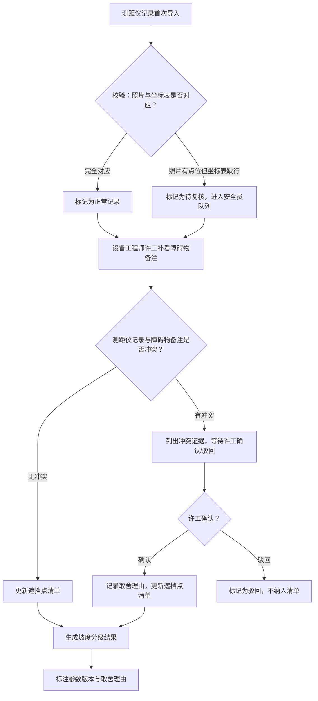

## 1. 产品概述

滑雪场雪道坡度分级管理系统，用于管理雪道坡度测量数据的导入、审核、冲突处理与分级记录。系统解决的核心问题是：测距仪记录与障碍物备注之间的数据不一致（如照片有点位但坐标表缺行）、旧口径补录数据的追溯，以及确保安全员与设备工程师之间的审批流程不被跳过。

目标用户：滑雪场安全员（负责复核）、设备工程师许工（负责确认/驳回冲突）、管理层（查看分级结果与历史记录）。

## 2. 核心功能

### 2.1 用户角色

| 角色 | 进入方式 | 核心权限 |
|------|----------|----------|
| 安全员 | 系统登录 | 导入测距仪记录、复核异常数据、查看遮挡点清单与历史记录 |
| 设备工程师（许工） | 系统登录 | 补看障碍物备注、确认或驳回冲突、更新遮挡点清单 |
| 管理层 | 系统登录 | 查看分级结果、参数版本与取舍理由、历史审计记录 |

### 2.2 功能模块

1. **数据导入页**：测距仪记录首次导入、障碍物备注补录、数据预览与校验
2. **审核工作台页**：冲突检测与证据展示、设备工程师确认/驳回、安全员复核队列
3. **遮挡点清单页**：遮挡点汇总列表、状态追踪（正常/待复核/已补录）、历史记录对账
4. **分级结果页**：雪道坡度分级展示、参数版本记录、取舍理由备注

### 2.3 页面详情

| 页面名称 | 模块名称 | 功能描述 |
|----------|----------|----------|
| 数据导入页 | 测距仪记录导入 | 上传/粘贴测距仪原始数据，系统自动解析点位与坐标，校验照片与坐标表的对应关系 |
| 数据导入页 | 障碍物备注补录 | 录入或导入障碍物备注信息，系统将其与已有测距仪记录匹配 |
| 数据导入页 | 数据校验提示 | 校验结果实时展示：正常/照片有点位但坐标表缺行/备注补录，不同类型用不同颜色与图标标记 |
| 审核工作台页 | 冲突检测 | 自动比对测距仪记录与障碍物备注，发现矛盾时列出冲突证据（来源、数值、时间） |
| 审核工作台页 | 工程师审批 | 设备工程师许工查看冲突证据，选择"确认"或"驳回"，填写取舍理由 |
| 审核工作台页 | 安全员复核队列 | 照片有点位但坐标表缺行的记录不归入正常，自动进入安全员复核队列 |
| 遮挡点清单页 | 遮挡点列表 | 按状态分类展示所有遮挡点，支持筛选与搜索 |
| 遮挡点清单页 | 历史记录对账 | 每条遮挡点的完整变更历史，可追溯处理结果来源 |
| 分级结果页 | 坡度分级展示 | 雪道按坡度分级（初级/中级/高级/专家），展示分级依据 |
| 分级结果页 | 参数版本与取舍 | 每条分级结果旁标注使用的计算参数版本、模型版本、以及冲突时的取舍理由 |

## 3. 核心流程

### 3.1 三步审核流程

系统必须支持完整的"测距仪记录导入 → 设备工程师补看障碍物备注 → 遮挡点清单更新"三步流程。任何一步未完成，后续步骤不可跳过执行。

### 3.2 三种数据记录处理

- **顺利记录**：照片与坐标表完全对应，无冲突，自动归入正常
- **照片有点位但坐标表缺一行**：不自动归入正常，进入安全员复核队列，标记为"待复核"
- **从障碍物备注补来的旧口径**：标记为"补录"，需设备工程师确认后方可纳入遮挡点清单

### 3.3 冲突处理流程

当测距仪记录与障碍物备注互相矛盾时：
1. 系统列出冲突证据（来源字段、数值差异、采集时间）
2. 不自动拍板，等待设备工程师许工选择"确认"或"驳回"
3. 许工必须填写取舍理由
4. 冲突处理结果记入历史记录

### 3.4 流程图

## 4. 用户界面设计

### 4.1 设计风格

- **主色调**：冷白底色 (#F8FAFB) + 冰蓝强调色 (#0EA5E9) + 雪峰深灰 (#1E293B)，呼应雪山冷冽质感
- **辅助色**：琥珀警示 (#F59E0B) 用于待复核状态、翡翠确认 (#10B981) 用于正常状态、玫瑰驳回 (#EF4444) 用于冲突驳回
- **按钮风格**：圆角 (8px)、微阴影、悬停时颜色加深 + 微上移
- **字体**：标题使用 "DM Sans" (粗体 700)，正文使用 "Noto Sans SC" (常规 400)
- **布局风格**：左侧固定导航栏 + 右侧内容区，卡片式内容分块
- **图标风格**：线性图标 (Lucide 风格)，2px 描边

### 4.2 页面设计概览

| 页面名称 | 模块名称 | UI 元素 |
|----------|----------|---------|
| 数据导入页 | 测距仪记录导入 | 拖拽上传区（虚线边框 + 冰蓝高亮）、数据预览表格、校验结果状态标签 |
| 数据导入页 | 障碍物备注补录 | 文本输入区 + 粘贴导入按钮、匹配结果高亮展示 |
| 数据导入页 | 数据校验提示 | 三色标签（绿/琥珀/玫瑰）、行内错误提示、统计摘要卡片 |
| 审核工作台页 | 冲突检测 | 左右对比面板（测距仪 vs 障碍物备注）、冲突高亮行、证据摘录卡片 |
| 审核工作台页 | 工程师审批 | 确认/驳回按钮组、取舍理由文本框、历史审批时间线 |
| 审核工作台页 | 安全员复核队列 | 待复核列表（琥珀边框卡片）、快速复核操作栏 |
| 遮挡点清单页 | 遮挡点列表 | 可排序表格、状态筛选标签组、展开行显示详情 |
| 遮挡点清单页 | 历史记录对账 | 时间线视图、变更类型标签、操作人头像 |
| 分级结果页 | 坡度分级展示 | 雪道卡片（坡度等级色带）、分级依据摘要 |
| 分级结果页 | 参数版本与取舍 | 参数版本标签、取舍理由折叠面板、计算模型版本号 |

### 4.3 响应式设计

桌面优先设计，左侧导航栏在 1024px 以下收起为图标模式，内容区自适应宽度。表格在窄屏下提供横向滚动。

### 4.4 样例数据

系统内置三组样例数据，用于展示三种不同的处理结果：

| 样例编号 | 类型 | 描述 | 预期处理结果 |
|----------|------|------|------------|
| S-001 | 顺利记录 | 照片3张，坐标表3行，完全对应 | 自动标记为正常，直接进入遮挡点清单 |
| S-002 | 照片有点位但坐标表缺一行 | 照片4张，坐标表仅3行，缺失第2点位坐标 | 标记为待复核，进入安全员队列，不自动归正常 |
| S-003 | 旧口径补录 | 坐标来自障碍物备注而非测距仪，与测距仪记录数值存在差异 | 标记为补录，触发冲突检测，需许工确认或驳回 |
