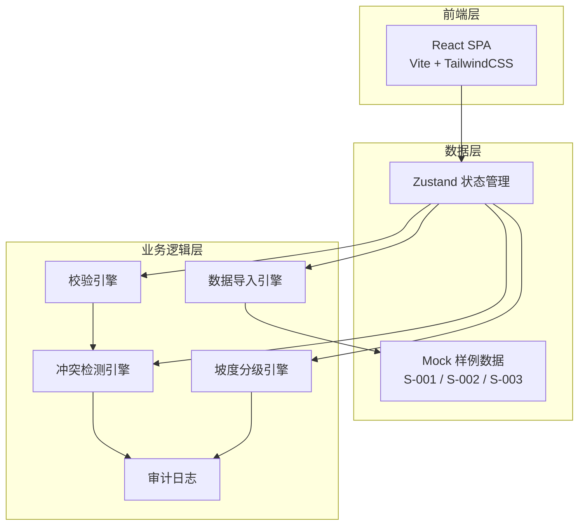
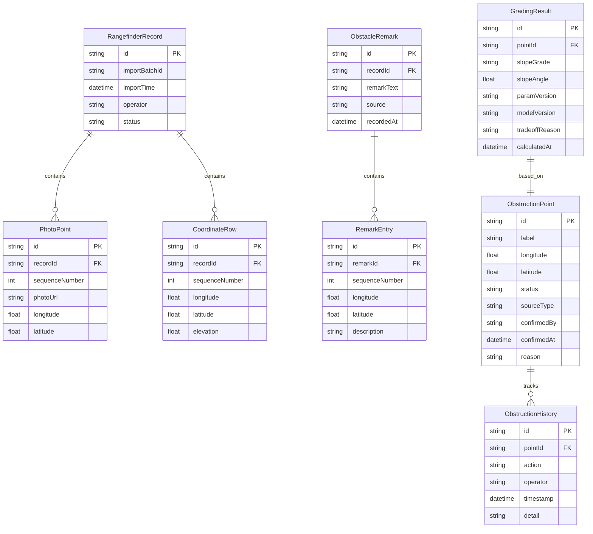

## 1. 架构设计



纯前端架构，无需后端服务。数据持久化使用 localStorage，状态管理使用 Zustand。

## 2. 技术说明

- **前端**：React@18 + TailwindCSS@3 + Vite
- **初始化工具**：Vite (react-ts 模板)
- **后端**：无（纯前端应用，使用 Mock 数据）
- **状态管理**：Zustand
- **数据库**：localStorage（浏览器本地存储）
- **图标库**：Lucide React
- **字体**：DM Sans (标题) + Noto Sans SC (正文)，通过 Google Fonts 加载

## 3. 路由定义

| 路由 | 用途 |
|------|------|
| `/` | 重定向至数据导入页 |
| `/import` | 数据导入页 - 测距仪记录导入与障碍物备注补录 |
| `/review` | 审核工作台 - 冲突检测、工程师审批、安全员复核 |
| `/obstructions` | 遮挡点清单 - 遮挡点列表与历史记录对账 |
| `/grading` | 分级结果页 - 坡度分级展示与参数版本记录 |

## 4. 数据模型

### 4.1 数据模型定义



### 4.2 核心类型定义

```typescript
type RecordStatus = "normal" | "pending_review" | "supplemented" | "conflict" | "rejected"

type SlopeGrade = "beginner" | "intermediate" | "advanced" | "expert"

type SourceType = "rangefinder" | "obstacle_remark" | "manual_supplement"

interface ConflictEvidence {
  field: string
  rangefinderValue: string
  remarkValue: string
  timestamp: string
}

interface ApprovalAction {
  action: "confirm" | "reject"
  operator: string
  reason: string
  timestamp: string
}
```

## 5. 样例数据结构

系统内置三组样例数据，每组对应一种处理路径：

### S-001（顺利记录）
- 测距仪记录：3个照片点位 + 3行坐标表，完全对应
- 障碍物备注：无冲突
- 预期结果：自动标记为 normal，直接进入遮挡点清单

### S-002（照片有点位但坐标表缺一行）
- 测距仪记录：4个照片点位 + 3行坐标表（缺第2点位坐标）
- 障碍物备注：无法匹配缺失点位
- 预期结果：标记为 pending_review，进入安全员复核队列

### S-003（旧口径补录）
- 测距仪记录：3个照片点位 + 3行坐标表
- 障碍物备注：第2点位坐标与测距仪记录不一致
- 预期结果：标记为 conflict，触发冲突检测，需许工确认或驳回
