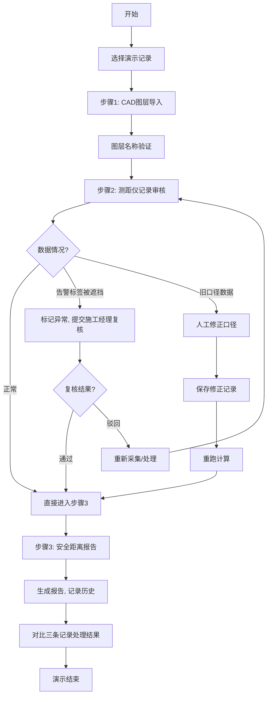

## 1. 产品概述
剧场声场反射点演示系统，用于航测内业人员培训和流程演示。通过模拟真实工作场景中的三种典型情况（正常记录、移动端截图遮挡告警标签、旧口径补录数据），帮助新人理解从 CAD 图层导入到安全距离报告生成的完整处理流程。

- 核心问题：航测内业工作中常遇到临时补材料、告警标签被遮挡、数据口径不一致等问题，需要直观的演示工具
- 目标用户：航测内业小魏及新入职的内业处理人员、施工经理
- 产品价值：提供小而真的演示数据，直观展示不同问题的处理方式和结果差异

## 2. 核心功能

### 2.1 用户角色
| 角色 | 注册方式 | 核心权限 |
|------|----------|----------|
| 航测内业人员 | 无需注册（演示系统） | 导入 CAD 图层、查看测距仪记录、人工修正数据、生成安全距离报告 |
| 施工经理 | 无需注册（演示系统） | 复核被遮挡的告警标签、确认异常处理结果 |

### 2.2 功能模块
1. **工作流主页**：三步流程导航、记录列表、状态看板
2. **CAD 图层导入**：图层信息展示、图层匹配、第一次导入验证
3. **测距仪记录审核**：记录详情、异常标记、人工修正入口
4. **安全距离报告**：报告生成、历史记录对比、结果展示
5. **施工经理复核**：待复核列表、复核操作、异常确认

### 2.3 页面详情
| 页面名称 | 模块名称 | 功能描述 |
|----------|----------|----------|
| 工作流主页 | 流程导航 | 展示三步处理流程：CAD 导入 → 测距仪审核 → 安全报告 |
| 工作流主页 | 记录列表 | 展示三条演示记录及其处理状态和结果 |
| 工作流主页 | 历史时间线 | 展示每条记录的完整操作历史和版本变化 |
| CAD 图层导入 | 图层列表 | 展示 CAD 图层名称、类型、导入状态 |
| CAD 图层导入 | 验证面板 | 检查图层命名规范、匹配测距仪点位 |
| 测距仪记录审核 | 记录卡片 | 展示测距仪编号、距离值、采集时间、照片附件 |
| 测距仪记录审核 | 异常处理 | 标记告警标签遮挡、发起人工修正、提交施工经理复核 |
| 安全距离报告 | 报告预览 | 展示计算结果、安全距离判定、告警信息 |
| 安全距离报告 | 结果对比 | 并排展示三条记录的不同处理结果 |
| 施工经理复核 | 复核面板 | 展示待复核项、遮挡照片对比、确认/驳回操作 |

## 3. 核心流程

用户打开演示系统，选择一条记录开始处理，依次完成三步流程。系统预置三条典型记录，分别对应不同的处理路径：

1. **顺利记录（记录A）**：CAD 图层正常 → 测距仪数据完整 → 直接生成安全报告
2. **告警标签被遮挡（记录B）**：CAD 图层正常 → 测距仪照片遮挡告警 → 提交施工经理复核 → 复核通过后生成报告
3. **旧口径补录（记录C）**：CAD 图层正常 → 测距仪数据口径错误 → 人工修正数据 → 重新计算 → 生成更新后的报告

## 4. 用户界面设计

### 4.1 设计风格
- **设计方向**：工业/实用型设计，符合工程测量专业工具的调性，严肃但不沉闷
- **主色调**：深蓝（#1e3a5f）代表专业可靠，搭配橙色（#f97316）作为告警强调色
- **辅助色**：绿色（#22c55e）表示正常通过，红色（#ef4444）表示严重错误，琥珀色（#f59e0b）表示待复核
- **按钮风格**：直角设计，带有细微边框和按下反馈，体现工业软件的严谨感
- **字体**：标题使用 "JetBrains Mono" 等宽字体体现工程感，正文使用 "Inter" 确保可读性
- **布局风格**：卡片式布局配合左侧导航栏，顶部显示当前步骤进度条
- **图标风格**：使用 lucide 线性图标，保持简洁专业

### 4.2 页面设计概述
| 页面名称 | 模块名称 | UI 元素 |
|----------|----------|---------|
| 工作流主页 | 流程导航 | 顶部三步进度条、步骤名称、当前状态指示器 |
| 工作流主页 | 记录列表 | 三列卡片布局，每张卡片显示记录编号、类型标签、状态徽章、操作按钮 |
| 工作流主页 | 历史时间线 | 左侧竖线时间轴，右侧展示每次操作的时间、操作人员、内容摘要 |
| CAD 图层导入 | 图层列表 | 表格展示图层名称、颜色、对象数量、验证状态 |
| 测距仪记录审核 | 记录卡片 | 左侧照片预览（可放大）、右侧数据字段、异常标记按钮、修正表单 |
| 安全距离报告 | 报告预览 | 数据卡片网格、安全距离计算结果高亮、告警信息红色边框 |
| 安全距离报告 | 结果对比 | 三栏并排布局，每栏对应一条记录的最终结果，用不同背景色区分状态 |
| 施工经理复核 | 复核面板 | 左右对比布局（遮挡照片 vs 正常照片）、复核意见输入框、通过/驳回按钮 |

### 4.3 响应性
- 桌面端优先设计，针对 1440px 和 1920px 宽度优化
- 平板端自适应：记录列表改为两列布局
- 移动端单列布局，重点信息前置，操作按钮底部固定
- 表格区域支持横向滚动以适配小屏幕

### 4.4 动画效果
- 页面加载：内容区域淡入，配合轻微上移效果
- 步骤切换：横向滑动过渡，配合进度条平滑填充动画
- 状态变化：状态徽章颜色渐变过渡，记录卡片轻微缩放反馈
- 错误提示：从顶部滑入，边框呼吸灯效果引起注意
