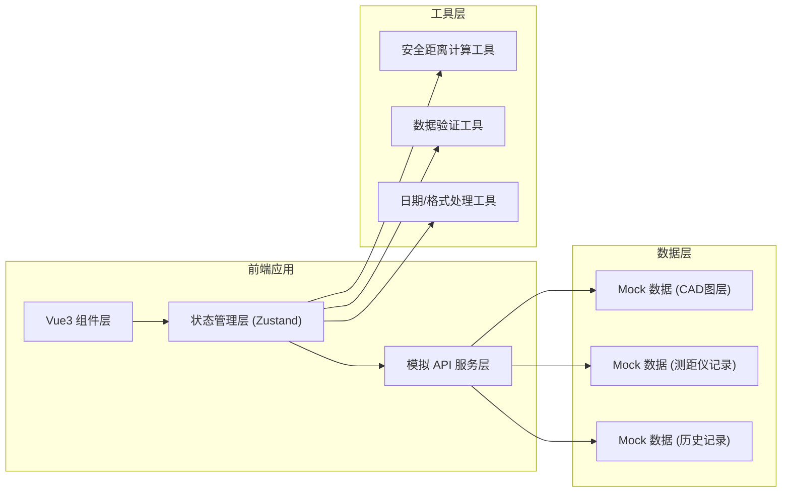
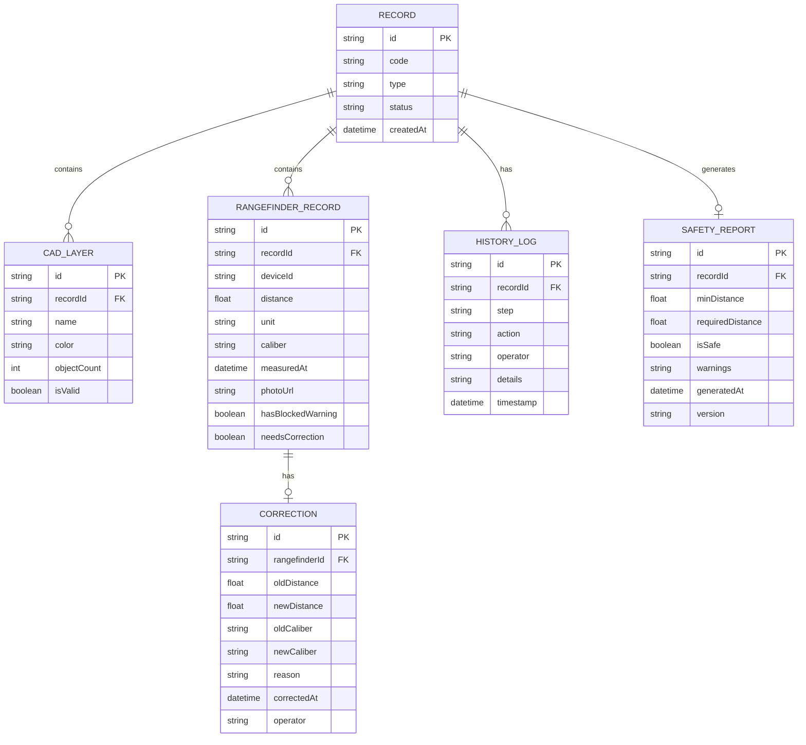

## 1. 架构设计



## 2. 技术描述

- **前端框架**: Vue@3.4 + TypeScript@5.4
- **构建工具**: Vite@5.2
- **状态管理**: Zustand@4.5
- **路由**: Vue Router@4.3
- **样式**: Tailwind CSS@3.4
- **图标库**: Lucide Vue Next@0.378
- **后端**: 无后端，全部使用 Mock 数据
- **数据存储**: 前端内存存储 + LocalStorage 持久化演示进度

## 3. 路由定义

| 路由 | 页面组件 | 用途 |
|------|----------|------|
| `/` | `WorkflowHome.vue` | 工作流主页，记录列表和总览 |
| `/cad-import/:recordId` | `CadImport.vue` | CAD 图层导入页面 |
| `/rangefinder/:recordId` | `RangefinderReview.vue` | 测距仪记录审核页面 |
| `/safety-report/:recordId` | `SafetyReport.vue` | 安全距离报告页面 |
| `/manager-review` | `ManagerReview.vue` | 施工经理复核页面 |
| `/result-comparison` | `ResultComparison.vue` | 三条记录结果对比页面 |

## 4. 数据模型

### 4.1 数据模型定义



### 4.2 TypeScript 类型定义

```typescript
// 记录类型
type RecordType = 'normal' | 'blocked-warning' | 'old-caliber';
type RecordStatus = 'pending' | 'cad-imported' | 'under-review' | 'pending-manager' | 'corrected' | 'report-generated';

interface CadLayer {
  id: string;
  recordId: string;
  name: string;
  color: string;
  objectCount: number;
  isValid: boolean;
  validationMessage?: string;
}

interface RangefinderRecord {
  id: string;
  recordId: string;
  deviceId: string;
  distance: number;
  unit: string;
  caliber: string;
  measuredAt: string;
  photoUrl: string;
  hasBlockedWarning: boolean;
  needsCorrection: boolean;
  warningLabelVisible: boolean;
}

interface Correction {
  id: string;
  rangefinderId: string;
  oldDistance: number;
  newDistance: number;
  oldCaliber: string;
  newCaliber: string;
  reason: string;
  correctedAt: string;
  operator: string;
}

interface HistoryLog {
  id: string;
  recordId: string;
  step: string;
  action: string;
  operator: string;
  details: string;
  timestamp: string;
}

interface SafetyReport {
  id: string;
  recordId: string;
  minDistance: number;
  requiredDistance: number;
  isSafe: boolean;
  warnings: string[];
  generatedAt: string;
  version: string;
  calculationDetails: {
    reflectionPoints: number;
    soundPathLength: number;
    decayRate: number;
  };
}

interface WorkflowRecord {
  id: string;
  code: string;
  type: RecordType;
  typeLabel: string;
  status: RecordStatus;
  statusLabel: string;
  description: string;
  createdAt: string;
  cadLayers: CadLayer[];
  rangefinderRecords: RangefinderRecord[];
  corrections: Correction[];
  historyLogs: HistoryLog[];
  safetyReport?: SafetyReport;
  currentStep: number;
}

interface ValidationError {
  field: string;
  message: string;
  suggestion: string;
}
```

### 4.3 演示数据说明

系统预置三条演示记录，覆盖所有业务场景：

**记录A - 顺利记录（NORMAL）**
- CAD图层：3个图层，全部通过验证
- 测距仪记录：1条，数据完整，告警标签可见
- 处理路径：直接通过，无需修正

**记录B - 告警标签被遮挡（BLOCKED_WARNING）**
- CAD图层：3个图层，全部通过验证
- 测距仪记录：1条，照片中移动端截图遮挡了告警标签
- 处理路径：标记异常 → 提交施工经理复核 → 复核通过

**记录C - 旧口径数据（OLD_CALIBER）**
- CAD图层：3个图层，全部通过验证
- 测距仪记录：1条，使用旧口径标准（英尺），需要人工修正为公制
- 处理路径：发现口径错误 → 人工修正数据 → 重跑计算 → 生成报告

## 5. 核心功能模块

### 5.1 状态管理 (Zustand Store)
- `useWorkflowStore`：管理工作流状态、记录数据、当前步骤
- `useNotificationStore`：管理系统通知、错误提示
- `useHistoryStore`：管理操作历史记录

### 5.2 工具函数
- `calculateSafetyDistance()`：安全距离计算算法
- `validateCadLayerName()`：CAD图层名称验证
- `formatHumanReadableError()`：将内部错误转换为用户友好的提示
- `generateHistoryLog()`：生成操作历史记录

### 5.3 组件结构
```
src/
├── components/
│   ├── layout/
│   │   ├── StepProgress.vue      # 步骤进度条
│   │   └── SideNavigation.vue    # 侧边导航
│   ├── cad/
│   │   ├── LayerTable.vue        # CAD图层表格
│   │   └── ValidationPanel.vue   # 验证面板
│   ├── rangefinder/
│   │   ├── RecordCard.vue        # 测距仪记录卡片
│   │   ├── PhotoPreview.vue      # 照片预览
│   │   └── CorrectionForm.vue    # 修正表单
│   ├── report/
│   │   ├── SafetyReportCard.vue  # 安全报告卡片
│   │   └── ResultComparison.vue  # 结果对比
│   └── common/
│       ├── StatusBadge.vue       # 状态徽章
│       ├── HistoryTimeline.vue   # 历史时间线
│       └── NotificationToast.vue # 提示消息
├── pages/
│   ├── WorkflowHome.vue
│   ├── CadImport.vue
│   ├── RangefinderReview.vue
│   ├── SafetyReport.vue
│   ├── ManagerReview.vue
│   └── ResultComparison.vue
├── stores/
│   ├── workflow.ts
│   ├── notification.ts
│   └── history.ts
├── utils/
│   ├── calculations.ts
│   ├── validation.ts
│   ├── errorMessages.ts
│   └── formatters.ts
├── data/
│   └── mockData.ts
└── types/
    └── index.ts
```

## 6. 错误提示规范

所有错误提示必须使用"人话"，禁止只显示内部字段名。示例：

| 内部字段 | 错误提示（禁止） | 人话提示（正确） |
|----------|-----------------|------------------|
| `cad_layer_invalid` | `CAD_LAYER_INVALID: layer_name cannot be null` | "CAD图层名称不能为空，请检查导入的图层文件" |
| `distance_out_of_range` | `DISTANCE_OUT_OF_RANGE: value 5000 > max 3000` | "测距值 5000 米超出了合理范围（最大 3000 米），请确认是否为旧口径数据" |
| `warning_label_blocked` | `WARNING_BLOCKED: photo_occlusion_detected` | "照片中的红色告警标签被移动端截图挡住了，请标记后提交施工经理复核" |
| `caliber_mismatch` | `CALIBER_MISMATCH: expected metric, got imperial` | "数据口径不匹配：当前使用的是英尺单位，需要修正为米单位" |
