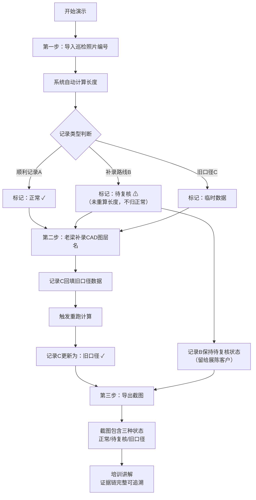

## 1. 产品概述

充电站车流排队模拟培训演示系统，用于培训教官老梁向新人展示巡检照片编号与CAD图层名的数据协同流程。系统聚焦于数据证据链的完整性，三种典型记录（顺利/待复核/旧口径）的处理差异一目了然。

- 核心问题：解决巡检照片编号与CAD图层名"互相补台又互相打架"的数据协同问题
- 目标用户：培训教官老梁、新入职巡检员、展陈客户
- 产品价值：让新人直观理解数据处理流程，让客户看到完整证据链而非凭空结论

---

## 2. 核心功能

### 2.1 用户角色

| 角色 | 核心权限 |
|------|----------|
| 培训教官老梁 | 导入数据、补录CAD图层名、人工修正、重跑计算、导出截图 |
| 新人学员 | 查看流程、对比三种记录差异 |
| 展陈客户 | 复核待处理记录、查看完整证据链 |

### 2.2 功能模块

1. **小看板首页**：数据概览、三条样例记录卡片、当前流程步骤指示
2. **数据导入模块**：巡检照片编号导入、导入标记、初步长度计算
3. **CAD补录模块**：培训教官补录CAD图层名、旧口径数据回填、长度重算触发
4. **人工修正模块**：单条记录人工修正、修正日志留存
5. **导出模块**：截图导出、CAD图层名更新后截图自动同步
6. **CLI入口**：命令行批量处理、脚本化演示
7. **API接口**：程序化调用、系统集成

### 2.3 页面详情

| 页面名称 | 模块名称 | 功能描述 |
|-----------|-------------|---------------------|
| 小看板首页 | 流程进度条 | 显示三步流程当前阶段：导入→补录CAD→导出 |
| 小看板首页 | 记录卡片区 | 三条样例记录并排展示，状态颜色区分 |
| 小看板首页 | 证据链面板 | 点击记录展开完整处理历史日志 |
| 小看板首页 | 操作按钮区 | 导入、补录、重跑、导出等核心操作 |
| 记录详情页 | 数据对比表 | 原始数据、计算值、修正值三列对比 |
| 记录详情页 | 时间线 | 完整操作时间线，每条操作带操作人、时间、变更内容 |

---

## 3. 核心流程

培训教官老梁带领新人走演示流程：

1. **第一步：导入巡检照片编号**
   - 导入三条样例记录的照片编号
   - 系统自动计算路线长度
   - 记录B标记为"补录路线未重算长度"状态（黄色待复核）

2. **第二步：补录CAD图层名**
   - 老梁手动补录每条记录的CAD图层名
   - 记录C从CAD图层名回填旧口径数据
   - 记录B保持待复核状态，不自动归为正常

3. **第三步：导出截图**
   - 导出包含最新CAD图层名的截图
   - 展示三种记录的不同处理结果
   - 记录B明确标注"待客户复核"

---

## 4. 演示数据说明

### 三条样例记录

| 记录ID | 类型 | 巡检照片编号 | CAD图层名 | 处理说明 | 最终状态 |
|--------|------|-------------|-----------|----------|----------|
| REC-001 | 顺利记录 | PHOTO-2026-001 | LAYER-CHARGE-A | 导入→计算→补录CAD→导出，全程顺利 | 正常 ✓ |
| REC-002 | 补录未重算 | PHOTO-2026-002 | LAYER-CHARGE-B | 补录路线但未重新计算长度，标注待复核 | 待复核 ⚠ |
| REC-003 | 旧口径 | PHOTO-2026-003 | LAYER-CHARGE-C-OLD | 从CAD图层名补入旧口径2023版数据 | 旧口径 ✓ |

### 关键数据字段

- **巡检照片编号**：唯一标识，格式PHOTO-YYYY-NNN
- **CAD图层名**：LAYER-{类型}-{标识}[-OLD]，带-OLD表示旧口径
- **路线长度**：自动计算值 vs 人工修正值
- **操作日志**：每步操作的操作人、时间、变更前后值
- **状态标记**：正常/待复核/旧口径/临时数据

---

## 5. 用户界面设计

### 5.1 设计风格

- **主色调**：工业深蓝 `#1e3a5f`，体现工程专业感
- **状态色**：
  - 正常：深绿 `#059669`
  - 待复核：琥珀黄 `#d97706`，配闪烁边框动画
  - 旧口径：靛蓝 `#4f46e5`
- **字体**：
  - 数据显示：等宽字体 `JetBrains Mono`，强调数据可追溯性
  - 标题说明：无衬线 `Noto Sans SC`，清晰易读
- **布局**：卡片式三列并排，便于横向对比三种记录
- **视觉重点**：证据链时间线，每条操作可追溯到具体操作人和时间

### 5.2 页面设计概述

| 页面名称 | 模块名称 | UI Elements |
|-----------|-------------|-------------|
| 小看板首页 | 顶部流程条 | 三步流程节点，当前步骤高亮，连接线动画 |
| 小看板首页 | 三列记录卡 | 每卡带状态色边框、数据字段、展开按钮 |
| 小看板首页 | 待复核卡片 | 黄色脉冲边框动画，"待客户复核"标签醒目 |
| 小看板首页 | 底部操作栏 | 导入/补录CAD/重跑/导出按钮，操作人显示"老梁" |
| 记录详情页 | 证据时间线 | 垂直时间线，节点带操作人头像、时间戳、变更diff |
| 记录详情页 | 数据对比表 | 三列对比：原始/计算/修正，差异高亮 |

### 5.3 交互细节

- 点击"导入"按钮：模拟读取照片编号，每条记录逐行显示导入动画
- 点击"补录CAD"：弹出输入框，默认填入演示数据，可编辑
- 待复核记录：悬停显示提示"此记录补录路线后未重算长度，请客户复核"
- 点击"导出截图"：模拟生成过程，文件名包含最新CAD图层名
- 所有操作后：时间线新增节点，滚动到最新位置

### 5.4 响应式

- 桌面端：三列并排布局，最优展示对比效果
- 平板：两列布局，待复核单独一行放大显示
- 移动端：单列堆叠，重点保留状态色和时间线

---

## 6. 关键约束

1. **证据链完整性**：每条数据变更必须可追溯到操作人、时间、变更内容
2. **待复核不归正常**：REC-002在整个演示流程中保持待复核状态，除非明确人工确认
3. **CAD图层名同步**：补录CAD图层名后，所有显示和导出必须使用最新名称
4. **三种结果可区分**：最终页面必须清晰展示三种记录的处理结果差异
5. **CLI/API/小看板三入口**：同一套核心逻辑，三种调用方式
