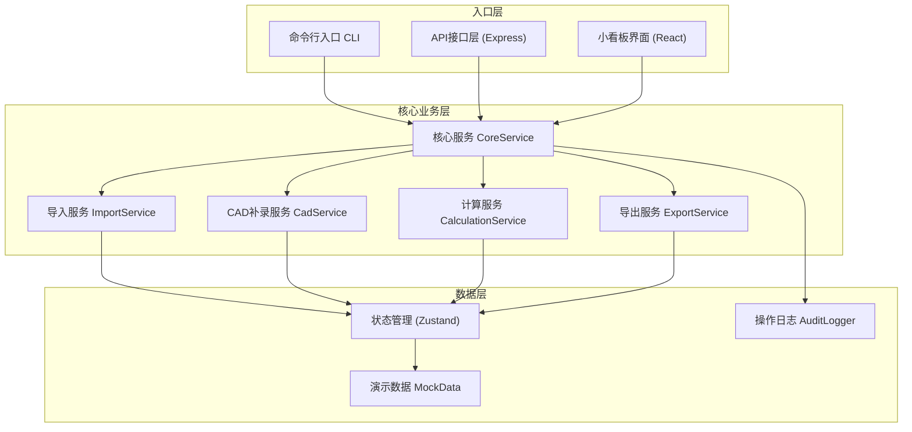
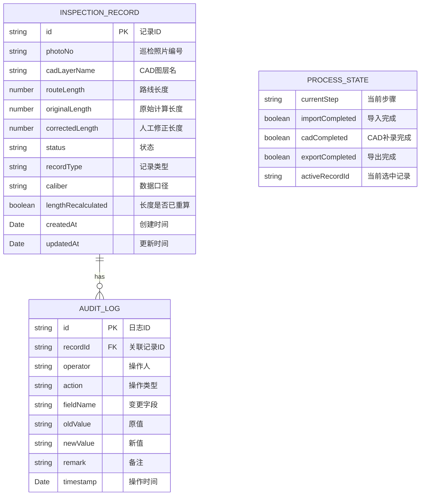

## 1. 架构设计



---

## 2. 技术描述

- **前端框架**：React@18 + TypeScript
- **构建工具**：Vite@5
- **样式方案**：TailwindCSS@3
- **状态管理**：Zustand@4（轻量级，适合演示场景）
- **后端**：Express@4（提供API接口）
- **命令行**：Node.js 内置 `process.argv` 解析
- **数据持久化**：LocalStorage（前端） + 内存存储（后端演示）
- **导出功能**：html2canvas（前端截图导出）

### 技术选型理由

1. **Zustand替代Redux**：演示系统数据量小，Zustand更轻量，代码更简洁
2. **html2canvas**：纯前端截图导出，无需后端依赖，文件名可动态包含CAD图层名
3. **Express极简API**：仅提供演示用接口，不连接真实数据库
4. **TypeScript**：确保数据模型一致性，三种入口共享类型定义

---

## 3. 目录结构

```
charging-station-sim/
├── .trae/documents/
│   ├── PRD-充电站车流排队模拟.md
│   └── TECH-充电站车流排队模拟.md
├── src/
│   ├── core/                    # 核心业务逻辑（三入口共享）
│   │   ├── types.ts             # 类型定义
│   │   ├── mockData.ts          # 演示数据
│   │   ├── CoreService.ts       # 核心服务
│   │   ├── ImportService.ts     # 导入服务
│   │   ├── CadService.ts        # CAD补录服务
│   │   ├── CalculationService.ts # 计算服务
│   │   ├── ExportService.ts     # 导出服务
│   │   └── AuditLogger.ts       # 审计日志
│   ├── store/
│   │   └── useAppStore.ts       # Zustand状态管理
│   ├── web/                     # 小看板界面
│   │   ├── App.tsx
│   │   ├── main.tsx
│   │   ├── components/
│   │   │   ├── ProcessStepper.tsx    # 流程进度条
│   │   │   ├── RecordCard.tsx        # 记录卡片
│   │   │   ├── EvidenceTimeline.tsx  # 证据时间线
│   │   │   ├── DataCompareTable.tsx  # 数据对比表
│   │   │   └── ActionBar.tsx         # 操作按钮栏
│   │   └── index.css
│   ├── api/                     # API接口层
│   │   └── server.ts            # Express服务
│   └── cli/                     # 命令行入口
│       └── cli.ts
├── package.json
├── tsconfig.json
├── vite.config.ts
└── tailwind.config.js
```

---

## 4. 核心数据模型

### 4.1 ER图



### 4.2 类型定义（TypeScript）

```typescript
// 记录状态枚举
export enum RecordStatus {
  PENDING = 'pending',         // 临时数据
  NORMAL = 'normal',           // 正常 ✓
  PENDING_REVIEW = 'pending_review', // 待复核 ⚠
  OLD_CALIBER = 'old_caliber', // 旧口径 ✓
}

// 记录类型枚举
export enum RecordType {
  SMOOTH = 'smooth',           // 顺利记录
  SUPPLEMENT_NO_RECALC = 'supplement_no_recalc', // 补录未重算
  OLD_CALIBER_FILL = 'old_caliber_fill', // 旧口径回填
}

// 流程步骤枚举
export enum ProcessStep {
  NOT_STARTED = 'not_started',
  IMPORT = 'import',           // 第一步：导入
  CAD_SUPPLEMENT = 'cad',      // 第二步：补录CAD
  EXPORT = 'export',           // 第三步：导出
  COMPLETED = 'completed',
}

export interface InspectionRecord {
  id: string;
  photoNo: string;
  cadLayerName: string;
  routeLength: number | null;
  originalLength: number | null;
  correctedLength: number | null;
  status: RecordStatus;
  recordType: RecordType;
  caliber: string;
  lengthRecalculated: boolean;
  hasManualCorrection: boolean;
  hasRerun: boolean;
  createdAt: string;
  updatedAt: string;
}

export interface AuditLogEntry {
  id: string;
  recordId: string;
  operator: string;
  action: 'import' | 'calculate' | 'cad_update' | 'manual_correct' | 'rerun' | 'export';
  fieldName?: string;
  oldValue?: string;
  newValue?: string;
  remark: string;
  timestamp: string;
}
```

---

## 5. 路由定义

### 前端路由

| 路由 | 页面 | 说明 |
|------|------|------|
| `/` | 小看板首页 | 三记录卡片 + 流程进度 + 操作栏 |
| `/record/:id` | 记录详情 | 证据时间线 + 数据对比表 |

### API路由

| 方法 | 路由 | 说明 |
|------|------|------|
| GET | `/api/records` | 获取所有记录 |
| GET | `/api/records/:id` | 获取单条记录详情 |
| POST | `/api/import` | 导入巡检照片编号 |
| PUT | `/api/records/:id/cad` | 补录CAD图层名 |
| POST | `/api/records/:id/rerun` | 重跑长度计算 |
| POST | `/api/records/:id/correct` | 人工修正 |
| GET | `/api/records/:id/logs` | 获取操作日志 |
| POST | `/api/export` | 导出截图（返回文件名） |

### CLI命令

```bash
# 查看所有记录
node dist/cli.js list

# 导入演示数据
node dist/cli.js import

# 补录CAD图层名
node dist/cli.js cad --id REC-002 --name "LAYER-CHARGE-B"

# 重跑计算
node dist/cli.js rerun --id REC-003

# 导出截图
node dist/cli.js export --output "./exports"

# 查看日志
node dist/cli.js logs --id REC-002
```

---

## 6. 核心流程实现

### 6.1 导入流程（第一步）

```typescript
// ImportService.ts
export class ImportService {
  static async importPhotoNumbers(photoNos: string[]): Promise<InspectionRecord[]> {
    const records: InspectionRecord[] = [];
    
    for (const [index, photoNo] of photoNos.entries()) {
      const record = this.createRecord(photoNo, index);
      // 模拟逐条导入延迟
      await new Promise(r => setTimeout(r, 300));
      
      // 自动计算长度
      const length = CalculationService.calculateRouteLength(record);
      record.originalLength = length;
      record.routeLength = length;
      
      // 记录B特殊处理：标记补录路线未重算
      if (record.recordType === RecordType.SUPPLEMENT_NO_RECALC) {
        record.status = RecordStatus.PENDING_REVIEW;
        record.lengthRecalculated = false;
      } else {
        record.status = RecordStatus.NORMAL;
        record.lengthRecalculated = true;
      }
      
      AuditLogger.log({
        recordId: record.id,
        operator: '系统导入',
        action: 'import',
        remark: `导入巡检照片编号: ${photoNo}`,
      });
      
      records.push(record);
    }
    
    return records;
  }
}
```

### 6.2 CAD补录流程（第二步）

```typescript
// CadService.ts
export class CadService {
  static updateCadLayerName(
    record: InspectionRecord, 
    cadLayerName: string,
    operator: string = '老梁'
  ): InspectionRecord {
    const oldValue = record.cadLayerName;
    record.cadLayerName = cadLayerName;
    record.updatedAt = new Date().toISOString();
    
    // 关键约束：记录B保持待复核，不归正常
    if (record.recordType === RecordType.SUPPLEMENT_NO_RECALC) {
      // 不改变status，保持 PENDING_REVIEW
      record.lengthRecalculated = false;
    }
    
    // 记录C：从CAD图层名识别旧口径
    if (record.recordType === RecordType.OLD_CALIBER_FILL) {
      if (cadLayerName.includes('-OLD')) {
        record.caliber = '2023版旧口径';
        record.status = RecordStatus.OLD_CALIBER;
        // 触发重跑
        CalculationService.recalculateWithOldCaliber(record);
        record.hasRerun = true;
      }
    }
    
    AuditLogger.log({
      recordId: record.id,
      operator,
      action: 'cad_update',
      fieldName: 'cadLayerName',
      oldValue,
      newValue: cadLayerName,
      remark: `培训教官${operator}补录CAD图层名`,
    });
    
    return record;
  }
}
```

### 6.3 导出流程（第三步）

```typescript
// ExportService.ts
export class ExportService {
  static async exportScreenshot(records: InspectionRecord[]): Promise<string> {
    // 生成文件名，包含最新CAD图层名
    const timestamp = new Date().toISOString().slice(0, 10);
    const cadNames = records.map(r => r.cadLayerName || 'NO-CAD').join('_');
    const fileName = `充电站车流模拟_${timestamp}_${cadNames}.png`;
    
    // 使用html2canvas截图
    const element = document.getElementById('simulation-board');
    if (element) {
      const canvas = await html2canvas(element, {
        backgroundColor: '#0f172a',
        scale: 2,
      });
      
      // 下载
      const link = document.createElement('a');
      link.download = fileName;
      link.href = canvas.toDataURL();
      link.click();
    }
    
    records.forEach(record => {
      AuditLogger.log({
        recordId: record.id,
        operator: '老梁',
        action: 'export',
        remark: `导出截图，文件名: ${fileName}`,
      });
    });
    
    return fileName;
  }
}
```

---

## 7. 演示数据定义

```typescript
// mockData.ts
export const DEMO_PHOTO_NOS = [
  'PHOTO-2026-001',
  'PHOTO-2026-002',
  'PHOTO-2026-003',
];

export const DEMO_CAD_LAYERS: Record<string, string> = {
  'REC-001': 'LAYER-CHARGE-A',
  'REC-002': 'LAYER-CHARGE-B',
  'REC-003': 'LAYER-CHARGE-C-OLD',
};

export const INITIAL_RECORDS: InspectionRecord[] = [
  {
    id: 'REC-001',
    photoNo: '',
    cadLayerName: '',
    routeLength: null,
    originalLength: null,
    correctedLength: null,
    status: RecordStatus.PENDING,
    recordType: RecordType.SMOOTH,
    caliber: '2026版新口径',
    lengthRecalculated: false,
    hasManualCorrection: false,
    hasRerun: false,
    createdAt: new Date().toISOString(),
    updatedAt: new Date().toISOString(),
  },
  // REC-002: 补录未重算
  {
    id: 'REC-002',
    photoNo: '',
    cadLayerName: '',
    routeLength: null,
    originalLength: null,
    correctedLength: null,
    status: RecordStatus.PENDING,
    recordType: RecordType.SUPPLEMENT_NO_RECALC,
    caliber: '2026版新口径',
    lengthRecalculated: false,
    hasManualCorrection: true, // 有一次人工修正
    hasRerun: false,
    createdAt: new Date().toISOString(),
    updatedAt: new Date().toISOString(),
  },
  // REC-003: 旧口径
  {
    id: 'REC-003',
    photoNo: '',
    cadLayerName: '',
    routeLength: null,
    originalLength: null,
    correctedLength: null,
    status: RecordStatus.PENDING,
    recordType: RecordType.OLD_CALIBER_FILL,
    caliber: '2026版新口径',
    lengthRecalculated: false,
    hasManualCorrection: false,
    hasRerun: true, // 有一次重跑
    createdAt: new Date().toISOString(),
    updatedAt: new Date().toISOString(),
  },
];
```

---

## 8. 关键约束实现

### 8.1 待复核不归正常

在 `CadService.updateCadLayerName` 中明确判断：

```typescript
// 关键约束：记录B保持待复核，不归正常
if (record.recordType === RecordType.SUPPLEMENT_NO_RECALC) {
  // 不改变status，保持 PENDING_REVIEW
  record.lengthRecalculated = false;
}
```

### 8.2 CAD图层名同步

状态管理中更新CAD图层名后，所有派生数据自动同步：

```typescript
// useAppStore.ts
const updateCadLayerName = (id: string, cadName: string) => {
  const record = get().records.find(r => r.id === id);
  if (record) {
    CadService.updateCadLayerName(record, cadName, '老梁');
    set({ records: [...get().records] });
  }
};
```

### 8.3 证据链完整性

所有操作通过 `AuditLogger` 记录：

```typescript
// AuditLogger.ts
export class AuditLogger {
  static logs: AuditLogEntry[] = [];
  
  static log(entry: Omit<AuditLogEntry, 'id' | 'timestamp'>): AuditLogEntry {
    const fullEntry: AuditLogEntry = {
      ...entry,
      id: `LOG-${Date.now()}-${Math.random().toString(36).slice(2, 6)}`,
      timestamp: new Date().toISOString(),
    };
    this.logs.push(fullEntry);
    return fullEntry;
  }
  
  static getLogsByRecordId(recordId: string): AuditLogEntry[] {
    return this.logs.filter(l => l.recordId === recordId)
      .sort((a, b) => a.timestamp.localeCompare(b.timestamp));
  }
}
```
