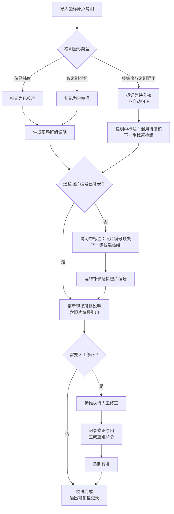

## 1. 产品概述

"室内导航信标校准"是一套面向园区运维和巡检班组的信标坐标校准工具。核心解决三个问题：经纬度与米制坐标混用时不能急于归正而需标记留痕、巡检照片编号后补后给现场班组的说明要跟着变、最终交付的不是功能清单而是一份可复盘的记录和可重跑的命令。

- 目标用户：园区运维人员（如小陶）、巡检组、现场班组
- 核心价值：让坐标校准过程可追溯、可复盘，减少因坐标混用导致的定位偏差

## 2. 核心功能

### 2.1 用户角色

| 角色 | 说明 | 核心操作 |
|------|------|----------|
| 园区运维 | 如小陶，日常维护信标 | 导入校准数据、补录巡检照片编号、人工修正坐标、重跑校准 |
| 巡检组 | 现场巡检并拍照 | 提供巡检照片编号、复核混用坐标 |
| 现场班组 | 执行定位相关任务 | 阅读校准说明、了解哪些信标可用、哪些待复核 |

### 2.2 功能模块

1. **校准看板**：校准记录列表、状态总览、混用坐标标记
2. **记录详情**：单条校准记录的全生命周期——导入、补录、修正、重跑
3. **操作日志**：每一步操作的人、时、因、果，形成可复盘记录
4. **说明生成**：给现场班组看的说明，自动跟随数据变化更新

### 2.3 页面详情

| 页面名称 | 模块名称 | 功能说明 |
|----------|----------|----------|
| 校准看板 | 记录列表 | 展示所有校准记录，标记混用坐标状态、巡检照片补录状态 |
| 校准看板 | 状态筛选 | 按状态筛选：待补录、待复核、已校准、有异常 |
| 校准看板 | 快速导入 | 支持 JSON/CSV 格式导入校准数据 |
| 记录详情 | 坐标数据 | 展示经纬度和米制坐标，混用时高亮标记 |
| 记录详情 | 巡检照片 | 补录巡检照片编号，记录补录时间和操作人 |
| 记录详情 | 说明面板 | 给现场班组的说明，含原因、缺失材料、下一步找谁 |
| 记录详情 | 操作历史 | 完整操作时间线，每步都可溯源 |
| 记录详情 | 重跑命令 | 生成可复制粘贴的重跑命令（CLI/API） |

## 3. 核心流程

**三步核心流程**：坐标原点说明导入 → 运维补录巡检照片编号 → 给现场班组的说明更新

关键约束：遇到经纬度和米制坐标混在一起时，不急于归正，标记为"待复核"留给巡检组。

## 4. 用户界面设计

### 4.1 设计风格

- **风格方向**：工业实用风（Industrial Utilitarian）——干净、功能性优先、信息密度高
- **主色调**：深灰底（#1a1a2e）+ 琥珀色强调（#f59e0b）+ 状态色（绿/红/蓝）
- **辅助色**：冷灰（#374151）用于卡片背景，暖白（#f5f5f0）用于文字
- **按钮风格**：圆角矩形，实心按钮用琥珀色，次要用描边
- **字体**：JetBrains Mono 用于数据展示，Noto Sans SC 用于中文正文
- **布局风格**：左侧导航 + 右侧内容区，卡片式信息分组
- **图标**：Lucide 图标库，线条风格

### 4.2 页面设计概览

| 页面名称 | 模块名称 | UI 元素 |
|----------|----------|---------|
| 校准看板 | 记录列表 | 表格布局，行状态色条，混用坐标用琥珀色标记，待复核用红色标记 |
| 校准看板 | 状态筛选 | 顶部标签组，点击切换，含数量角标 |
| 校准看板 | 快速导入 | 拖拽上传区域 + 文件选择按钮 |
| 记录详情 | 坐标数据 | 双列对照：经纬度列 + 米制列，混用行高亮 + 图标标记 |
| 记录详情 | 巡检照片 | 输入框 + 补录按钮，已补录显示编号和操作人 |
| 记录详情 | 说明面板 | 卡片式说明，含"为什么留下""缺什么""找谁"三段式 |
| 记录详情 | 操作历史 | 垂直时间线，每步含操作人、时间、原因 |
| 记录详情 | 重跑命令 | 代码块样式，一键复制按钮 |

### 4.3 响应式

- 桌面优先，内容区最小宽度 1024px
- 平板端：侧边栏折叠为汉堡菜单
- 移动端暂不适配（现场班组主要使用桌面或平板）

## 5. 演示数据要求

演示数据需包含以下场景，供园区运维小陶给新人讲解流程：

1. **坐标原点说明**：一条包含经纬度参考点和米制原点的记录
2. **巡检照片编号**：一条初始缺失、后补录的记录
3. **一次人工修正**：运维发现坐标偏差后手动修正，并记录修正原因
4. **一次重跑**：修正后重跑校准，生成新的校准结果
5. **混用坐标**：一条经纬度和米制坐标混用的记录，标记为待复核
