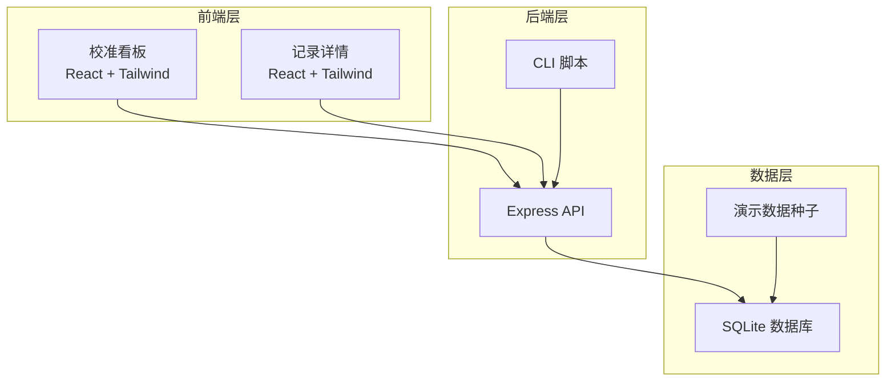
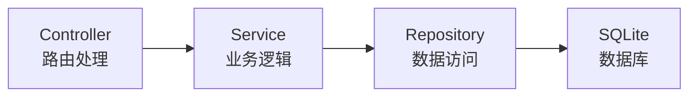

## 1. 架构设计



## 2. 技术说明

- 前端：React@18 + TailwindCSS@3 + Zustand（状态管理）+ Vite
- 后端：Express@4 + TypeScript（ESM）
- 数据库：SQLite（better-sqlite3），无需外部数据库服务
- CLI：Node.js 脚本，通过 HTTP 调用 API
- 初始化工具：vite-init（react-express-ts 模板）

## 3. 路由定义

| 路由 | 用途 |
|------|------|
| `/` | 校准看板首页，展示记录列表和状态筛选 |
| `/record/:id` | 记录详情页，展示坐标数据、巡检照片、说明、操作历史 |

## 4. API 定义

### 4.1 校准记录 API

```typescript
interface CalibrationRecord {
  id: string
  beaconId: string
  originDescription: string
  coordinates: CoordinateEntry[]
  inspectionPhotoIds: string[]
  inspectionPhotoSupplementedAt: string | null
  inspectionPhotoSupplementedBy: string | null
  status: "calibrated" | "pending_review" | "pending_photo" | "anomaly"
  coordinateMixDetected: boolean
  createdAt: string
  updatedAt: string
}

interface CoordinateEntry {
  id: string
  recordId: string
  pointName: string
  latLng: { lat: number; lng: number } | null
  metric: { x: number; y: number; z: number } | null
  coordinateType: "latlng" | "metric" | "mixed"
  manualCorrection: {
    correctedBy: string
    correctedAt: string
    reason: string
    previousValue: CoordinateEntry
  } | null
}
```

### 4.2 操作日志 API

```typescript
interface OperationLog {
  id: string
  recordId: string
  action: "import" | "supplement_photo" | "manual_correct" | "rerun" | "update_note"
  operator: string
  operatorRole: "operations" | "inspection" | "system"
  description: string
  reason: string | null
  beforeSnapshot: Record<string, unknown> | null
  afterSnapshot: Record<string, unknown> | null
  timestamp: string
}
```

### 4.3 现场班组说明 API

```typescript
interface FieldTeamNote {
  id: string
  recordId: string
  whyLeftBehind: string
  missingMaterials: string[]
  nextStep: {
    contactTeam: "inspection" | "operations"
    contactPerson: string
    action: string
  }
  generatedAt: string
  version: number
}
```

### 4.4 端点列表

| 方法 | 路径 | 用途 |
|------|------|------|
| GET | `/api/records` | 获取校准记录列表，支持状态筛选 |
| GET | `/api/records/:id` | 获取单条记录详情 |
| POST | `/api/records/import` | 导入坐标原点说明（JSON/CSV） |
| PATCH | `/api/records/:id/photo` | 补录巡检照片编号 |
| POST | `/api/records/:id/correct` | 人工修正坐标 |
| POST | `/api/records/:id/rerun` | 重跑校准 |
| GET | `/api/records/:id/logs` | 获取操作日志 |
| GET | `/api/records/:id/note` | 获取现场班组说明 |
| GET | `/api/records/:id/rerun-command` | 获取可重跑的命令 |
| GET | `/api/demo/seed` | 植入演示数据 |

## 5. 服务器架构



## 6. 数据模型

### 6.1 数据模型定义

```mermaid
erDiagram
    CalibrationRecord ||--o{ CoordinateEntry : contains
    CalibrationRecord ||--o{ OperationLog : has
    CalibrationRecord ||--|| FieldTeamNote : generates

    CalibrationRecord {
        string id PK
        string beaconId
        string originDescription
        string status
        boolean coordinateMixDetected
        string createdAt
        string updatedAt
    }

    CoordinateEntry {
        string id PK
        string recordId FK
        string pointName
        string coordinateType
        float lat
        float lng
        float x
        float y
        float z
        string manualCorrection JSON
    }

    OperationLog {
        string id PK
        string recordId FK
        string action
        string operator
        string operatorRole
        string description
        string reason
        string beforeSnapshot JSON
        string afterSnapshot JSON
        string timestamp
    }

    FieldTeamNote {
        string id PK
        string recordId FK
        string whyLeftBehind
        string missingMaterials JSON
        string nextStep JSON
        string generatedAt
        int version
    }

    InspectionPhoto {
        string id PK
        string recordId FK
        string photoId
        string supplementedBy
        string supplementedAt
    }
```

### 6.2 数据定义语言

```sql
CREATE TABLE calibration_records (
  id TEXT PRIMARY KEY,
  beacon_id TEXT NOT NULL,
  origin_description TEXT NOT NULL DEFAULT '',
  status TEXT NOT NULL CHECK(status IN ('calibrated','pending_review','pending_photo','anomaly')),
  coordinate_mix_detected INTEGER NOT NULL DEFAULT 0,
  created_at TEXT NOT NULL DEFAULT (datetime('now')),
  updated_at TEXT NOT NULL DEFAULT (datetime('now'))
);

CREATE TABLE coordinate_entries (
  id TEXT PRIMARY KEY,
  record_id TEXT NOT NULL REFERENCES calibration_records(id),
  point_name TEXT NOT NULL,
  coordinate_type TEXT NOT NULL CHECK(coordinate_type IN ('latlng','metric','mixed')),
  lat REAL,
  lng REAL,
  x REAL,
  y REAL,
  z REAL,
  manual_correction TEXT,
  created_at TEXT NOT NULL DEFAULT (datetime('now'))
);

CREATE TABLE operation_logs (
  id TEXT PRIMARY KEY,
  record_id TEXT NOT NULL REFERENCES calibration_records(id),
  action TEXT NOT NULL CHECK(action IN ('import','supplement_photo','manual_correct','rerun','update_note')),
  operator TEXT NOT NULL,
  operator_role TEXT NOT NULL CHECK(operator_role IN ('operations','inspection','system')),
  description TEXT NOT NULL,
  reason TEXT,
  before_snapshot TEXT,
  after_snapshot TEXT,
  timestamp TEXT NOT NULL DEFAULT (datetime('now'))
);

CREATE TABLE field_team_notes (
  id TEXT PRIMARY KEY,
  record_id TEXT NOT NULL UNIQUE REFERENCES calibration_records(id),
  why_left_behind TEXT NOT NULL DEFAULT '',
  missing_materials TEXT NOT NULL DEFAULT '[]',
  next_step TEXT NOT NULL DEFAULT '{}',
  generated_at TEXT NOT NULL DEFAULT (datetime('now')),
  version INTEGER NOT NULL DEFAULT 1
);

CREATE TABLE inspection_photos (
  id TEXT PRIMARY KEY,
  record_id TEXT NOT NULL REFERENCES calibration_records(id),
  photo_id TEXT NOT NULL,
  supplemented_by TEXT,
  supplemented_at TEXT
);

CREATE INDEX idx_records_status ON calibration_records(status);
CREATE INDEX idx_entries_record ON coordinate_entries(record_id);
CREATE INDEX idx_logs_record ON operation_logs(record_id);
CREATE INDEX idx_photos_record ON inspection_photos(record_id);
```
