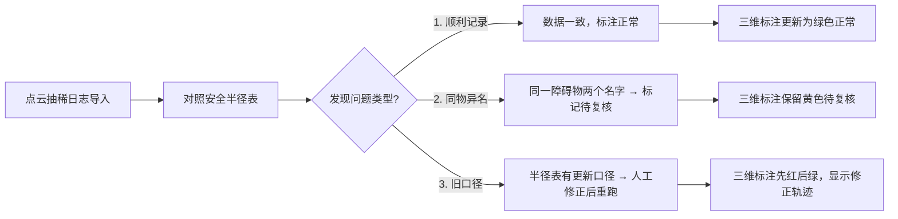

## 1. 产品概述

变电站检修安全距离培训演示系统，用于园区运维团队内部培训新人理解点云抽稀日志、安全半径表与三维标注之间的协作流程。解决实际工作中"日志和半径表互相补台又互相打架"的痛点，通过真实演示数据让学员直观感受三种典型处理场景。

### 核心价值
- 让新人快速理解变电站安全距离检测的完整工作流
- 直观展示数据不一致时的处理思路
- 培养学员对"同一障碍物多名"问题的复核意识

---

## 2. 核心 Features

### 2.1 用户角色

| 角色 | 使用方式 | 核心权限 |
|------|----------|----------|
| 培训讲师（园区运维小陶） | 演示流程、讲解要点 | 导入日志、查看半径表、人工修正、重跑分析 |
| 培训学员 | 跟随操作、复核问题 | 查看数据、标记待复核、浏览历史 |

### 2.2 功能模块

1. **三维标注视图**：点云场景可视化、安全距离渲染、障碍物标注
2. **点云抽稀日志管理**：日志导入、记录列表、状态标记
3. **安全半径表管理**：设备参数查询、口径对比、历史版本
4. **历史记录面板**：操作轨迹、版本对比、处理结果展示
5. **流程演示控制**：分步演示、暂停讲解、重置重跑

### 2.3 页面详情

| 页面名称 | 模块名称 | 功能描述 |
|----------|----------|----------|
| 主工作台 | 三维标注视图 | 变电站3D场景展示，实时渲染安全距离范围，支持缩放、旋转、选中障碍物 |
| 主工作台 | 点云抽稀日志面板 | 展示导入的日志记录，每条记录包含设备ID、抽稀参数、检测结果、状态标签 |
| 主工作台 | 安全半径表面板 | 设备安全半径参数表，支持新旧口径对比，高亮口径不一致条目 |
| 主工作台 | 历史记录时间轴 | 按时间顺序展示操作轨迹，点击可回溯对应状态，区分"正常/待复核/已修正" |
| 主工作台 | 流程控制栏 | 分步演示按钮：导入日志 → 对照半径表 → 更新标注，支持人工修正和重跑 |

---

## 3. 核心流程

### 三步标准工作流
1. **点云抽稀日志导入**：系统导入变电站设备点云数据的抽稀处理日志，自动识别障碍物并初步标注安全距离
2. **对照安全半径表**：运维人员核对安全半径表，发现口径不一致或命名冲突
3. **三维标注视图更新**：根据核对结果更新标注，待复核问题保留原样供学员处理

### 三种典型场景演示流程

---

## 4. 用户界面设计

### 4.1 设计风格
- **主色调**：工业深蓝 `#1a365d` 作为主色，代表电力行业专业性；告警红 `#e53e3e`、待复核黄 `#d69e2e`、正常绿 `#38a169` 作为状态色
- **按钮风格**：扁平化设计，2px圆角，hover时轻微上浮+阴影
- **字体**：标题使用 `Noto Sans SC` 加粗700，正文使用 `Noto Sans SC` 常规400，数据表格使用等宽字体 `JetBrains Mono`
- **布局**：三栏式专业工作台布局，左侧日志面板、中间3D视图、右侧半径表+历史记录
- **视觉元素**：使用电力行业图标（⚡ 🔌 📡），状态标记使用带边框的圆角标签

### 4.2 页面设计概览

| 页面名称 | 模块名称 | UI元素 |
|----------|----------|--------|
| 主工作台 | 三维标注视图 | 深色背景3D场景，点云粒子效果，安全距离半透明球体，选中高亮描边 |
| 主工作台 | 日志面板 | 卡片式列表，每条卡片带状态色条，hover展开详情 |
| 主工作台 | 半径表面板 | 数据表格，新旧口径对比行高亮显示，口径冲突行标红 |
| 主工作台 | 历史时间轴 | 垂直时间轴，节点用不同颜色图标区分状态，连线动画展示流程走向 |
| 主工作台 | 流程控制栏 | 底部固定栏，三步进度指示器，操作按钮组 |

### 4.3 响应式
- 桌面端优先（1280px以上），三栏布局
- 平板端（768-1279px）：左右面板可折叠，中间3D视图自适应
- 移动端（<768px）：垂直堆叠布局，优先保证3D视图可见

### 4.4 3D场景设计
- **环境**：深色工业风背景，渐变深蓝到黑，模拟控制室氛围
- **光照**：三盏点光源模拟变电站照明，设备本体有自发光效果
- **相机**：默认透视相机，初始角度为45度俯瞰，支持轨道控制
- **交互元素**：安全距离球体使用半透明材质，边缘有发光描边；障碍物可点击选中，选中后显示信息浮窗
- **动画**：标注更新时有缩放过渡动画，状态变化有颜色渐变效果
- **性能**：使用Three.js + InstancedMesh渲染大量点云，保持60fps
