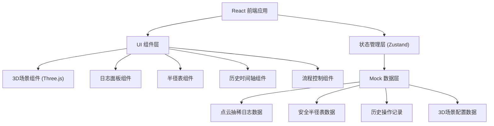
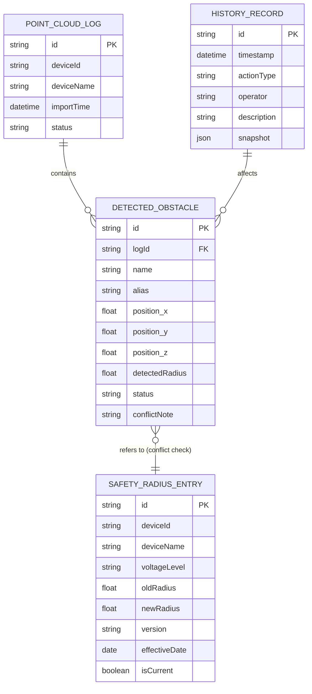

## 1. 架构设计



---

## 2. 技术选型说明

- **前端框架**: React@18 + TypeScript + Vite@6
- **状态管理**: Zustand — 轻量级状态管理，适合多面板共享状态
- **3D渲染**: Three.js + @react-three/fiber + @react-three/drei — React生态中最成熟的3D解决方案
- **样式方案**: TailwindCSS@3 — 快速构建专业工作台界面
- **UI组件**: 自研组件 + Lucide React 图标库
- **动画**: Framer Motion — 实现流畅的状态切换动画
- **数据**: 纯前端Mock数据，内置三种演示场景的完整数据集

---

## 3. 路由定义

| 路由 | 用途 |
|------|------|
| `/` | 主工作台页面（唯一页面，单页应用） |

---

## 4. 核心数据类型定义

```typescript
// 障碍物状态枚举
type ObstacleStatus = 'normal' | 'pending_review' | 'conflict' | 'corrected';

// 点云抽稀日志记录
interface PointCloudLog {
  id: string;
  deviceId: string;
  deviceName: string;
  thinningParams: {
    voxelSize: number;
    maxPoints: number;
    quality: string;
  };
  detectedObstacles: DetectedObstacle[];
  importTime: string;
  operator: string;
  status: 'imported' | 'reviewed' | 'corrected';
}

// 检测到的障碍物
interface DetectedObstacle {
  id: string;
  name: string;
  alias?: string; // 同物异名时的别名
  position: { x: number; y: number; z: number };
  detectedRadius: number;
  status: ObstacleStatus;
  conflictNote?: string; // 冲突说明
  correctedRadius?: number; // 修正后的半径
}

// 安全半径表条目
interface SafetyRadiusEntry {
  id: string;
  deviceId: string;
  deviceName: string;
  voltageLevel: string; // 电压等级
  oldRadius: number; // 旧口径
  newRadius: number; // 新口径
  version: string;
  effectiveDate: string;
  isCurrent: boolean;
}

// 历史操作记录
interface HistoryRecord {
  id: string;
  timestamp: string;
  actionType: 'import_log' | 'check_radius' | 'manual_correct' | 're_run' | 'mark_review';
  operator: string;
  description: string;
  affectedObstacleIds: string[];
  snapshot: {
    obstacles: DetectedObstacle[];
  };
}

// 应用全局状态
interface AppState {
  currentStep: 1 | 2 | 3; // 当前流程步骤
  pointCloudLogs: PointCloudLog[];
  safetyRadiusTable: SafetyRadiusEntry[];
  historyRecords: HistoryRecord[];
  activeObstacleId: string | null;
  scenarioType: 'normal' | 'duplicate_name' | 'old_caliber' | null;
  actions: {
    importLog: () => void;
    checkRadiusTable: () => void;
    updateAnnotation: () => void;
    manualCorrect: (obstacleId: string, newRadius: number) => void;
    markForReview: (obstacleId: string) => void;
    reRun: () => void;
    resetDemo: () => void;
    selectObstacle: (id: string | null) => void;
    setScenarioType: (type: 'normal' | 'duplicate_name' | 'old_caliber' | null) => void;
  };
}
```

---

## 5. 数据模型 ER 图



---

## 6. Mock 演示数据设计

### 场景1：顺利记录（正常）
- 设备：#1主变压器
- 日志数据与安全半径表完全一致
- 结果：标注正常，绿色显示

### 场景2：同物异名（待复核）
- 障碍物：35kV母线架构
- 日志中标注为"母线架构A"和"构架支架B"，实际是同一个物体
- 结果：保留两个标注，黄色待复核，留给学员发现

### 场景3：旧口径（需修正）
- 设备：10kV开关柜
- 日志使用旧口径安全半径1.5米，半径表已更新为2.0米
- 结果：先标红，人工修正后重跑变绿，历史记录显示修正轨迹

---

## 7. 组件划分与职责

| 组件路径 | 组件名称 | 职责 |
|----------|----------|------|
| `src/components/Scene3D/` | Scene3D | 3D场景主容器，Three.js渲染 |
| `src/components/Scene3D/` | PointCloud | 点云数据渲染 |
| `src/components/Scene3D/` | SafetySphere | 安全距离球体渲染 |
| `src/components/Scene3D/` | ObstacleMarker | 障碍物标记与交互 |
| `src/components/LogPanel/` | LogPanel | 点云抽稀日志面板 |
| `src/components/LogPanel/` | LogCard | 单条日志卡片 |
| `src/components/RadiusTable/` | RadiusTable | 安全半径表组件 |
| `src/components/RadiusTable/` | RadiusRow | 表格行（支持口径对比） |
| `src/components/HistoryTimeline/` | HistoryTimeline | 历史记录时间轴 |
| `src/components/HistoryTimeline/` | TimelineNode | 时间轴节点 |
| `src/components/FlowControl/` | FlowControl | 流程控制栏 |
| `src/components/FlowControl/` | StepIndicator | 三步进度指示器 |
| `src/store/` | useAppStore | Zustand全局状态管理 |
| `src/data/` | mockData | 演示Mock数据 |
| `src/types/` | index | TypeScript类型定义 |
