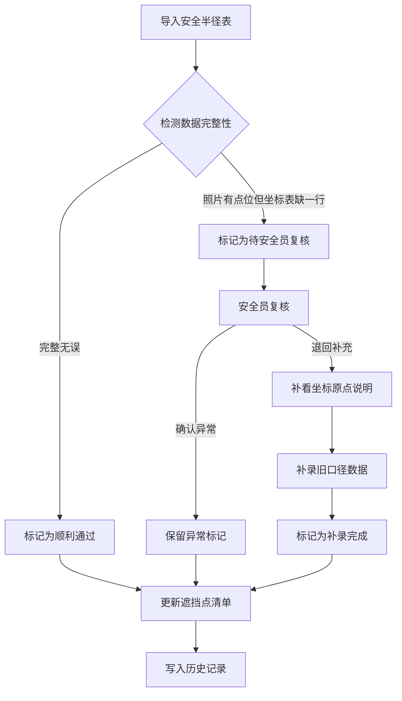

## 1. 产品概述

海岛风暴潮淹没沙盘——展陈安全半径核对演示系统，面向展陈设计师（如阿景），用于演示和培训安全半径表导入→坐标原点说明补看→遮挡点清单更新的完整流程。系统能处理三种典型场景：顺利通过、照片有点位但坐标表缺一行（需安全员复核）、从坐标原点说明补录旧口径。

- 目标用户：展陈设计师、安全员、新人培训
- 核心价值：将现场常见的错口径和补录返工流程可视化，方便新人快速理解处理逻辑

## 2. 核心功能

### 2.1 用户角色

| 角色 | 注册方式 | 核心权限 |
|------|----------|----------|
| 展陈设计师 | 默认角色 | 导入安全半径表、查看坐标原点说明、更新遮挡点清单、标记需复核项 |
| 安全员 | 默认角色 | 复核"照片有点位但坐标表缺一行"的待审项、确认或退回 |

### 2.2 功能模块

1. **工作台页面**：流程概览、三条演示数据入口、当前处理状态
2. **安全半径表页面**：导入安全半径表数据、展示点位列表、标注缺行异常
3. **坐标原点说明页面**：查看坐标原点定义、补录旧口径数据
4. **遮挡点清单页面**：展示遮挡点计算结果、区分三种处理状态
5. **历史记录页面**：完整操作日志、三种场景结果对比

### 2.3 页面详情

| 页面名称 | 模块名称 | 功能描述 |
|----------|----------|----------|
| 工作台 | 流程概览 | 展示三步流程（导入→补看→更新），标注当前步骤 |
| 工作台 | 演示数据卡片 | 三条演示数据入口：顺利记录、缺行记录、补录记录 |
| 工作台 | 状态看板 | 显示各记录的处理状态和异常标记 |
| 安全半径表 | 数据导入 | 模拟导入安全半径表，展示点位坐标和半径值 |
| 安全半径表 | 异常检测 | 自动检测"照片有点位但坐标表缺一行"，标记为待安全员复核 |
| 安全半径表 | 数据列表 | 表格展示所有点位，异常行高亮 |
| 坐标原点说明 | 原点定义 | 展示坐标原点说明文档，含原点坐标、参考系、测量日期 |
| 坐标原点说明 | 补录入口 | 从坐标原点说明中补录旧口径缺失数据 |
| 遮挡点清单 | 遮挡点列表 | 根据安全半径和坐标数据计算遮挡点，三种状态色标区分 |
| 遮挡点清单 | 处理结果对比 | 顺利/缺行待复核/补录成功三种结果的可视化对比 |
| 历史记录 | 操作日志 | 按时间线展示所有操作：导入、补看、复核、更新 |
| 历史记录 | 场景对比 | 三种场景的处理结果并排对比 |

## 3. 核心流程

展陈设计师导入安全半径表→系统检测异常（照片有点位但坐标表缺一行时不自动归正常，留给安全员复核）→设计师补看坐标原点说明→根据说明补录旧口径→遮挡点清单更新→历史记录归档。

## 4. 用户界面设计

### 4.1 设计风格

- 主色调：深蓝灰（#1e293b）+ 海洋蓝强调色（#0ea5e9）+ 琥珀色警示色（#f59e0b）
- 按钮风格：圆角微阴影，主按钮实色填充，次按钮边框描边
- 字体：思源黑体/Noto Sans SC，标题 18px/16px，正文 14px，辅助 12px
- 布局风格：左侧导航栏 + 右侧内容区，卡片式布局
- 图标风格：线性图标（lucide-react），2px 描边

### 4.2 页面设计概览

| 页面名称 | 模块名称 | UI 元素 |
|----------|----------|---------|
| 工作台 | 流程概览 | 步骤条（横向三步），当前步骤高亮 |
| 工作台 | 演示数据卡片 | 三张卡片，每张含场景名、状态徽章、操作按钮 |
| 工作台 | 状态看板 | 三列状态列：顺利/待复核/已补录，数字统计 |
| 安全半径表 | 数据导入 | 导入按钮 + 进度条 + 数据表格 |
| 安全半径表 | 异常检测 | 表格异常行琥珀色高亮 + 醒目的"待复核"标签 |
| 坐标原点说明 | 原点定义 | 卡片式文档展示，关键字段加粗 |
| 坐标原点说明 | 补录入口 | 表单：选择缺失点位 + 填入旧口径坐标 + 提交 |
| 遮挡点清单 | 遮挡点列表 | 表格，状态列用绿/琥珀/蓝三色标签区分 |
| 遮挡点清单 | 处理结果对比 | 三列并排卡片，每列一种场景结果 |
| 历史记录 | 操作日志 | 时间线组件，每条记录含操作类型、操作人、时间 |
| 历史记录 | 场景对比 | 标签页切换三种场景的完整处理链路 |

### 4.3 响应式设计

- 桌面优先，最小支持 1280px 宽度
- 内容区最大宽度 1200px，居中布局
- 表格在窄屏下支持横向滚动

### 4.4 演示数据说明

三条核心演示数据：

1. **顺利记录**（点位 HD-A01）：安全半径表 6 行数据完整，照片有点位且坐标表一一对应，遮挡点计算顺利通过，状态标记为"✓ 正常"
2. **缺行记录**（点位 HD-B03）：安全半径表 5 行数据，照片显示有 6 个点位，坐标表缺一行（第 4 行缺失），系统自动标记为"⚠ 待安全员复核"，不自动归正常
3. **补录记录**（点位 HD-C07）：原始坐标表缺一行，后从坐标原点说明中补录旧口径数据（参考 2023 年测量基准），补录后遮挡点清单更新，状态标记为"↻ 已补录"

每条记录需展示：点位编号、安全半径值、坐标数据、照片点位数、坐标表行数、处理状态、操作历史。
