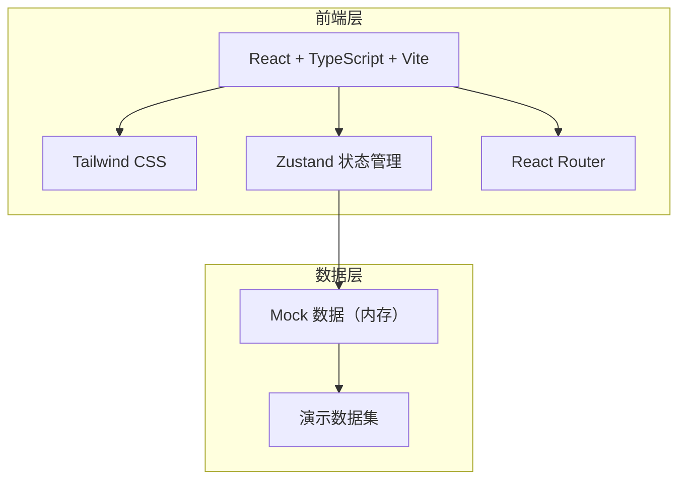
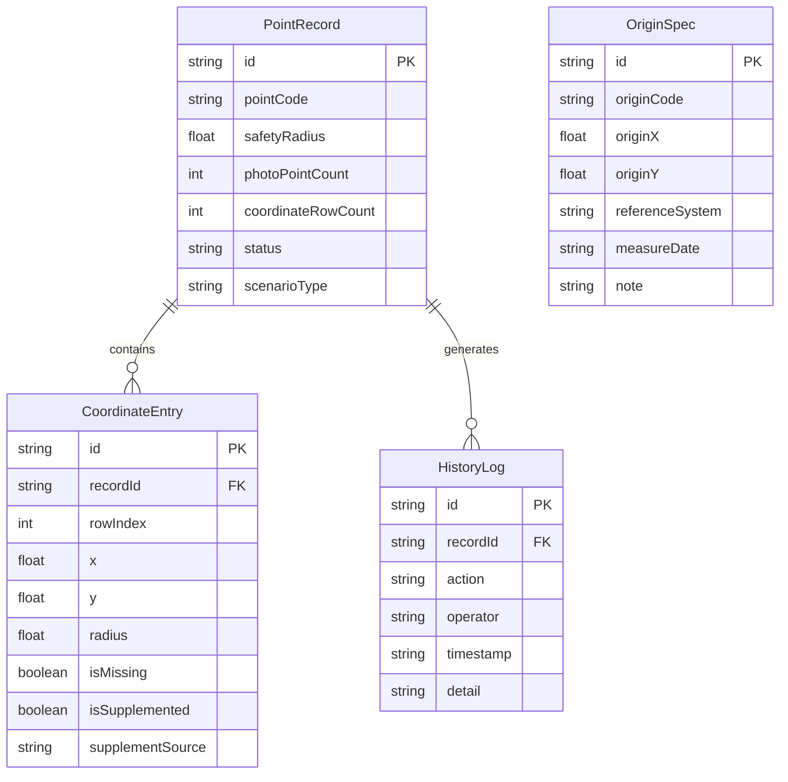

## 1. 架构设计

纯前端项目，无后端服务。所有数据存储在 Zustand store 的内存中，通过预置的演示数据集驱动界面。

## 2. 技术说明

- 前端：React@18 + TypeScript + Tailwind CSS@3 + Vite
- 初始化工具：vite-init
- 状态管理：Zustand
- 路由：React Router DOM v6
- 后端：无
- 数据库：无，使用内存 Mock 数据

## 3. 路由定义

| 路由 | 用途 |
|------|------|
| / | 工作台首页，流程概览和演示数据入口 |
| /safety-radius | 安全半径表页面，导入和查看数据 |
| /origin-spec | 坐标原点说明页面，查看和补录 |
| /obstruction | 遮挡点清单页面，查看处理结果 |
| /history | 历史记录页面，操作日志和场景对比 |

## 4. 数据模型

### 4.1 数据模型定义

### 4.2 演示数据定义

**点位记录（PointRecord）**：

| id | pointCode | safetyRadius | photoPointCount | coordinateRowCount | status | scenarioType |
|----|-----------|-------------|----------------|-------------------|--------|-------------|
| rec-001 | HD-A01 | 120.5 | 6 | 6 | normal | smooth |
| rec-002 | HD-B03 | 95.0 | 6 | 5 | pending_review | missing_row |
| rec-003 | HD-C07 | 110.0 | 6 | 5→6 | supplemented | old_calibration |

**坐标数据（CoordinateEntry）**：

| id | recordId | rowIndex | x | y | radius | isMissing | isSupplemented | supplementSource |
|----|----------|----------|---|---|--------|-----------|---------------|-----------------|
| ce-001-1 | rec-001 | 1 | 120.3 | 45.6 | 120.5 | false | false | - |
| ce-001-2 | rec-001 | 2 | 121.0 | 46.2 | 120.5 | false | false | - |
| ce-001-3 | rec-001 | 3 | 119.8 | 45.9 | 120.5 | false | false | - |
| ce-001-4 | rec-001 | 4 | 122.1 | 44.8 | 120.5 | false | false | - |
| ce-001-5 | rec-001 | 5 | 120.7 | 46.5 | 120.5 | false | false | - |
| ce-001-6 | rec-001 | 6 | 119.5 | 45.3 | 120.5 | false | false | - |
| ce-002-1 | rec-002 | 1 | 85.2 | 32.1 | 95.0 | false | false | - |
| ce-002-2 | rec-002 | 2 | 86.0 | 33.5 | 95.0 | false | false | - |
| ce-002-3 | rec-002 | 3 | 84.7 | 31.8 | 95.0 | false | false | - |
| ce-002-5 | rec-002 | 5 | 87.3 | 34.2 | 95.0 | false | false | - |
| ce-002-6 | rec-002 | 6 | 85.9 | 32.7 | 95.0 | false | false | - |
| ce-003-1 | rec-003 | 1 | 105.1 | 50.3 | 110.0 | false | false | - |
| ce-003-2 | rec-003 | 2 | 106.4 | 51.1 | 110.0 | false | false | - |
| ce-003-3 | rec-003 | 3 | 104.8 | 50.7 | 110.0 | false | false | - |
| ce-003-5 | rec-003 | 5 | 107.2 | 49.9 | 110.0 | false | false | - |
| ce-003-6 | rec-003 | 6 | 105.6 | 51.5 | 110.0 | false | false | - |
| ce-003-4s | rec-003 | 4 | 106.8 | 50.2 | 110.0 | false | true | 坐标原点说明-2023基准 |

**坐标原点说明（OriginSpec）**：

| id | originCode | originX | originY | referenceSystem | measureDate | note |
|----|-----------|---------|---------|----------------|-------------|------|
| os-001 | HD-ORIGIN | 100.0 | 50.0 | CGCS2000 | 2023-06-15 | 海岛风暴潮淹没沙盘主原点 |
| os-002 | HD-OLD | 99.8 | 49.7 | CGCS2000-2023 | 2023-03-20 | 旧测量基准，用于补录旧口径坐标 |

**历史记录（HistoryLog）**：预设完整操作链路，覆盖导入→补看→更新三步流程。
