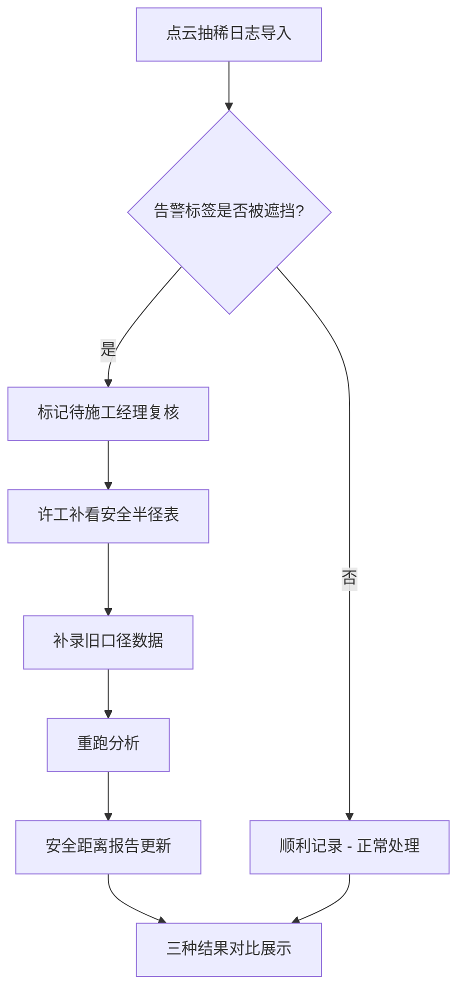

## 1. 产品概述
滑翔伞起降区风向图系统是设备工程师许工用于处理点云抽稀日志、检测告警遮挡、管理安全半径表并生成安全距离报告的专业工具。解决施工经理夜间催结果时，告警标签被移动端截图遮挡导致结论无法直接发送的痛点。

- 核心用户：设备工程师许工、施工经理
- 核心价值：三步走完点云抽稀日志导入→补看安全半径表→安全距离报告更新，中间截图遮挡问题留待施工经理复核

---

## 2. 核心功能

### 2.1 用户角色
| 角色 | 识别方式 | 核心权限 |
|------|----------|----------|
| 设备工程师许工 | 系统内置角色 | 导入日志、补录半径表、人工修正、重跑分析 |
| 施工经理 | 系统内置角色 | 复核截图遮挡记录、审批结论 |

### 2.2 功能模块
1. **小看板首页**：总览三条样例记录状态、安全半径表、最新安全距离报告
2. **点云抽稀日志管理**：导入日志、查看详情、标记告警遮挡
3. **安全半径表管理**：补录数据、新旧口径对比
4. **安全距离报告**：自动生成、随数据更新、导出结论
5. **流程演示**：三步走演示、人工修正和重跑演示

### 2.3 页面详情
| 页面名称 | 模块名称 | 功能描述 |
|---------|----------|----------|
| 小看板首页 | 状态总览 | 展示三条样例记录的不同处理结果、告警数量、报告更新时间 |
| 日志详情页 | 告警检测 | 标记移动端截图遮挡告警标签、标注待复核状态 |
| 半径表页面 | 数据管理 | 补录安全半径数据、新旧口径切换、版本对比 |
| 报告页面 | 报告生成 | 展示安全距离计算结果、随数据自动更新、导出结论 |
| 流程演示页 | 步骤引导 | 三步走动画演示：导入→补录→更新 |

---

## 3. 核心流程

### 三步主流程
1. 点云抽稀日志第一次导入：系统自动解析，检测到移动端截图遮挡告警标签时标记为"待施工经理复核"，不归为正常
2. 设备工程师许工补看安全半径表：从历史数据中补录旧口径数据
3. 安全距离报告更新：根据最新半径表重新计算，报告自动刷新

### 三种记录处理结果对比
- **顺利记录**：无告警遮挡，直接通过，报告正常生成
- **截图遮挡记录**：告警标签被移动端截图挡住，标记为待复核，报告标黄
- **旧口径补录记录**：从安全半径表补入历史数据，报告显示新旧口径对比

---

## 4. 用户界面设计

### 4.1 设计风格
- **主色调**：工业蓝 #1e3a5f + 警示橙 #f59e0b + 安全绿 #10b981
- **按钮风格**：扁平直角按钮，带细微边框，hover时轻微上浮
- **字体**：标题用 "JetBrains Mono" 等宽字体（工程感），正文用 "Noto Sans SC"
- **布局风格**：信息密度高的工具型布局，左侧导航 + 右侧内容区，卡片式数据展示
- **图标风格**：使用工程类线性图标，告警用闪烁红点动画

### 4.2 页面设计概述
| 页面名称 | 模块名称 | UI元素 |
|---------|----------|--------|
| 小看板首页 | 状态总览 | 三色状态卡片（绿/橙/蓝代表三种结果）、流程进度条、实时更新的报告摘要 |
| 日志详情页 | 告警检测 | 日志列表表格、告警标签高亮、遮挡标记浮层、待复核徽章 |
| 半径表页面 | 数据管理 | 可编辑表格、新旧版本切换、差异高亮对比 |
| 报告页面 | 报告生成 | 风向图可视化、安全半径环形图、三种结果对比表格 |
| 流程演示页 | 步骤引导 | 三步时间线、点击展开详情、动画演示流程 |

### 4.3 响应性
- Desktop-first，重点优化1280px以上大屏展示
- 表格区域支持横向滚动，适配移动端查看
- 关键操作按钮（导入、补录、重跑）固定在底部操作栏

### 4.4 数据可视化
- **风向玫瑰图**：展示滑翔伞起降区各风向频率和安全距离
- **安全半径环形图**：内圈旧口径、外圈新口径，直观对比
- **告警时间轴**：按时间顺序展示点云抽稀处理过程中的告警事件
- **三种结果对比柱形图**：直观展示顺利/待复核/旧口径三种记录的安全距离差异
