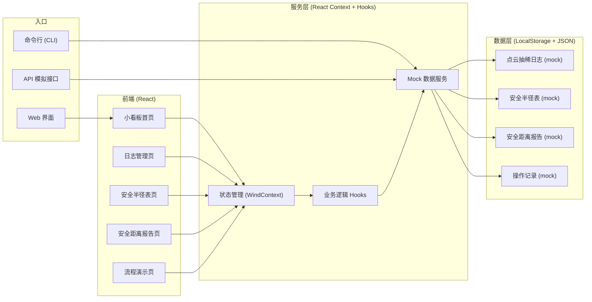
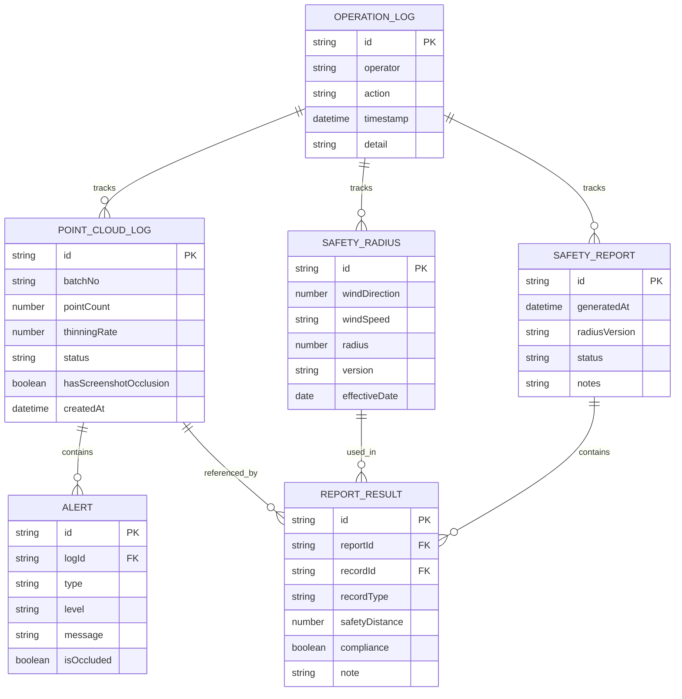

## 1. 架构设计



## 2. 技术描述
- **前端**：React@18 + TypeScript + tailwindcss@3 + vite
- **初始化工具**：pnpm create vite
- **图表库**：recharts（风向玫瑰图、柱形图、环形图）
- **状态管理**：React Context + useReducer
- **后端**：无后端，使用 Mock 数据 + LocalStorage 持久化
- **CLI**：Node.js 脚本，通过 ts-node 执行
- **API**：Express 轻量服务器模拟 REST API

## 3. 路由定义
| 路由 | 页面 | 用途 |
|------|------|------|
| / | 小看板首页 | 状态总览、三种结果对比、快捷操作 |
| /logs | 点云抽稀日志 | 日志列表、导入、告警检测、遮挡标记 |
| /radius | 安全半径表 | 半径数据管理、新旧口径对比、补录 |
| /report | 安全距离报告 | 报告生成、风向图、数据导出 |
| /demo | 流程演示 | 三步流程动画演示、人工修正和重跑 |

## 4. API 定义（模拟接口）

```typescript
// 点云抽稀日志
interface PointCloudLog {
  id: string;
  timestamp: string;
  batchNo: string;
  pointCount: number;
  thinningRate: number;
  alerts: Alert[];
  status: 'success' | 'blocked' | 'legacy' | 'pending_review';
  source: string;
  hasScreenshotOcclusion: boolean;
  screenshotNote?: string;
}

interface Alert {
  id: string;
  type: 'distance' | 'height' | 'obstacle' | 'occlusion';
  level: 'warning' | 'danger' | 'info';
  message: string;
  isOccluded: boolean;
  position: { x: number; y: number; z: number };
}

// 安全半径表
interface SafetyRadius {
  id: string;
  windDirection: number; // 0-360 度
  windSpeed: string; // 'low' | 'medium' | 'high'
  radius: number; // 米
  version: 'new' | 'legacy';
  effectiveDate: string;
  source: string;
}

// 安全距离报告
interface SafetyReport {
  id: string;
  generatedAt: string;
  logIds: string[];
  radiusVersion: 'new' | 'legacy' | 'mixed';
  results: ReportResult[];
  status: 'draft' | 'pending_review' | 'approved' | 'rejected';
  reviewedBy?: string;
  notes: string;
}

interface ReportResult {
  recordId: string;
  recordType: 'success' | 'blocked' | 'legacy';
  safetyDistance: number;
  compliance: boolean;
  note: string;
}

// API 端点
// GET /api/logs - 获取日志列表
// POST /api/logs/import - 导入日志
// POST /api/logs/:id/mark-occlusion - 标记截图遮挡
// GET /api/radius - 获取安全半径表
// POST /api/radius - 补录半径数据
// POST /api/report/generate - 生成报告
// GET /api/report/latest - 获取最新报告
// POST /api/report/:id/review - 施工经理复核
```

## 5. 数据模型

### 5.1 ER 图


### 5.2 初始演示数据
```typescript
// 三条样例记录
const demoLogs: PointCloudLog[] = [
  {
    id: 'LOG-001',
    timestamp: '2024-06-15T08:30:00',
    batchNo: 'PC-2024-0615-A',
    pointCount: 1250000,
    thinningRate: 0.85,
    status: 'success',
    source: '机载LiDAR',
    hasScreenshotOcclusion: false,
    alerts: [
      { id: 'A-001', type: 'distance', level: 'info', message: '北侧障碍物距离正常', isOccluded: false, position: { x: 120, y: 80, z: 45 } }
    ]
  },
  {
    id: 'LOG-002',
    timestamp: '2024-06-15T14:20:00',
    batchNo: 'PC-2024-0615-B',
    pointCount: 980000,
    thinningRate: 0.82,
    status: 'pending_review',
    source: '移动端巡检',
    hasScreenshotOcclusion: true,
    screenshotNote: '告警标签区域被移动端截图水印遮挡约40%，需人工复核',
    alerts: [
      { id: 'A-002', type: 'distance', level: 'danger', message: '东北方向安全距离不足', isOccluded: true, position: { x: 95, y: -110, z: 38 } },
      { id: 'A-003', type: 'obstacle', level: 'warning', message: '高压塔位置标记存疑', isOccluded: false, position: { x: 80, y: -90, z: 52 } }
    ]
  },
  {
    id: 'LOG-003',
    timestamp: '2024-06-14T16:45:00',
    batchNo: 'PC-2024-0614-A',
    pointCount: 1120000,
    thinningRate: 0.88,
    status: 'legacy',
    source: '历史数据补录',
    hasScreenshotOcclusion: false,
    alerts: [
      { id: 'A-004', type: 'height', level: 'warning', message: '相对高度按2023旧口径计算', isOccluded: false, position: { x: -60, y: 130, z: 41 } }
    ]
  }
];

// 安全半径表 - 新旧口径对比
const demoRadius: SafetyRadius[] = [
  { id: 'R-001', windDirection: 0, windSpeed: 'low', radius: 150, version: 'new', effectiveDate: '2024-01-01', source: 'GB 2024' },
  { id: 'R-002', windDirection: 0, windSpeed: 'low', radius: 120, version: 'legacy', effectiveDate: '2023-01-01', source: 'GB 2023' },
  { id: 'R-003', windDirection: 45, windSpeed: 'medium', radius: 200, version: 'new', effectiveDate: '2024-01-01', source: 'GB 2024' },
  { id: 'R-004', windDirection: 45, windSpeed: 'medium', radius: 160, version: 'legacy', effectiveDate: '2023-01-01', source: 'GB 2023' },
  { id: 'R-005', windDirection: 90, windSpeed: 'high', radius: 280, version: 'new', effectiveDate: '2024-01-01', source: 'GB 2024' },
  { id: 'R-006', windDirection: 90, windSpeed: 'high', radius: 220, version: 'legacy', effectiveDate: '2023-01-01', source: 'GB 2023' },
  { id: 'R-007', windDirection: 180, windSpeed: 'low', radius: 180, version: 'new', effectiveDate: '2024-01-01', source: 'GB 2024' },
  { id: 'R-008', windDirection: 180, windSpeed: 'low', radius: 140, version: 'legacy', effectiveDate: '2023-01-01', source: 'GB 2023' },
  { id: 'R-009', windDirection: 270, windSpeed: 'medium', radius: 220, version: 'new', effectiveDate: '2024-01-01', source: 'GB 2024' },
  { id: 'R-010', windDirection: 270, windSpeed: 'medium', radius: 180, version: 'legacy', effectiveDate: '2023-01-01', source: 'GB 2023' }
];
```
