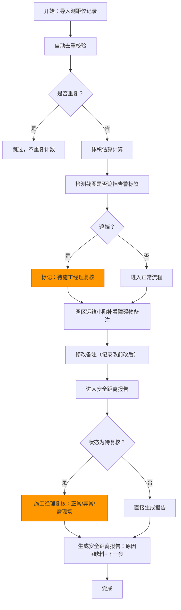

## 1. 产品概述

粮仓堆垛体积估算系统，为园区运维与施工管理团队提供从测距仪数据导入、障碍物核查到安全距离报告生成的全流程协作平台。解决施工经理会前10分钟快速决策、重复导入数据不重复计数、变更历史可追溯、报告可读可执行等核心痛点。

### 核心价值
- **效率提升**：施工经理10分钟内完成决策，无需翻查原始测距仪记录
- **数据准确**：重复导入自动去重，避免估算数量翻倍
- **责任清晰**：变更留痕，截图遮挡告警留待经理复核，不自动归正常
- **报告可用**：安全距离报告说明原因、缺料、下一步责任人，而非冰冷日志

---

## 2. 核心功能

### 2.1 用户角色

| 角色 | 场景说明 | 核心权限 |
|------|----------|----------|
| 园区运维（小陶） | 现场数据采集、障碍物备注补充 | 导入测距仪记录、编辑障碍物备注、查看估算结果 |
| 施工经理 | 会前快速复核、决策审批 | 复核告警遮挡项、审批安全距离报告、查看所有历史 |
| 服务复核 | 3D/图表展示时的数据核对 | 点击数据点回溯原始记录、关联障碍物备注 |

### 2.2 功能模块

1. **工作流总览页**：三步工作流进度展示、待办事项、快速跳转
2. **测距仪记录导入**：批量导入、自动去重、导入校验报告
3. **堆垛体积估算**：专业计算引擎、参数版本标注、计算过程透明化
4. **障碍物备注管理**：编辑备注、历史对比（改前/改后）、移动端截图关联
5. **告警标签处理**：截图遮挡检测、待复核标记、经理复核通道
6. **3D/图表展示**：体积可视化、点击回溯原始数据、关联备注跳转
7. **安全距离报告**：原因说明、缺料清单、责任人分配、下一步指引
8. **变更历史**：全操作留痕、对比视图、审计追踪

### 2.3 页面详情

| 页面名称 | 模块名称 | 功能描述 |
|----------|----------|----------|
| 工作流总览 | 三步进度条 | 导入→补备注→更新报告，每步状态清晰标记，告警项高亮 |
| 工作流总览 | 待办卡片 | 「待小陶补备注」「待经理复核」「待更新报告」数量与快速入口 |
| 测距仪导入 | 文件上传 | 支持Excel/CSV批量导入，预览数据，冲突检测提示 |
| 测距仪导入 | 去重校验 | 自动识别同一批记录，显示导入统计：新增X条，重复Y条已跳过 |
| 体积估算 | 计算结果 | 单堆垛估算值、总估算值、专业公式显示 |
| 体积估算 | 参数标注 | 计算参数版本、取舍理由（如"取锥体模型而非长方体，因堆垛顶部呈锥形"） |
| 障碍物备注 | 列表视图 | 每条记录：测距点、截图预览、备注、告警状态 |
| 障碍物备注 | 编辑弹窗 | 备注输入框、历史对比侧栏（改前/改后并排显示） |
| 告警处理 | 遮挡检测 | 自动检测移动端截图是否遮挡告警标签，标记为"待经理复核" |
| 告警处理 | 复核面板 | 经理可查看截图、原始测距记录、备注，决定"正常"/"异常"/"需现场复核" |
| 3D/图表视图 | 堆垛可视化 | 按实际形状3D展示，点击任一区域高亮并显示关联数据 |
| 3D/图表视图 | 回溯跳转 | 点击数据点→跳转测距仪记录或障碍物备注，不脱离上下文 |
| 安全距离报告 | 报告列表 | 每条记录：编号、状态、原因说明、缺料、下一步责任人 |
| 安全距离报告 | 报告详情 | 为什么留下（如"距离仅0.8米，小于安全距离1.2米"）、缺什么材料（如"缺隔离桩3根"）、下一步找谁（如"联系施工经理协调"） |
| 变更历史 | 时间线 | 所有操作：谁、什么时候、改了什么、改前改后 |
| 变更历史 | 对比视图 | 同一字段不同版本的并排对比 |

---

## 3. 核心流程

### 三步核心工作流
1. **第一步：测距仪记录第一次导入**
   - 园区运维小陶批量导入测距仪记录
   - 系统自动去重，标记"截图遮挡告警标签"的记录为"待施工经理复核"
   - 体积估算自动计算，参数版本和取舍理由附在结果旁

2. **第二步：园区运维小陶补看障碍物备注**
   - 小陶查看每条记录的移动端截图和测距数据
   - 补充或修改障碍物备注，系统自动记录改前改后
   - 截图遮挡的记录保持"待复核"状态，不自动归正常

3. **第三步：安全距离报告更新**
   - 施工经理复核"待复核"项，给出明确结论
   - 系统生成安全距离报告，逐条说明：原因、缺料、下一步
   - 报告可导出，可在线查看

### 业务流程图

---

## 4. 用户界面设计

### 4.1 设计风格

**设计理念**：工业极简主义 + 功能性优先。

- **主色调**：深工业蓝 `#1e3a5f`（专业、稳重、适合工业场景）
- **强调色**：警示橙 `#ff6b35`（待复核、告警项高亮）、通过绿 `#2d6a4f`（已确认正常）、警告黄 `#f4a261`（缺料、待补充）
- **中性色**：冷灰系列 `#f8f9fa` / `#e9ecef` / `#495057`（保证大量数据展示时的可读性）
- **按钮风格**：直角微圆角（2px），1px边框，悬停时上移1px+浅阴影，工业感十足
- **字体**：
  - 标题：`"Noto Sans SC"`，粗体700，字间距收紧-0.5px
  - 正文：`"Source Han Sans SC"`，常规400，行高1.6
  - 数据/数字：`"JetBrains Mono"`，等宽字体，保证数字对齐易读
- **布局风格**：卡片式分区，严格对齐网格线，充足留白但不松散
- **视觉细节**：
  - 卡片添加1px浅灰边框 + 极细内阴影（深度感）
  - 数据表格使用斑马纹提升可读性
  - 告警项使用左侧4px宽色条标记（而非整行变色）

### 4.2 页面设计概览

| 页面名称 | 模块名称 | UI 元素 |
|----------|----------|----------|
| 工作流总览 | 三步进度条 | 竖向时间线，每步包含：图标、标题、状态标签、计数，当前步骤高亮放大 |
| 工作流总览 | 待办卡片 | 三栏并排卡片，悬停缩放1.02倍，点击涟漪效果，底部显示快速操作按钮 |
| 测距仪导入 | 上传区域 | 虚线边框拖拽区，支持点击选择，上传后实时进度条 |
| 体积估算 | 计算卡片 | 大号结果数字 + 小号参数说明，右上角参数版本标签，hover显示取舍理由tooltip |
| 障碍物备注 | 列表行 | 左侧截图缩略图 + 中间数据 + 右侧状态色条 + 操作按钮，点击展开历史对比 |
| 告警处理 | 复核弹窗 | 左侧截图放大 + 右侧原始数据 + 底部三个决策按钮（正常/异常/需现场） |
| 3D/图表视图 | 展示区 | 3D堆垛模型可旋转缩放，悬停显示数据点，点击弹出快捷操作菜单（查看测距记录/查看备注） |
| 安全距离报告 | 报告行 | 三部分结构：①为什么留下（红色说明）②缺什么（黄色清单）③下一步（蓝色责任人） |
| 变更历史 | 对比视图 | 左右分栏，改前红叉标记删除，改后绿勾标记新增，时间戳与操作人 |

### 4.3 响应式设计

- **桌面优先**（1280px以上）：三栏布局，左侧导航，中间主内容，右侧详情面板
- **平板适配**（768-1279px）：两栏布局，顶部导航，主内容区可折叠右侧面板
- **手机适配**（375-767px）：单栏布局，底部Tab导航，卡片垂直堆叠，操作按钮改为底部浮层
- **触控优化**：移动端按钮最小高度48px，间距8px以上，避免误触

### 4.4 3D场景设计

- **环境**：工业厂房场景，HDRI使用柔和仓库照明，避免过暗或过曝
- **光照**：主光顶光+辅助侧光，突出堆垛形状的体积感，阴影柔和
- **相机**：默认45°俯视角，可拖拽旋转、滚轮缩放、双击复位
- **交互**：点击堆垛表面高亮对应区域，显示体积占比、测距点位置，弹出关联操作
- **动画**：数据加载时堆垛从底部渐入+轻微上抬，切换数据时平滑过渡
- **性能**：单个堆垛面数控制在5000以内，使用实例化渲染优化多个堆垛展示
