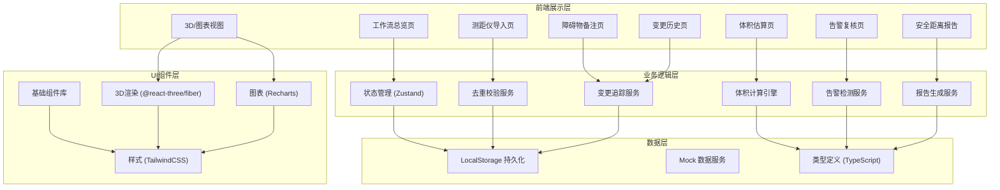
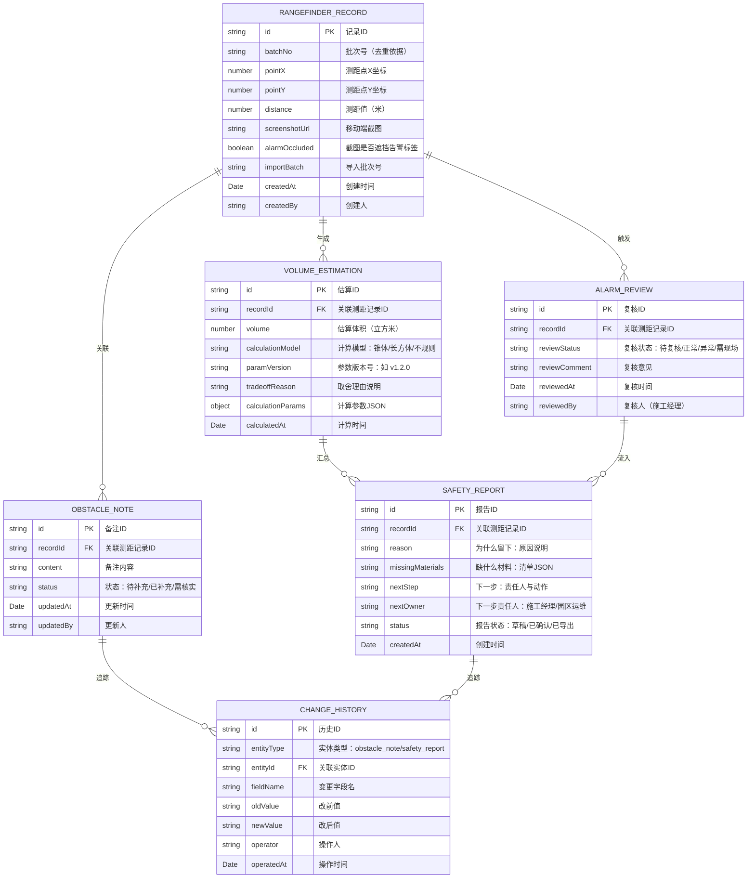

## 1. 架构设计



---

## 2. 技术选型说明

### 技术栈
| 层级 | 技术选型 | 版本 | 说明 |
|------|----------|------|------|
| 前端框架 | React | 18.x | 函数式组件 + Hooks |
| 开发工具 | Vite | 5.x | 快速构建与热更新 |
| 语言 | TypeScript | 5.x | 类型安全 |
| 状态管理 | Zustand | 4.x | 轻量、高性能状态管理 |
| 样式 | TailwindCSS | 3.4.x | 原子化CSS，快速开发 |
| 3D渲染 | @react-three/fiber | 8.x | Three.js的React封装 |
| 3D工具 | @react-three/drei | 9.x | 常用3D组件库 |
| 图表 | Recharts | 2.x | 组合式图表库 |
| 数据持久化 | LocalStorage | - | 前端本地存储 |
| 文件解析 | xlsx | 0.18.x | Excel/CSV解析 |

### 初始化方式
- 使用 `pnpm create vite@latest . -- --template react-ts` 初始化项目
- 后续安装所需依赖

### 后端说明
- 本版本为纯前端实现，使用 Mock 数据与 LocalStorage 持久化
- 数据模型设计预留后端 API 接入能力

---

## 3. 路由定义

| 路由路径 | 页面名称 | 说明 |
|----------|----------|------|
| `/` | 工作流总览 | 三步工作流进度、待办卡片、快速导航 |
| `/import` | 测距仪记录导入 | 文件上传、预览、去重校验、导入结果 |
| `/estimation` | 堆垛体积估算 | 计算结果、参数版本、取舍理由 |
| `/obstacles` | 障碍物备注 | 备注列表、编辑、历史对比 |
| `/review` | 告警复核 | 截图遮挡项列表、经理复核面板 |
| `/visualization` | 3D/图表展示 | 堆垛3D可视化、体积图表、点击回溯 |
| `/report` | 安全距离报告 | 报告列表、原因/缺料/下一步说明、导出 |
| `/history` | 变更历史 | 操作时间线、改前改后对比 |

---

## 4. 数据模型设计

### 4.1 ER图



### 4.2 TypeScript 类型定义

```typescript
// 测距仪记录
export interface RangefinderRecord {
  id: string;
  batchNo: string;
  pointX: number;
  pointY: number;
  distance: number;
  screenshotUrl: string;
  alarmOccluded: boolean;
  importBatch: string;
  createdAt: string;
  createdBy: string;
}

// 体积估算
export interface VolumeEstimation {
  id: string;
  recordId: string;
  volume: number;
  calculationModel: 'cone' | 'cuboid' | 'irregular';
  paramVersion: string;
  tradeoffReason: string;
  calculationParams: Record<string, number>;
  calculatedAt: string;
}

// 障碍物备注
export interface ObstacleNote {
  id: string;
  recordId: string;
  content: string;
  status: 'pending' | 'completed' | 'verify';
  updatedAt: string;
  updatedBy: string;
}

// 告警复核
export interface AlarmReview {
  id: string;
  recordId: string;
  reviewStatus: 'pending' | 'normal' | 'abnormal' | 'onsite';
  reviewComment: string;
  reviewedAt: string;
  reviewedBy: string;
}

// 安全距离报告
export interface SafetyReport {
  id: string;
  recordId: string;
  reason: string;
  missingMaterials: string[];
  nextStep: string;
  nextOwner: 'manager' | 'operator';
  status: 'draft' | 'confirmed' | 'exported';
  createdAt: string;
}

// 变更历史
export interface ChangeHistory {
  id: string;
  entityType: 'obstacle_note' | 'safety_report';
  entityId: string;
  fieldName: string;
  oldValue: string;
  newValue: string;
  operator: string;
  operatedAt: string;
}

// 工作流状态
export type WorkflowStep = 'import' | 'notes' | 'report';
export type WorkflowStatus = 'pending' | 'in_progress' | 'completed' | 'blocked';
```

---

## 5. 核心服务设计

### 5.1 去重校验服务

```typescript
interface DuplicateCheckResult {
  newRecords: RangefinderRecord[];
  duplicateRecords: RangefinderRecord[];
  skippedCount: number;
  addedCount: number;
}

class DuplicateChecker {
  // 基于 batchNo + pointX + pointY 联合去重
  checkDuplicates(incoming: RangefinderRecord[], existing: RangefinderRecord[]): DuplicateCheckResult;
  // 生成导入批次号
  generateImportBatch(): string;
}
```

### 5.2 体积计算引擎

```typescript
interface CalculationResult {
  volume: number;
  model: 'cone' | 'cuboid' | 'irregular';
  paramVersion: string;
  tradeoffReason: string;
  params: Record<string, number>;
}

class VolumeCalculator {
  // 自动选择计算模型
  autoSelectModel(record: RangefinderRecord): CalculationResult;
  // 锥体模型计算
  calculateCone(height: number, radius: number): CalculationResult;
  // 长方体模型计算
  calculateCuboid(length: number, width: number, height: number): CalculationResult;
}
```

### 5.3 变更追踪服务

```typescript
class ChangeTracker {
  // 记录字段变更
  trackChange<T>(entityType: string, entityId: string, fieldName: string, oldValue: T, newValue: T, operator: string): void;
  // 获取实体的变更历史
  getHistory(entityType: string, entityId: string): ChangeHistory[];
  // 生成改前改后对比
  generateDiff(oldValue: string, newValue: string): { removed: string[]; added: string[] };
}
```

### 5.4 告警检测服务

```typescript
class AlarmDetector {
  // 检测截图是否遮挡告警标签（模拟AI检测，实际项目可接入图像识别API）
  detectOcclusion(screenshotUrl: string): boolean;
  // 自动标记待复核状态
  markForReview(recordId: string): void;
}
```

---

## 6. 状态管理设计

### Store 结构

```typescript
interface AppState {
  // 数据
  rangefinderRecords: RangefinderRecord[];
  volumeEstimations: VolumeEstimation[];
  obstacleNotes: ObstacleNote[];
  alarmReviews: AlarmReview[];
  safetyReports: SafetyReport[];
  changeHistories: ChangeHistory[];

  // UI状态
  currentStep: WorkflowStep;
  selectedRecordId: string | null;
  viewMode: 'list' | '3d' | 'chart';

  // 操作
  importRecords: (files: File[]) => Promise<DuplicateCheckResult>;
  updateObstacleNote: (id: string, content: string, operator: string) => void;
  reviewAlarm: (id: string, status: AlarmReview['reviewStatus'], comment: string, operator: string) => void;
  generateSafetyReport: (recordId: string) => SafetyReport;
  getHistoryForEntity: (entityType: string, entityId: string) => ChangeHistory[];
}
```

---

## 7. 核心业务逻辑伪代码

### 三步工作流状态流转

```typescript
// 第一步：导入测距仪记录
async function step1_importRecords(file: File) {
  const parsed = await parseExcel(file);
  const { newRecords, skippedCount } = duplicateChecker.checkDuplicates(parsed, state.rangefinderRecords);
  
  for (const record of newRecords) {
    record.alarmOccluded = alarmDetector.detectOcclusion(record.screenshotUrl);
    // 自动计算体积
    const estimation = volumeCalculator.autoSelectModel(record);
    state.volumeEstimations.push(estimation);
    // 如果遮挡告警，创建待复核
    if (record.alarmOccluded) {
      state.alarmReviews.push({
        id: uuid(),
        recordId: record.id,
        reviewStatus: 'pending', // 保持待复核，不自动归正常
        reviewComment: '',
        reviewedAt: '',
        reviewedBy: ''
      });
    }
  }
  
  state.rangefinderRecords.push(...newRecords);
  return { addedCount: newRecords.length, skippedCount };
}

// 第二步：园区运维补看备注
function step2_updateObstacleNote(recordId: string, newContent: string, operator: string) {
  const note = state.obstacleNotes.find(n => n.recordId === recordId);
  if (note) {
    const oldContent = note.content;
    note.content = newContent;
    note.updatedAt = new Date().toISOString();
    note.updatedBy = operator;
    note.status = 'completed';
    
    // 追踪变更历史
    changeTracker.trackChange('obstacle_note', note.id, 'content', oldContent, newContent, operator);
  }
  
  // 关键：截图遮挡的记录保持待复核状态，不自动归正常
  const review = state.alarmReviews.find(r => r.recordId === recordId);
  if (review && review.reviewStatus === 'pending') {
    // 状态不变，等待施工经理复核
  }
}

// 第三步：安全距离报告更新
function step3_generateSafetyReport(recordId: string) {
  const record = state.rangefinderRecords.find(r => r.id === recordId);
  const estimation = state.volumeEstimations.find(e => e.recordId === recordId);
  const review = state.alarmReviews.find(r => r.recordId === recordId);
  
  // 如果是待复核状态，必须经理先复核才能生成报告
  if (review && review.reviewStatus === 'pending') {
    throw new Error('请先由施工经理复核告警遮挡项');
  }
  
  // 生成报告三要素：原因、缺料、下一步
  const report: SafetyReport = {
    id: uuid(),
    recordId,
    reason: generateReason(record, estimation, review),
    missingMaterials: determineMissingMaterials(record, estimation),
    nextStep: determineNextStep(review),
    nextOwner: review?.reviewStatus === 'abnormal' ? 'manager' : 'operator',
    status: 'confirmed',
    createdAt: new Date().toISOString()
  };
  
  state.safetyReports.push(report);
  return report;
}

// 生成"为什么留下"的原因说明
function generateReason(record, estimation, review): string {
  const safeDistance = 1.2; // 安全距离标准
  if (record.distance < safeDistance) {
    return `实测距离仅${record.distance}米，小于安全距离标准${safeDistance}米，需保留此告警。`;
  }
  if (review?.reviewStatus === 'abnormal') {
    return `施工经理复核判定为异常：${review.reviewComment}`;
  }
  return '距离符合安全标准，但因障碍物类型特殊需保留观察。';
}
```
