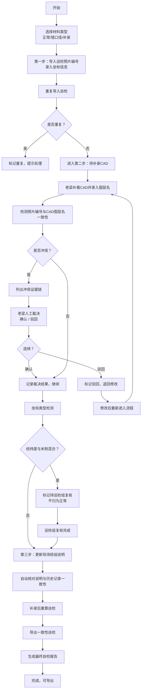

## 1. 产品概述

船舶机舱管线定位系统，用于管理船舶机舱内管线巡检数据，解决经纬度与米制坐标混合、巡检照片编号与CAD图层名冲突、数据追溯断裂等核心痛点，确保现场作业说明与历史记录一致可查。

- 核心用户：培训教官老梁、巡检组、现场班组
- 核心价值：建立可追溯的三步工作流，强制人工复核关键冲突，杜绝自动拍板导致的错误

---

## 2. 核心功能

### 2.1 用户角色

| 角色 | 注册方式 | 核心权限 |
|------|----------|----------|
| 培训教官（老梁） | 系统内置 | 导入数据、补录CAD图层名、冲突裁决（确认/驳回）、更新现场说明 |
| 巡检组 | 系统内置 | 复核坐标混合数据、执行自检 |
| 现场班组 | 系统内置 | 查看作业说明、查看历史记录 |

### 2.2 功能模块

1. **数据导入页**：三种材料（正常/错口径/补录）导入、巡检照片编号录入
2. **工作流主面板**：三步流程进度可视化、管线记录列表、状态追踪
3. **CAD补录页**：培训教官补看并录入CAD图层名
4. **冲突处理页**：照片编号与CAD图层名冲突证据展示、人工裁决
5. **坐标复核页**：经纬度与米制坐标混合检测、巡检组复核
6. **自检中心**：重复导入、坐标混合、补录重算、导出一致性检查
7. **历史追溯页**：操作历史、版本对比、证据链查看
8. **现场说明页**：给现场班组的作业说明、与历史记录核对

### 2.3 页面详情

| 页面名称 | 模块名称 | 功能描述 |
|----------|----------|----------|
| 数据导入页 | 材料类型选择 | 支持正常材料、错口径材料、补录材料三种类型导入 |
| 数据导入页 | 照片编号录入 | 批量或单个录入巡检照片编号，自动检测重复 |
| 数据导入页 | 坐标录入 | 支持经纬度和米制坐标录入，标记坐标类型 |
| 工作流主面板 | 进度看板 | 三步流程进度条、各状态数量统计 |
| 工作流主面板 | 管线列表 | 展示所有管线记录，支持筛选、搜索、状态标签 |
| CAD补录页 | 图层名录入 | 培训教官补看CAD图后录入图层名，与照片编号关联 |
| 冲突处理页 | 冲突证据展示 | 列出照片编号与CAD图层名矛盾的具体证据链 |
| 冲突处理页 | 人工裁决 | 老梁选择确认或驳回，禁止系统自动处理 |
| 坐标复核页 | 混合检测 | 自动检测经纬度与米制坐标混合的记录 |
| 坐标复核页 | 巡检复核 | 标记为待巡检组复核，不自动归为正常 |
| 自检中心 | 四项自检 | 重复导入检测、坐标混合检测、补录重算、导出一致检查 |
| 自检中心 | 报告生成 | 生成自检报告，标记问题项，提供定位入口 |
| 历史追溯页 | 操作日志 | 完整记录每一步操作人、时间、变更内容 |
| 历史追溯页 | 版本对比 | 支持不同版本数据对比，高亮差异 |
| 现场说明页 | 作业说明 | 展示最终确认的作业说明，关联历史记录 |
| 现场说明页 | 历史核对 | 自动核对说明与历史记录是否一致，标记异常 |

---

## 3. 核心流程

### 三步工作流主流程

培训教官老梁导入巡检照片编号（第一步）→ 老梁补看CAD图层名（第二步）→ 检测冲突并人工裁决 → 坐标混合检测并巡检组复核 → 更新现场班组说明（第三步）→ 自检 → 导出

---

## 4. 用户界面设计

### 4.1 设计风格

- **主色调**：工业蓝（#1e3a5f）作为主色，警示橙（#e67e22）用于冲突标记，确认绿（#27ae60）用于正常状态，驳回红（#c0392b）用于异常
- **按钮风格**：方角矩形，轻微阴影，工业工装风格，状态色区分明确
- **字体**：标题使用 Roboto Condensed（工业感 condensed 字体），正文使用 JetBrains Mono（等宽字体，便于编号/坐标对齐阅读）
- **布局风格**：左右分栏 + 顶部导航 + 底部状态栏，左侧流程进度，右侧内容区，卡片式模块
- **图标风格**：线性工业图标，避免圆润可爱风格，使用简洁几何图形
- **视觉细节**：增加微妙的网格纹理背景，模拟工程图纸感；关键数据使用等宽表格对齐；证据链使用时间轴样式展示

### 4.2 页面设计概述

| 页面名称 | 模块名称 | UI元素 |
|----------|----------|--------|
| 数据导入页 | 材料类型选择 | 三个大卡片，不同颜色边框，点击选中 |
| 数据导入页 | 表单区 | 表格形式录入，照片编号列、坐标列、坐标类型下拉选择 |
| 工作流主面板 | 进度看板 | 顶部三步进度条，当前步骤高亮，已完成打钩 |
| 工作流主面板 | 管线列表 | 数据表格，行高紧凑，状态标签颜色区分，支持多选 |
| 冲突处理页 | 证据展示 | 左右对比布局，左侧照片编号信息，右侧CAD图层信息，中间冲突标记 |
| 冲突处理页 | 裁决区 | 底部固定操作栏，确认/驳回两个大按钮，必须点击选择 |
| 坐标复核页 | 混合标记 | 表格中混合坐标行高亮橙色，复核按钮突出 |
| 自检中心 | 四项检查 | 四个检查卡片，每个有状态指示灯、问题数量、查看详情按钮 |
| 历史追溯页 | 时间轴 | 左侧时间轴，右侧操作详情，变更内容红色划线 + 绿色新值对比 |
| 现场说明页 | 说明区 | 大字号说明内容，底部关联历史记录折叠面板 |

### 4.3 响应式

- **Desktop-first**：主布局1280px以上优化，左侧固定240px流程导航，右侧自适应内容区
- **平板适配**：1024px时左侧导航可折叠为图标
- **移动适配**：768px以下上下布局，顶部标签页切换，表格支持横向滚动

### 4.4 动效设计

- 页面加载：顶部进度条 + 内容区淡入
- 状态变更：状态标签颜色过渡动画（0.3s ease）
- 冲突检测：冲突项轻微闪烁提示（2次橙色脉冲）
- 时间轴：滚动时逐步显现
- 按钮点击：微缩放（scale 0.97）+ 阴影加深
