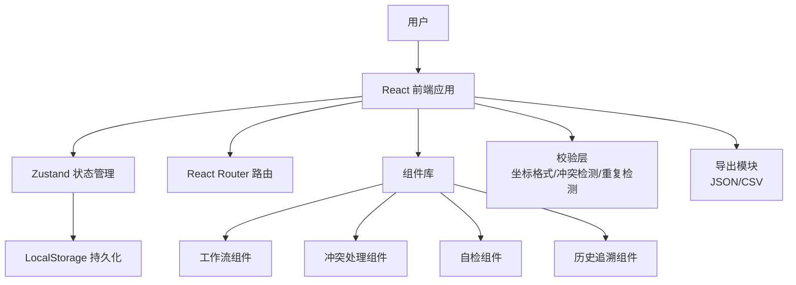
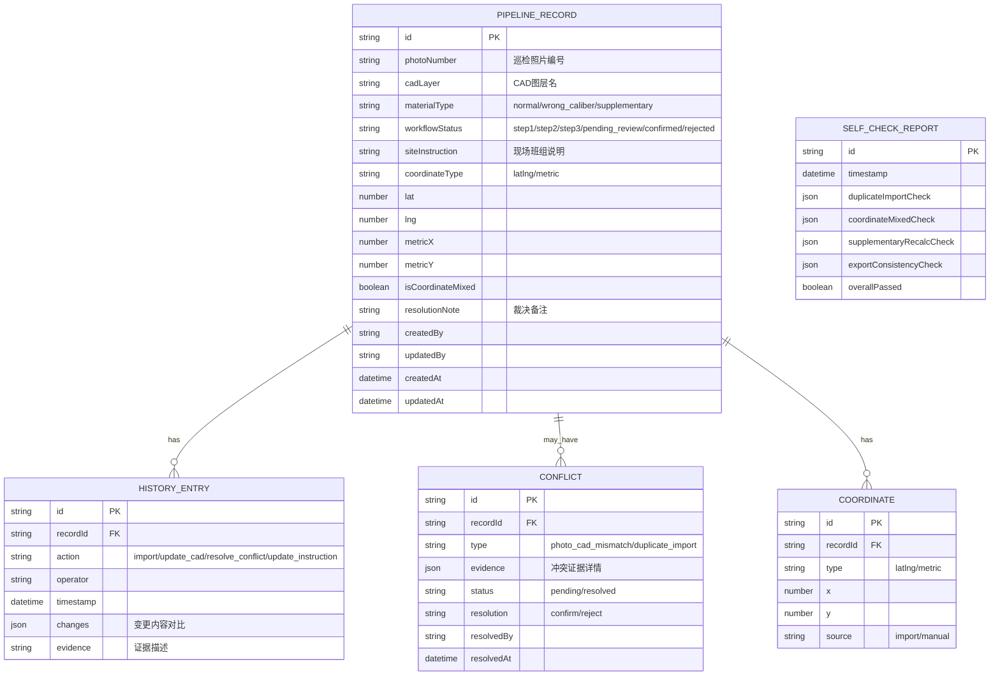

## 1. 架构设计



## 2. 技术描述

- **前端框架**：React@18 + TypeScript
- **构建工具**：Vite@5
- **样式方案**：TailwindCSS@3 + CSS Variables
- **状态管理**：Zustand（轻量，无需复杂中间件）
- **路由**：React Router DOM@6
- **图标**：Lucide React（线性工业风格）
- **数据持久化**：LocalStorage（纯前端，无需后端）
- **导出功能**：原生 JSON/CSV 导出，使用 FileSaver 库

## 3. 路由定义

| 路由 | 用途 |
|------|------|
| / | 工作流主面板（首页） |
| /import | 数据导入页 |
| /cad | CAD图层名补录页 |
| /conflicts | 冲突处理页 |
| /coordinates | 坐标复核页 |
| /self-check | 自检中心 |
| /history | 历史追溯页 |
| /instructions | 现场说明页 |

## 4. 数据模型

### 4.1 数据模型定义



### 4.2 TypeScript 类型定义

```typescript
type MaterialType = 'normal' | 'wrong_caliber' | 'supplementary';
type WorkflowStatus = 'step1' | 'step2' | 'step3' | 'pending_review' | 'confirmed' | 'rejected';
type CoordinateType = 'latlng' | 'metric';
type ConflictType = 'photo_cad_mismatch' | 'duplicate_import';
type ConflictStatus = 'pending' | 'resolved';
type ConflictResolution = 'confirm' | 'reject';

interface Coordinate {
  type: CoordinateType;
  lat?: number;
  lng?: number;
  metricX?: number;
  metricY?: number;
}

interface PipelineRecord {
  id: string;
  photoNumber: string;
  cadLayer?: string;
  materialType: MaterialType;
  status: WorkflowStatus;
  siteInstruction?: string;
  coordinate: Coordinate;
  isCoordinateMixed?: boolean;
  resolutionNote?: string;
  createdBy: string;
  updatedBy: string;
  createdAt: string;
  updatedAt: string;
}

interface HistoryEntry {
  id: string;
  recordId: string;
  action: 'import' | 'update_cad' | 'resolve_conflict' | 'update_instruction' | 'review_coordinate';
  operator: string;
  timestamp: string;
  changes: {
    field: string;
    oldValue: any;
    newValue: any;
  }[];
  evidence?: string;
}

interface Conflict {
  id: string;
  recordId: string;
  type: ConflictType;
  evidence: {
    description: string;
    photoValue: any;
    cadValue: any;
  }[];
  status: ConflictStatus;
  resolution?: ConflictResolution;
  resolvedBy?: string;
  resolvedAt?: string;
}

interface SelfCheckReport {
  id: string;
  timestamp: string;
  checks: {
    duplicateImport: {
      passed: boolean;
      issues: { recordId: string; photoNumber: string; count: number }[];
    };
    coordinateMixed: {
      passed: boolean;
      issues: { recordId: string; photoNumber: string; detail: string }[];
    };
    supplementaryRecalc: {
      passed: boolean;
      issues: { recordId: string; photoNumber: string; detail: string }[];
    };
    exportConsistency: {
      passed: boolean;
      issues: { recordId: string; photoNumber: string; detail: string }[];
    };
  };
  overallPassed: boolean;
}
```

## 5. 核心业务规则实现

### 5.1 冲突检测规则
- 照片编号与CAD图层名命名规则不一致（如编号前缀不匹配）时标记为冲突
- 同一照片编号对应多个CAD图层名时标记为冲突
- **必须列出证据，不可自动裁决**

### 5.2 坐标混合检测规则
- 同时存在经纬度和米制坐标字段值时标记为混合
- 检测全局范围内坐标类型不统一时标记为混合
- **标记为待巡检组复核，不归为正常**

### 5.3 自检规则
1. **重复导入检测**：同一照片编号导入多次时标记
2. **坐标混合检测**：见5.2
3. **补录重算检测**：补录材料后重新计算所有关联记录的状态一致性
4. **导出一致性检测**：导出数据与当前系统数据逐字段对比，确保一致

### 5.4 三步流转规则
- 第一步完成（导入照片编号）→ 自动进入第二步待补录CAD
- 第二步完成（补录CAD图层名）→ 触发冲突检测 → 冲突处理完成 → 坐标检测
- 坐标复核完成 → 进入第三步更新现场说明
- 三步全部完成 + 自检通过 → 标记为 confirmed
