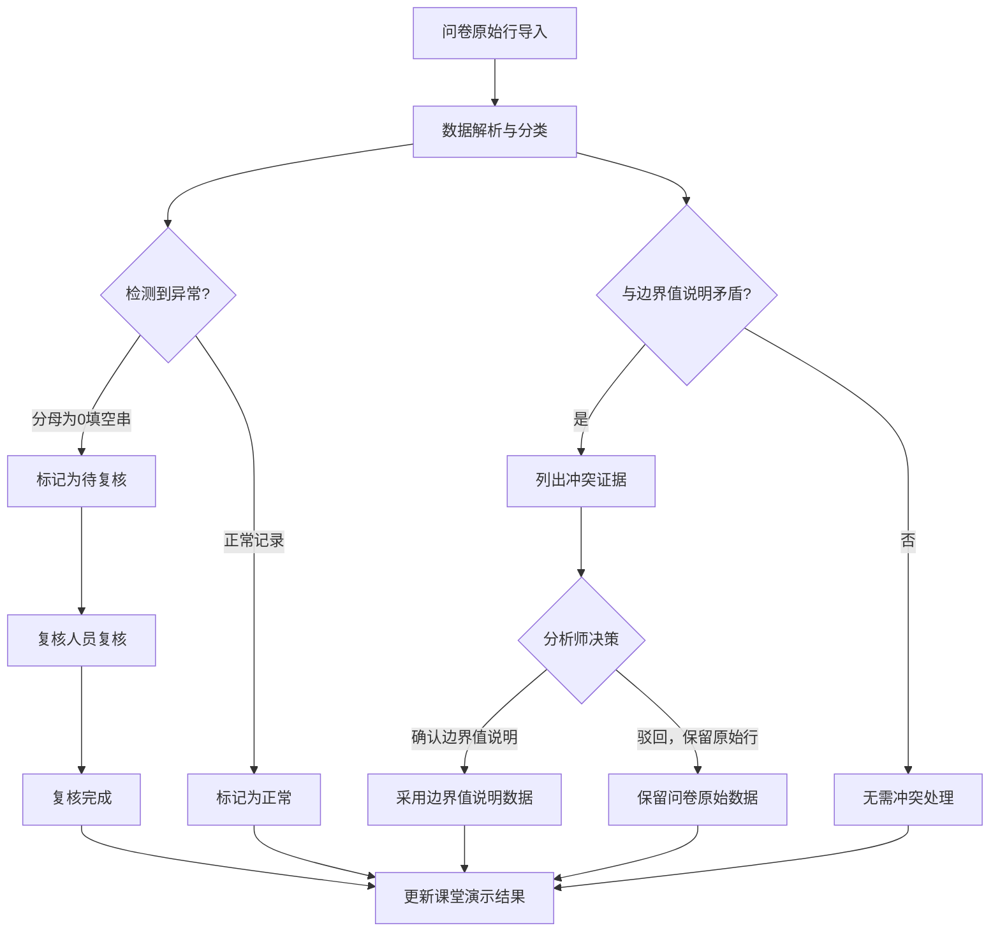
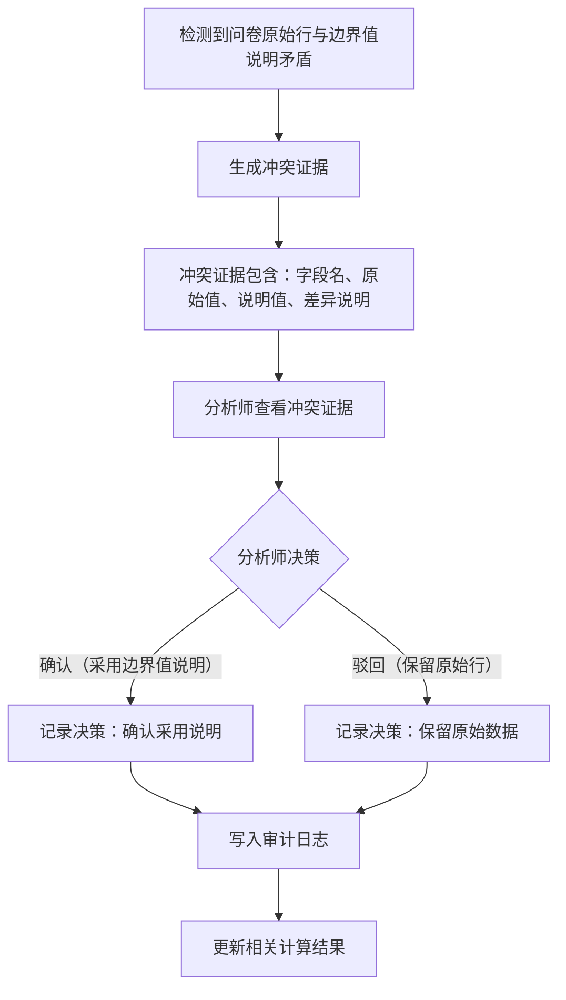

## 1. 产品概述

"多目标评分权重调参"是一套面向数据分析师的评分权重配置与复核工具，核心解决的问题是：在多目标评分场景下，权重参数的导入、校验、冲突处理和变更审计必须全程可追溯，边界值说明等备注材料不可被清洗为无上下文的干净数据。
- 目标用户：数据分析师（如小祁）、业务复核人员
- 核心价值：确保权重调参过程中每一步数据来源可证、冲突可审、变更可追、结果可复现

## 2. 核心功能

### 2.1 用户角色

| 角色 | 注册方式 | 核心权限 |
|------|----------|----------|
| 数据分析师 | 系统分配账号 | 导入问卷原始行、查看边界值说明、处理冲突、确认/驳回补录、更新演示结果 |
| 复核人员 | 系统分配账号 | 查看审计日志、复核异常记录、批准或退回变更 |

### 2.2 功能模块

1. **工作台页面**：全局概览，展示导入状态、冲突队列、复核待办、近期审计日志
2. **问卷导入页面**：问卷原始行首次导入、数据解析与分类标记
3. **边界值说明页面**：查看和管理边界值说明备注，支持补录旧口径数据
4. **冲突处理页面**：问卷原始行与边界值说明矛盾时列出冲突证据，由分析师确认或驳回
5. **审计日志页面**：谁改了什么、为什么改、改完影响哪些结果，全链路记录
6. **课堂演示结果页面**：展示评分计算结果，支持三步流程更新

### 2.3 页面详情

| 页面名称 | 模块名称 | 功能描述 |
|----------|----------|----------|
| 工作台 | 导入状态卡片 | 显示最近一次问卷导入时间、记录数、异常记录数 |
| 工作台 | 冲突队列摘要 | 显示待处理冲突数量，快捷跳转到冲突处理页面 |
| 工作台 | 复核待办摘要 | 显示待复核记录数（如分母为0的记录） |
| 工作台 | 近期审计日志 | 显示最近5条变更记录，含操作人、时间、变更摘要 |
| 问卷导入 | 文件上传区 | 支持CSV/Excel文件上传，解析问卷原始行 |
| 问卷导入 | 数据预览表格 | 展示解析后的数据，标记记录类型（正常/异常/补录） |
| 问卷导入 | 异常检测提示 | 自动检测分母为0却被填为空字符串的记录，标记为待复核 |
| 边界值说明 | 说明文档列表 | 列出所有边界值说明备注，支持搜索和筛选 |
| 边界值说明 | 补录入口 | 将旧口径数据补录到系统，自动标记来源为"边界值说明补录" |
| 边界值说明 | 备注详情 | 展示备注全文，关联到对应的问卷记录 |
| 冲突处理 | 冲突证据列表 | 当问卷原始行与边界值说明矛盾时，列出冲突证据 |
| 冲突处理 | 确认/驳回操作 | 分析师可选择确认（采用边界值说明）或驳回（保留问卷原始行） |
| 冲突处理 | 冲突历史 | 展示已处理的冲突及其决策结果 |
| 审计日志 | 变更时间线 | 按时间顺序展示所有变更，含操作人、变更内容、影响范围 |
| 审计日志 | 筛选与搜索 | 按操作人、时间范围、变更类型筛选日志 |
| 课堂演示结果 | 结果仪表板 | 展示各目标评分和权重配置的计算结果 |
| 课堂演示结果 | 三步流程状态 | 显示当前处于三步流程的哪一步：导入→补看→更新 |
| 课堂演示结果 | 结果对比 | 展示变更前后的评分结果对比 |

## 3. 核心流程

### 三步主流程

1. **问卷原始行首次导入**：上传问卷数据，系统自动解析并标记记录类型（正常/分母为0填空串/需补录），分母为0却被填成空字符串的记录不归入正常，标记为"待复核"
2. **数据分析师补看边界值说明**：分析师查看边界值说明备注，如发现旧口径数据则补录，系统检测问卷原始行与边界值说明是否存在矛盾
3. **课堂演示结果更新**：冲突处理完成后，更新评分计算结果，演示结果可复现

### 冲突处理流程

## 4. 用户界面设计

### 4.1 设计风格

- 主色调：深灰蓝（#1e293b）为底，琥珀色（#f59e0b）为强调色，表示需要关注的异常和待办
- 次要色：石板灰（#64748b）用于辅助信息和边框，翡翠绿（#10b981）用于正常状态，玫红（#f43f5e）用于异常/冲突
- 按钮风格：圆角矩形，带微弱阴影，主操作按钮使用琥珀色填充，次要操作使用描边样式
- 字体：标题使用 Noto Serif SC（衬线体，体现严谨专业），正文使用 Noto Sans SC
- 布局风格：左侧固定导航栏 + 右侧内容区，内容区采用卡片式布局
- 图标风格：线性图标，统一使用 lucide-react

### 4.2 页面设计概览

| 页面名称 | 模块名称 | UI要素 |
|----------|----------|--------|
| 工作台 | 导入状态卡片 | 深色卡片，琥珀色数字高亮，右上角状态标签 |
| 工作台 | 冲突队列摘要 | 玫红边框卡片，显示待处理数量，点击跳转 |
| 工作台 | 复核待办摘要 | 琥珀色边框卡片，列表形式展示待复核项 |
| 工作台 | 近期审计日志 | 浅灰背景时间线，每条含头像、操作描述、时间戳 |
| 问卷导入 | 文件上传区 | 虚线边框拖拽区，中央上传图标与文字提示 |
| 问卷导入 | 数据预览表格 | 斑马纹表格，异常行用玫红左侧边框标记，补录行用琥珀色标记 |
| 问卷导入 | 异常检测提示 | 顶部横幅提示，列出异常类型与数量 |
| 边界值说明 | 说明文档列表 | 卡片列表，每张卡片含标题、摘要、关联记录数 |
| 边界值说明 | 补录入口 | 弹窗表单，含字段映射选择器 |
| 边界值说明 | 备注详情 | 侧边抽屉面板，展示备注全文和关联记录 |
| 冲突处理 | 冲突证据列表 | 双栏对比布局，左侧问卷原始值，右侧边界值说明值，差异高亮 |
| 冲突处理 | 确认/驳回操作 | 底部固定操作栏，确认按钮（翡翠绿）和驳回按钮（石板灰描边） |
| 冲突处理 | 冲突历史 | 可折叠时间线，每条含决策标签（已确认/已驳回） |
| 审计日志 | 变更时间线 | 垂直时间线，每节点含操作人、时间、变更摘要、影响范围标签 |
| 审计日志 | 筛选与搜索 | 顶部筛选栏，下拉选择+日期范围+关键词搜索 |
| 课堂演示结果 | 结果仪表板 | 大号数字卡片展示各目标评分，权重饼图 |
| 课堂演示结果 | 三步流程状态 | 顶部步骤条，已完成步骤打勾，当前步骤高亮 |
| 课堂演示结果 | 结果对比 | 左右对比表格，变更值用颜色标记（增加绿色，减少玫红） |

### 4.3 响应式设计

- 桌面优先设计，最小宽度1024px
- 导航栏在窄屏时收起为图标模式
- 表格在窄屏时支持水平滚动
- 冲突对比在窄屏时切换为上下布局

### 4.4 3D场景指导

不适用
