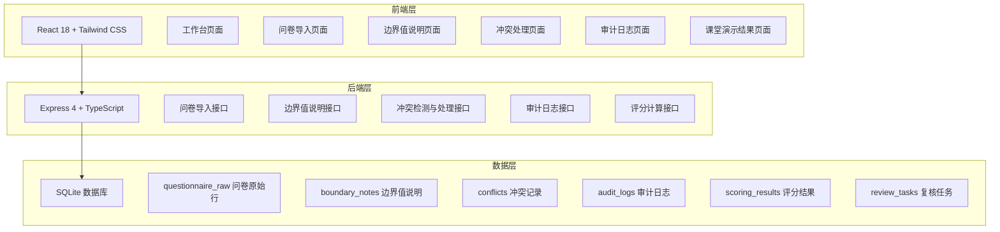
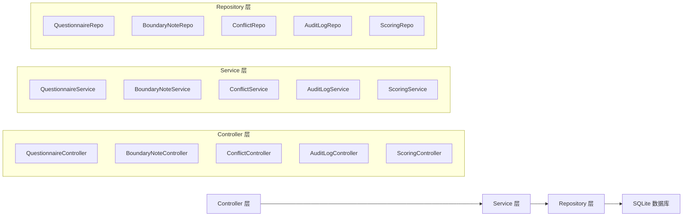
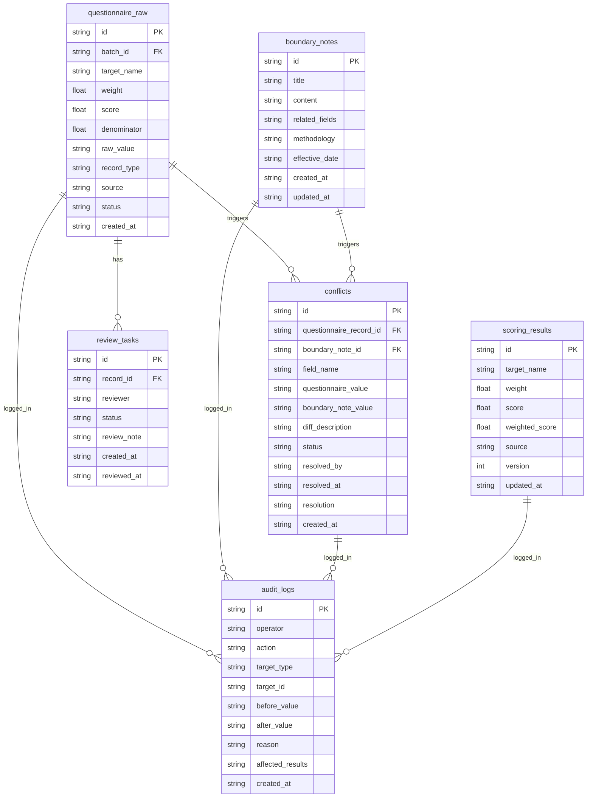

## 1. 架构设计



## 2. 技术说明

- 前端：React@18 + Tailwind CSS@3 + Vite
- 初始化工具：vite-init
- 后端：Express@4 + TypeScript (ESM)
- 数据库：SQLite（使用 better-sqlite3）
- 状态管理：Zustand
- 路由：react-router-dom

## 3. 路由定义

| 路由 | 用途 |
|------|------|
| / | 工作台页面，全局概览 |
| /import | 问卷原始行导入页面 |
| /boundary | 边界值说明管理页面 |
| /conflicts | 冲突处理页面 |
| /audit | 审计日志页面 |
| /demo | 课堂演示结果页面 |

## 4. API 定义

### 4.1 问卷导入接口

```typescript
interface QuestionnaireRaw {
  id: string
  batchId: string
  targetName: string
  weight: number | null
  score: number | null
  denominator: number | null
  rawValue: string
  recordType: "normal" | "zero_denominator_empty" | "supplemented"
  source: "questionnaire" | "boundary_note"
  status: "pending" | "review" | "confirmed" | "rejected"
  createdAt: string
}

// POST /api/questionnaire/import
interface ImportRequest {
  data: Record<string, string>[]
  batchId: string
}

interface ImportResponse {
  batchId: string
  totalRecords: number
  normalCount: number
  zeroDenominatorCount: number
  supplementedCount: number
  conflictsDetected: number
}

// GET /api/questionnaire?batchId=xxx
interface QuestionnaireListResponse {
  records: QuestionnaireRaw[]
  summary: {
    total: number
    normal: number
    zeroDenominator: number
    supplemented: number
    pendingReview: number
  }
}
```

### 4.2 边界值说明接口

```typescript
interface BoundaryNote {
  id: string
  title: string
  content: string
  relatedFields: string[]
  methodology: string
  effectiveDate: string
  createdAt: string
  updatedAt: string
}

// GET /api/boundary-notes
interface BoundaryNoteListResponse {
  notes: BoundaryNote[]
}

// POST /api/boundary-notes/supplement
interface SupplementRequest {
  noteId: string
  targetField: string
  supplementValue: string
  reason: string
}

interface SupplementResponse {
  recordId: string
  conflictDetected: boolean
  conflictId?: string
}
```

### 4.3 冲突处理接口

```typescript
interface Conflict {
  id: string
  questionnaireRecordId: string
  boundaryNoteId: string
  fieldName: string
  questionnaireValue: string
  boundaryNoteValue: string
  diffDescription: string
  status: "pending" | "confirmed" | "rejected"
  resolvedBy: string | null
  resolvedAt: string | null
  resolution: string | null
  createdAt: string
}

// GET /api/conflicts?status=pending
interface ConflictListResponse {
  conflicts: Conflict[]
}

// PUT /api/conflicts/:id/resolve
interface ResolveConflictRequest {
  decision: "confirm" | "reject"
  reason: string
}

interface ResolveConflictResponse {
  conflictId: string
  status: "confirmed" | "rejected"
  affectedResults: string[]
  auditLogId: string
}
```

### 4.4 审计日志接口

```typescript
interface AuditLog {
  id: string
  operator: string
  action: "import" | "supplement" | "resolve_conflict" | "update_result" | "review"
  targetType: "questionnaire" | "boundary_note" | "conflict" | "scoring_result"
  targetId: string
  beforeValue: string | null
  afterValue: string | null
  reason: string
  affectedResults: string[]
  createdAt: string
}

// GET /api/audit-logs?operator=xxx&action=xxx&from=xxx&to=xxx
interface AuditLogListResponse {
  logs: AuditLog[]
  total: number
}
```

### 4.5 评分计算接口

```typescript
interface ScoringResult {
  id: string
  targetName: string
  weight: number
  score: number
  weightedScore: number
  source: "questionnaire" | "boundary_note" | "manual"
  version: number
  updatedAt: string
}

// GET /api/scoring/results
interface ScoringResultResponse {
  results: ScoringResult[]
  stepStatus: "imported" | "reviewed" | "updated"
  totalWeight: number
  totalScore: number
}

// POST /api/scoring/update
interface UpdateScoringRequest {
  batchId: string
}

interface UpdateScoringResponse {
  updatedResults: ScoringResult[]
  previousResults: ScoringResult[]
  auditLogIds: string[]
}
```

## 5. 服务端架构图



## 6. 数据模型

### 6.1 数据模型定义



### 6.2 数据定义语言

```sql
CREATE TABLE questionnaire_raw (
  id TEXT PRIMARY KEY,
  batch_id TEXT NOT NULL,
  target_name TEXT NOT NULL,
  weight REAL,
  score REAL,
  denominator REAL,
  raw_value TEXT NOT NULL,
  record_type TEXT NOT NULL CHECK(record_type IN ('normal', 'zero_denominator_empty', 'supplemented')),
  source TEXT NOT NULL CHECK(source IN ('questionnaire', 'boundary_note')),
  status TEXT NOT NULL CHECK(status IN ('pending', 'review', 'confirmed', 'rejected')),
  created_at TEXT NOT NULL DEFAULT (datetime('now'))
);

CREATE TABLE boundary_notes (
  id TEXT PRIMARY KEY,
  title TEXT NOT NULL,
  content TEXT NOT NULL,
  related_fields TEXT NOT NULL DEFAULT '[]',
  methodology TEXT NOT NULL,
  effective_date TEXT NOT NULL,
  created_at TEXT NOT NULL DEFAULT (datetime('now')),
  updated_at TEXT NOT NULL DEFAULT (datetime('now'))
);

CREATE TABLE conflicts (
  id TEXT PRIMARY KEY,
  questionnaire_record_id TEXT NOT NULL REFERENCES questionnaire_raw(id),
  boundary_note_id TEXT NOT NULL REFERENCES boundary_notes(id),
  field_name TEXT NOT NULL,
  questionnaire_value TEXT NOT NULL,
  boundary_note_value TEXT NOT NULL,
  diff_description TEXT NOT NULL,
  status TEXT NOT NULL CHECK(status IN ('pending', 'confirmed', 'rejected')),
  resolved_by TEXT,
  resolved_at TEXT,
  resolution TEXT,
  created_at TEXT NOT NULL DEFAULT (datetime('now'))
);

CREATE TABLE audit_logs (
  id TEXT PRIMARY KEY,
  operator TEXT NOT NULL,
  action TEXT NOT NULL CHECK(action IN ('import', 'supplement', 'resolve_conflict', 'update_result', 'review')),
  target_type TEXT NOT NULL CHECK(target_type IN ('questionnaire', 'boundary_note', 'conflict', 'scoring_result')),
  target_id TEXT NOT NULL,
  before_value TEXT,
  after_value TEXT,
  reason TEXT NOT NULL,
  affected_results TEXT NOT NULL DEFAULT '[]',
  created_at TEXT NOT NULL DEFAULT (datetime('now'))
);

CREATE TABLE scoring_results (
  id TEXT PRIMARY KEY,
  target_name TEXT NOT NULL,
  weight REAL NOT NULL,
  score REAL NOT NULL,
  weighted_score REAL NOT NULL,
  source TEXT NOT NULL CHECK(source IN ('questionnaire', 'boundary_note', 'manual')),
  version INTEGER NOT NULL DEFAULT 1,
  updated_at TEXT NOT NULL DEFAULT (datetime('now'))
);

CREATE TABLE review_tasks (
  id TEXT PRIMARY KEY,
  record_id TEXT NOT NULL REFERENCES questionnaire_raw(id),
  reviewer TEXT NOT NULL,
  status TEXT NOT NULL CHECK(status IN ('pending', 'approved', 'rejected')),
  review_note TEXT,
  created_at TEXT NOT NULL DEFAULT (datetime('now')),
  reviewed_at TEXT
);

CREATE INDEX idx_questionnaire_batch ON questionnaire_raw(batch_id);
CREATE INDEX idx_questionnaire_status ON questionnaire_raw(status);
CREATE INDEX idx_questionnaire_type ON questionnaire_raw(record_type);
CREATE INDEX idx_conflicts_status ON conflicts(status);
CREATE INDEX idx_audit_operator ON audit_logs(operator);
CREATE INDEX idx_audit_action ON audit_logs(action);
CREATE INDEX idx_audit_created ON audit_logs(created_at);
CREATE INDEX idx_review_status ON review_tasks(status);

-- 初始样例数据：正常记录
INSERT INTO questionnaire_raw (id, batch_id, target_name, weight, score, denominator, raw_value, record_type, source, status)
VALUES ('qr-001', 'batch-001', '客户满意度', 0.3, 85.0, 100.0, '客户满意度,0.3,85.0,100.0', 'normal', 'questionnaire', 'confirmed');

-- 初始样例数据：分母为0却被填成空字符串
INSERT INTO questionnaire_raw (id, batch_id, target_name, weight, score, denominator, raw_value, record_type, source, status)
VALUES ('qr-002', 'batch-001', '响应时效', 0.25, 0, 0, '响应时效,0.25,,', 'zero_denominator_empty', 'questionnaire', 'review');

-- 初始样例数据：从边界值说明补录的旧口径
INSERT INTO questionnaire_raw (id, batch_id, target_name, weight, score, denominator, raw_value, record_type, source, status)
VALUES ('qr-003', 'batch-001', '合规达标率', 0.2, 92.0, 100.0, '合规达标率,0.2,92.0,100.0', 'supplemented', 'boundary_note', 'pending');

-- 初始样例数据：边界值说明
INSERT INTO boundary_notes (id, title, content, related_fields, methodology, effective_date)
VALUES ('bn-001', '合规达标率旧口径说明', '2024年Q1之前合规达标率计算口径：分母为实际检查项数，非全部应检项数。补录时需按旧口径折算。', '["合规达标率"]', '旧口径：实际检查项数作分母', '2024-03-31');

INSERT INTO boundary_notes (id, title, content, related_fields, methodology, effective_date)
VALUES ('bn-002', '响应时效异常处理说明', '当响应时效分母为0时（无工单），原始行可能填为空字符串，不可自动归零或归正常，需提交复核人员判断。', '["响应时效"]', '分母为0时保留空值，标记待复核', '2024-06-01');

-- 初始样例数据：评分结果
INSERT INTO scoring_results (id, target_name, weight, score, weighted_score, source, version)
VALUES ('sr-001', '客户满意度', 0.3, 85.0, 25.5, 'questionnaire', 1);

INSERT INTO scoring_results (id, target_name, weight, score, weighted_score, source, version)
VALUES ('sr-002', '响应时效', 0.25, 0, 0, 'questionnaire', 1);

INSERT INTO scoring_results (id, target_name, weight, score, weighted_score, source, version)
VALUES ('sr-003', '合规达标率', 0.2, 92.0, 18.4, 'boundary_note', 1);
```
