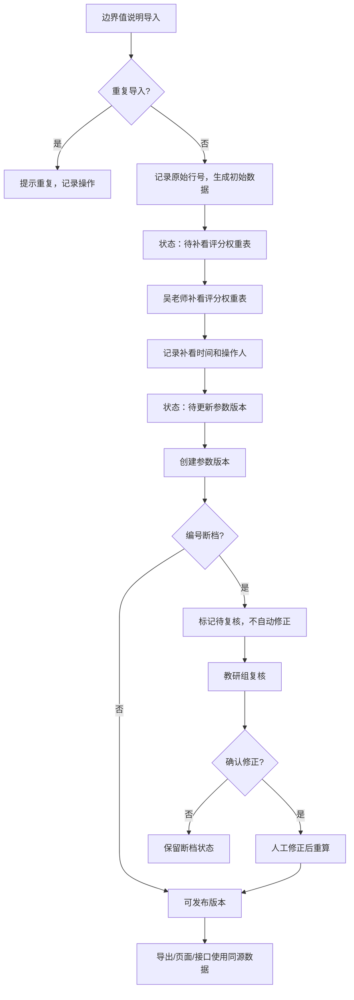

## 1. 产品概述

本系统为教育教研场景下的"组合优化拣货路线"管理平台，解决边界值说明与评分权重表数据不一致、人工修改后编号断档、数据溯源困难等核心痛点。目标用户为教研负责人吴老师及教研组，提供数据导入、自检校验、状态流转、版本管理的全流程支持。

系统价值在于建立完整的数据审计链路，确保导出明细、页面展示、接口返回三者数据一致性，同时在关键节点（如编号断档）保留复核机制，避免自动修正导致的数据失真。

---

## 2. 核心功能

### 2.1 用户角色

| 角色 | 说明 | 核心权限 |
|------|------|----------|
| 教研负责人（吴老师） | 系统主要使用者 | 数据导入、评分权重表补录、参数版本更新、状态流转 |
| 教研组 | 复核人员 | 查看审计记录、复核编号断档数据、导出明细 |

### 2.2 功能模块

1. **数据导入页**：边界值说明CSV导入、重复导入检测、原始行号记录
2. **明细展示页**：拣货路线明细展示、断档高亮、人工操作记录、状态标签
3. **评分权重表页**：权重参数配置、与边界值说明关联、吴老师补看标记
4. **参数版本页**：版本历史、参数变更记录、版本发布
5. **自检中心**：重复导入检测、编号断档检测、补录重算、导出一致性校验

### 2.3 页面详情

| 页面名称 | 模块名称 | 功能描述 |
|---------|---------|----------|
| 数据导入页 | 导入模块 | 支持CSV拖拽上传，显示导入进度，自动检测重复导入（基于文件哈希+内容指纹），记录每一行的原始行号 |
| 数据导入页 | 导入预览 | 导入前展示数据预览，标记可能的问题行，显示原始行号映射 |
| 明细展示页 | 数据表格 | 展示拣货路线明细，包含：当前编号、原始行号、数据内容、状态标签、操作人、操作时间 |
| 明细展示页 | 操作栏 | 支持人工删除行（记录删除操作）、补录行（触发重算）、查看变更历史 |
| 明细展示页 | 断档标记 | 编号不连续时用醒目标记高亮，不自动修正，显示"待教研组复核"状态 |
| 评分权重表页 | 权重配置 | 展示各评分维度权重，支持吴老师"已补看"标记，记录补看时间和备注 |
| 参数版本页 | 版本列表 | 展示历史版本，支持版本对比，显示版本状态（草稿/待复核/已发布） |
| 参数版本页 | 版本更新 | 支持创建新版本，关联评分权重表状态，只有吴老师补看完成后才能发布 |
| 自检中心 | 自检概览 | 展示4项自检结果：重复导入检测、编号断档检测、补录重算、导出一致性 |
| 自检中心 | 导出功能 | 导出明细数据（与页面/接口同源），导出文件包含审计字段 |

---

## 3. 核心流程

### 三步核心工作流

1. **边界值说明第一次导入**：吴老师上传边界值说明CSV，系统记录每行原始行号，执行重复导入检测，生成初始拣货路线数据，状态为"待补看评分权重表"。

2. **吴老师补看评分权重表**：吴老师进入评分权重表页，核对权重参数，确认无误后点击"已补看"，系统记录补看时间和操作人，数据状态流转为"待更新参数版本"。

3. **参数版本页更新**：吴老师进入参数版本页，创建新版本，系统自动关联已补看的评分权重表，执行编号断档检测。如有断档，标记为"待教研组复核"，不自动修正；如无问题，可发布版本。

### 异常处理流程

- **人工删除一行后编号断档**：系统检测到编号不连续，将断档前后的行标记为"编号断档-待复核"，保留删除操作记录（原始行号、删除人、删除时间），不自动重新编号，等待教研组复核。

- **补录后重算**：补录新行时，系统自动重算拣货路线优化结果，记录重算前后对比，保留原始计算结果作为审计依据。

- **重复导入**：系统检测文件哈希和内容指纹，如发现重复导入，提示"该文件已于X年X月X日导入"，允许查看历史导入记录或强制重新导入（记录为"强制重导"状态）。

---

## 4. 用户界面设计

### 4.1 设计风格

- **主色调**：深蓝色（#1e3a5f）代表专业严谨，搭配琥珀色（#d97706）作为警告/待复核标记
- **辅助色**：绿色（#059669）表示正常，红色（#dc2626）表示异常，灰色（#6b7280）表示历史数据
- **设计风格**：专业教研工具风格，强调数据可读性和操作痕迹，使用卡片式布局搭配清晰的分割线
- **字体**：标题使用"思源宋体"体现学术感，正文使用"思源黑体"保证可读性
- **按钮风格**：直角按钮，2px边框，hover时背景色加深，强调操作的正式感
- **核心记忆点**：每行数据左侧显示"原始行号"标签，操作历史以时间线形式展示在侧边抽屉

### 4.2 页面设计概览

| 页面名称 | 模块名称 | UI元素 |
|---------|---------|--------|
| 数据导入页 | 导入区域 | 拖拽上传区（虚线边框，深蓝色基调），文件信息卡片，原始行号预览列 |
| 数据导入页 | 自检状态 | 4个自检指标卡片，分别显示：重复导入、编号断档、补录重算、导出一致性的状态 |
| 明细展示页 | 数据表格 | 固定表头，斑马纹行，"原始行号"列固定在最左侧，状态标签使用彩色圆角徽章 |
| 明细展示页 | 操作抽屉 | 点击行号打开右侧抽屉，展示：变更历史时间线、人工操作记录、状态流转日志 |
| 评分权重表页 | 权重表格 | 可编辑权重值，"已补看"按钮为琥珀色，点击后变为绿色并显示补看人信息 |
| 参数版本页 | 版本卡片 | 每个版本一张卡片，显示版本号、创建时间、关联的评分权重表状态、操作按钮 |
| 自检中心 | 自检面板 | 4个自检项以大卡片展示，绿色/红色状态图标，点击展开详情 |

### 4.3 响应式

采用桌面端优先设计，1200px断点适配平板，次要列在小屏幕可折叠。表格支持横向滚动，保证核心数据列（编号、原始行号、状态）始终可见。

---

## 5. 数据一致性设计

**单一数据源原则**：所有展示、导出、接口调用均读取同一份结果数据。

- 页面展示 → 读取 `picking_route_results` 表
- 导出功能 → 读取 `picking_route_results` 表
- API接口 → 读取 `picking_route_results` 表

**审计字段**：每条记录包含：
- `original_line_no`：原始行号（导入时记录，永不修改）
- `current_line_no`：当前编号（可因删除/补录变化）
- `status`：处理状态（正常/编号断档-待复核/已删除/补录待重算）
- `change_log`：JSON格式的变更历史，记录每次操作的操作人、时间、变更内容
- `source_batch`：导入批次号，用于追溯
