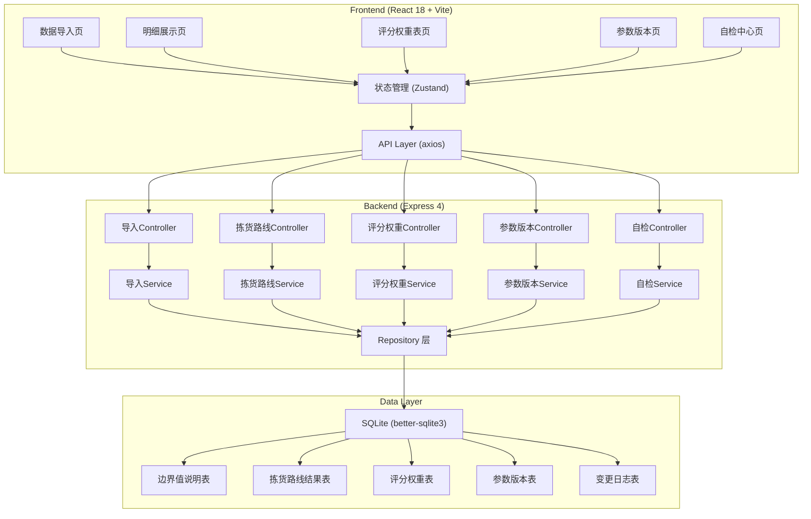
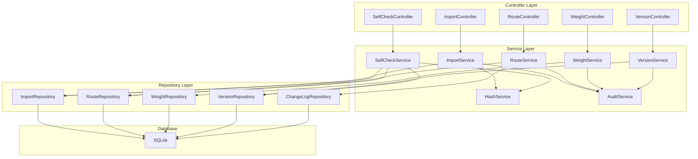

## 1. 架构设计



---

## 2. 技术说明

- **前端**：React@18 + TypeScript + tailwindcss@3 + Vite@5 + Zustand@4 + React Router@6
- **后端**：Express@4 + TypeScript + better-sqlite3
- **初始化工具**：Vite 官方脚手架
- **数据库**：SQLite（本地文件存储，适合教研场景单机使用）
- **Mock数据**：开发阶段内置示例数据，可直接演示完整流程
- **其他依赖**：axios（HTTP请求）、papaparse（CSV解析）、crypto-js（文件哈希计算）、dayjs（日期处理）

---

## 3. 路由定义

| 前端路由 | 页面 | 说明 |
|---------|------|------|
| /import | 数据导入页 | 边界值说明CSV导入 |
| /routes | 明细展示页 | 拣货路线明细与操作 |
| /weights | 评分权重表页 | 权重配置与吴老师补看标记 |
| /versions | 参数版本页 | 版本历史与发布 |
| /self-check | 自检中心页 | 4项自检与导出 |

| 后端API路由 | 方法 | 说明 |
|------------|------|------|
| /api/import | POST | 导入边界值说明CSV |
| /api/import/check-duplicate | POST | 重复导入检测 |
| /api/routes | GET | 获取拣货路线列表 |
| /api/routes/:id | DELETE | 人工删除行（逻辑删除） |
| /api/routes | POST | 补录新行 |
| /api/routes/recalculate | POST | 触发重算 |
| /api/routes/export | GET | 导出明细（同源数据） |
| /api/weights | GET | 获取评分权重表 |
| /api/weights/review | POST | 吴老师标记已补看 |
| /api/versions | GET | 获取版本列表 |
| /api/versions | POST | 创建新版本 |
| /api/versions/:id/publish | POST | 发布版本 |
| /api/self-check | GET | 执行4项自检 |
| /api/changes/:routeId | GET | 获取单条记录变更历史 |

---

## 4. API 类型定义

```typescript
// 边界值说明导入
interface ImportRequest {
  file: File;
  operator: string;
}

interface ImportResponse {
  batchId: string;
  totalRows: number;
  importedRows: number;
  isDuplicate: boolean;
  duplicateInfo?: {
    previousImportTime: string;
    previousOperator: string;
  };
  warnings: string[];
}

// 拣货路线记录
interface PickingRoute {
  id: string;
  originalLineNo: number;      // 原始行号，永不修改
  currentLineNo: number;       // 当前编号
  routeData: RouteOptimizationResult;
  status: 'normal' | 'gap_pending_review' | 'deleted' | 'supplement_pending_recalc';
  statusLabel: string;
  sourceBatch: string;
  operator: string;
  createdAt: string;
  updatedAt: string;
  changeLog: ChangeRecord[];
}

interface RouteOptimizationResult {
  orderNo: string;
  sku: string;
  quantity: number;
  warehouseZone: string;
  pickingSequence: number;
  distance: number;
  estimatedTime: number;
}

interface ChangeRecord {
  timestamp: string;
  operator: string;
  action: 'import' | 'delete' | 'supplement' | 'recalculate' | 'status_update';
  beforeValue?: any;
  afterValue?: any;
  remark: string;
}

// 评分权重
interface ScoreWeight {
  id: string;
  dimension: string;         // 评分维度：距离、时间、优先级等
  weight: number;            // 权重值 0-100
  description: string;
  reviewedBy: string | null;
  reviewedAt: string | null;
  remark: string | null;
}

// 参数版本
interface ParameterVersion {
  id: string;
  versionNo: string;
  status: 'draft' | 'pending_review' | 'published';
  weightBatchId: string;     // 关联的评分权重表
  hasGap: boolean;           // 是否存在编号断档
  createdBy: string;
  createdAt: string;
  publishedAt: string | null;
}

// 自检结果
interface SelfCheckResult {
  duplicateImport: {
    passed: boolean;
    details: {
      totalBatches: number;
      duplicateCount: number;
      duplicates: { batchId: string; time: string; operator: string }[];
    };
  };
  numberGap: {
    passed: boolean;
    details: {
      gapCount: number;
      gaps: { beforeLineNo: number; afterLineNo: number; missingCount: number }[];
    };
  };
  supplementRecalc: {
    passed: boolean;
    details: {
      supplementCount: number;
      pendingRecalcCount: number;
      items: { id: string; originalLineNo: number; status: string }[];
    };
  };
  exportConsistency: {
    passed: boolean;
    details: {
      pageCount: number;
      exportCount: number;
      apiCount: number;
      isConsistent: boolean;
    };
  };
}
```

---

## 5. 服务器架构图



---

## 6. 数据模型

### 6.1 数据模型定义

```mermaid
erDiagram
    IMPORT_BATCH ||--o{ PICKING_ROUTE : "contains"
    IMPORT_BATCH ||--o{ PARAMETER_VERSION : "referenced by"
    SCORE_WEIGHT ||--o{ PARAMETER_VERSION : "referenced by"
    PICKING_ROUTE ||--o{ CHANGE_LOG : "has"

    IMPORT_BATCH {
        string id PK
        string file_hash
        string content_fingerprint
        string file_name
        int total_rows
        string operator
        datetime created_at
        boolean is_force_reimport
    }

    PICKING_ROUTE {
        string id PK
        int original_line_no
        int current_line_no
        string route_data JSON
        string status
        string source_batch FK
        string operator
        datetime created_at
        datetime updated_at
        string change_log JSON
    }

    SCORE_WEIGHT {
        string id PK
        string dimension
        int weight
        string description
        string reviewed_by
        datetime reviewed_at
        string remark
        datetime created_at
        datetime updated_at
    }

    PARAMETER_VERSION {
        string id PK
        string version_no
        string status
        string weight_batch_id FK
        boolean has_gap
        string created_by
        datetime created_at
        datetime published_at
    }

    CHANGE_LOG {
        string id PK
        string route_id FK
        string operator
        string action
        string before_value JSON
        string after_value JSON
        string remark
        datetime timestamp
    }
```

### 6.2 DDL 语句

```sql
-- 导入批次表
CREATE TABLE import_batch (
  id TEXT PRIMARY KEY,
  file_hash TEXT NOT NULL,
  content_fingerprint TEXT NOT NULL,
  file_name TEXT NOT NULL,
  total_rows INTEGER NOT NULL,
  operator TEXT NOT NULL,
  created_at DATETIME DEFAULT CURRENT_TIMESTAMP,
  is_force_reimport INTEGER DEFAULT 0
);

CREATE INDEX idx_import_batch_hash ON import_batch(file_hash);
CREATE INDEX idx_import_batch_fingerprint ON import_batch(content_fingerprint);

-- 拣货路线结果表（单一数据源）
CREATE TABLE picking_route (
  id TEXT PRIMARY KEY,
  original_line_no INTEGER NOT NULL,
  current_line_no INTEGER NOT NULL,
  route_data TEXT NOT NULL,
  status TEXT NOT NULL DEFAULT 'normal',
  source_batch TEXT NOT NULL,
  operator TEXT NOT NULL,
  created_at DATETIME DEFAULT CURRENT_TIMESTAMP,
  updated_at DATETIME DEFAULT CURRENT_TIMESTAMP,
  change_log TEXT NOT NULL DEFAULT '[]',
  FOREIGN KEY (source_batch) REFERENCES import_batch(id)
);

CREATE INDEX idx_picking_route_batch ON picking_route(source_batch);
CREATE INDEX idx_picking_route_status ON picking_route(status);
CREATE INDEX idx_picking_route_original ON picking_route(original_line_no);

-- 评分权重表
CREATE TABLE score_weight (
  id TEXT PRIMARY KEY,
  dimension TEXT NOT NULL,
  weight INTEGER NOT NULL,
  description TEXT,
  reviewed_by TEXT,
  reviewed_at DATETIME,
  remark TEXT,
  created_at DATETIME DEFAULT CURRENT_TIMESTAMP,
  updated_at DATETIME DEFAULT CURRENT_TIMESTAMP
);

-- 参数版本表
CREATE TABLE parameter_version (
  id TEXT PRIMARY KEY,
  version_no TEXT NOT NULL,
  status TEXT NOT NULL DEFAULT 'draft',
  weight_batch_id TEXT,
  has_gap INTEGER DEFAULT 0,
  created_by TEXT NOT NULL,
  created_at DATETIME DEFAULT CURRENT_TIMESTAMP,
  published_at DATETIME,
  FOREIGN KEY (weight_batch_id) REFERENCES score_weight(id)
);

CREATE INDEX idx_parameter_version_status ON parameter_version(status);

-- 变更日志表
CREATE TABLE change_log (
  id TEXT PRIMARY KEY,
  route_id TEXT NOT NULL,
  operator TEXT NOT NULL,
  action TEXT NOT NULL,
  before_value TEXT,
  after_value TEXT,
  remark TEXT,
  timestamp DATETIME DEFAULT CURRENT_TIMESTAMP,
  FOREIGN KEY (route_id) REFERENCES picking_route(id)
);

CREATE INDEX idx_change_log_route ON change_log(route_id);

-- 初始化评分权重数据
INSERT INTO score_weight (id, dimension, weight, description) VALUES
  ('w1', '拣货距离', 40, '路径总长度，单位米'),
  ('w2', '拣货时间', 30, '预计完成时间，单位分钟'),
  ('w3', '订单优先级', 20, '紧急订单优先处理'),
  ('w4', '货区集中度', 10, '同一货区订单合并处理');
```
