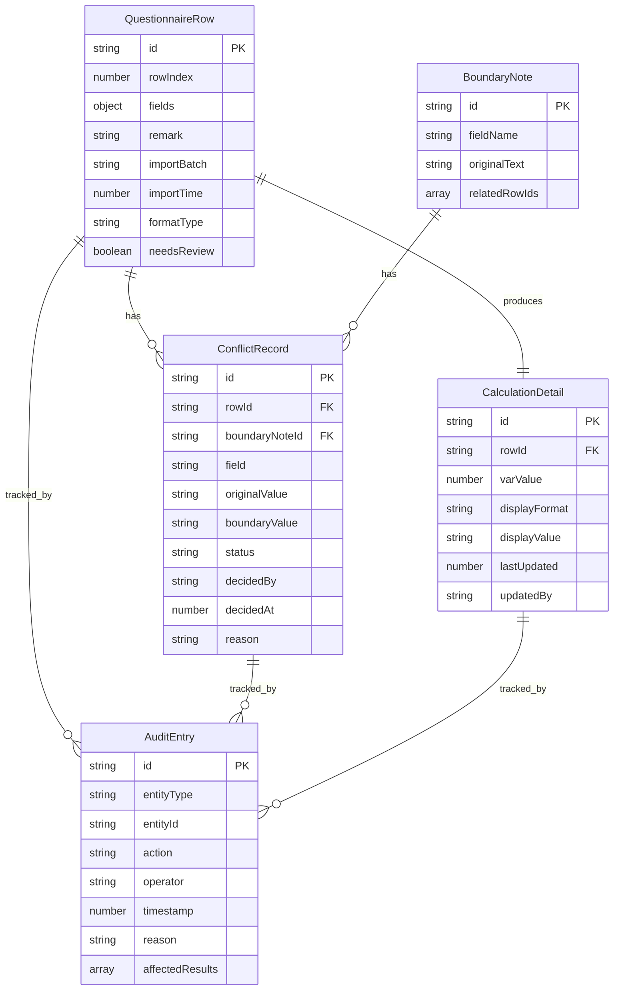

## 1. 架构设计

```mermaid
graph TD
    "前端 React SPA" --> "状态管理 Zustand"
    "状态管理 Zustand" --> "本地存储 IndexedDB"
    "状态管理 Zustand" --> "内存计算引擎"
    "内存计算引擎" --> "自检模块"
    "自检模块" --> "导出模块"
```

纯前端架构，所有数据与计算在浏览器本地完成，无需后端服务。

## 2. 技术说明

- 前端：React@18 + TypeScript + Tailwind CSS@3 + Vite
- 初始化工具：Vite (react-ts 模板)
- 状态管理：Zustand（轻量、适合单页应用）
- 本地存储：IndexedDB（via idb 库，持久化问卷数据与审计记录）
- 后端：无
- 数据库：无（使用浏览器本地存储 + Mock 数据演示）

## 3. 路由定义

| 路由 | 用途 |
|------|------|
| / | 回放工作台：三步流程（导入 → 补看 → 更新） |
| /conflict | 冲突与复核：冲突证据、待复核队列、决策面板 |
| /check | 自检与导出：自检仪表盘、导出管理 |

## 4. API 定义

无后端 API。所有数据通过 Zustand store 管理，组件从同一 store 读取数据，保证导出明细、页面展示、接口返回（模拟）三者同源。

### 4.1 核心 Store 结构

```typescript
interface QuestionnaireRow {
  id: string
  rowIndex: number
  fields: Record<string, string>
  remark: string
  importBatch: string
  importTime: number
  formatType: 'percent' | 'decimal' | 'mixed'
  needsReview: boolean
}

interface BoundaryNote {
  id: string
  fieldName: string
  originalText: string
  relatedRowIds: string[]
}

interface ConflictRecord {
  id: string
  rowId: string
  boundaryNoteId: string
  field: string
  originalValue: string
  boundaryValue: string
  status: 'pending' | 'confirmed' | 'rejected'
  decidedBy?: string
  decidedAt?: number
  reason?: string
}

interface CalculationDetail {
  id: string
  rowId: string
  varValue: number
  displayFormat: 'percent' | 'decimal'
  displayValue: string
  lastUpdated: number
  updatedBy: string
}

interface AuditEntry {
  id: string
  entityType: 'row' | 'conflict' | 'calculation'
  entityId: string
  action: string
  operator: string
  timestamp: number
  reason: string
  affectedResults: string[]
}

interface SelfCheckResult {
  duplicateImport: 'pass' | 'fail' | 'warning'
  formatConsistency: 'pass' | 'fail' | 'warning'
  recalcAfterSupplement: 'pass' | 'fail' | 'warning'
  exportConsistency: 'pass' | 'fail' | 'warning'
  details: Record<string, string[]>
}
```

## 5. 服务器架构图

不适用（纯前端应用）

## 6. 数据模型

### 6.1 数据模型定义



### 6.2 数据定义语言

使用 IndexedDB 对象仓库：

- `questionnaireRows`：主键 `id`，索引 `importBatch`、`rowIndex`、`formatType`、`needsReview`
- `boundaryNotes`：主键 `id`，索引 `fieldName`
- `conflictRecords`：主键 `id`，索引 `rowId`、`boundaryNoteId`、`status`
- `calculationDetails`：主键 `id`，索引 `rowId`
- `auditEntries`：主键 `id`，索引 `entityType`、`entityId`、`timestamp`
