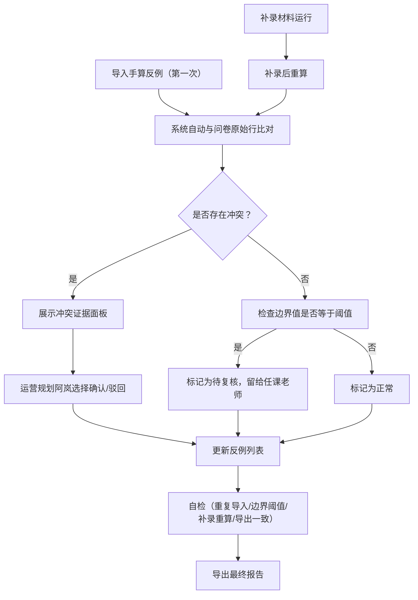

## 1. 产品概述

梯度下降学习率演示平台——一套面向教学场景的反例验证与数据自检工具。核心目标：让运营规划人员（如阿岚）能对手算反例和问卷原始行做交叉比对，在边界值等于阈值时保留复核标记而非自动归入正常，确保任课老师拿到的结论有据可查。

- 目标用户：任课老师（复核结论）、运营规划人员（执行比对与补录）、新人（按 README 从样例跑到报告）
- 核心价值：消除手算反例与问卷原始行之间的矛盾盲区，提供可追溯的自检与导出流程

## 2. 核心功能

### 2.1 用户角色

| 角色 | 进入方式 | 核心权限 |
|------|----------|----------|
| 运营规划（阿岚） | 直接访问 | 导入材料、比对反例与问卷、补录、确认/驳回冲突 |
| 任课老师 | 直接访问 | 复核边界值等于阈值的条目、查看自检报告、导出最终报告 |
| 新人 | 直接访问 | 按 README 样例跑完整流程、查看操作指引 |

### 2.2 功能模块

1. **主控台页**：学习率演示动画、近期运行状态、自检摘要、快捷入口
2. **反例管理页**：反例列表、问卷原始行对照、冲突证据面板、确认/驳回操作
3. **材料运行页**：正常材料/错口径材料/补录材料三种运行模式、运行历史记录
4. **自检与导出页**：自检结果看板（重复导入/边界阈值/补录重算/导出一致）、报告导出

### 2.3 页面详情

| 页面名称 | 模块名称 | 功能描述 |
|----------|----------|----------|
| 主控台 | 学习率演示区 | 可调学习率的梯度下降动画（2D 等高线+路径），展示不同 lr 下收敛/发散/振荡行为 |
| 主控台 | 状态摘要卡 | 显示当前运行轮次、反例总数、冲突数、待复核数、自检通过率 |
| 主控台 | 快捷入口 | 一键跳转反例管理、材料运行、自检导出 |
| 反例管理 | 反例列表 | 展示所有反例条目，含编号、来源材料、原始值、阈值、偏差、状态（正常/边界/冲突/待复核） |
| 反例管理 | 问卷原始行对照 | 与反例条目联动的问卷原始行展示，高亮差异字段 |
| 反例管理 | 冲突证据面板 | 当手算反例与问卷原始行矛盾时，左右并排展示双方数据，标记矛盾字段 |
| 反例管理 | 确认/驳回操作 | 运营规划阿岚可对冲突条目选择"确认反例"或"驳回反例"，操作写入历史 |
| 反例管理 | 边界值标记 | 当值刚好等于阈值时，状态标记为"待复核"，不自动归为正常，留给任课老师 |
| 材料运行 | 运行模式选择 | 正常材料/错口径材料/补录材料三个 Tab，各自独立运行记录 |
| 材料运行 | 运行结果 | 运行后展示本轮反例列表、偏差统计、与历史记录对比 |
| 材料运行 | 历史记录 | 所有运行轮次的时间线，可展开查看每轮详情 |
| 自检与导出 | 自检看板 | 四项自检结果：重复导入检测、边界值阈值检测、补录后重算一致性、导出数据一致性 |
| 自检与导出 | 自检详情 | 展开每项自检的通过/失败条目清单 |
| 自检与导出 | 报告导出 | 生成完整报告（含反例列表、冲突处理记录、自检结果），支持下载 |

## 3. 核心流程

**手算反例导入 → 问卷原始行比对 → 冲突确认/驳回 → 反例列表更新 → 自检 → 报告导出**

## 4. 用户界面设计

### 4.1 设计风格

- 主色调：深靛蓝(#1a1a2e) + 荧光青(#0ff0b3) 点缀，科技感数据工具风格
- 辅助色：琥珀橙(#ff9f1c) 用于冲突/警告，冷灰(#e0e0e0) 用于背景层
- 按钮：微圆角(6px)、略带阴影的胶囊按钮，确认用荧光青、驳回用琥珀橙
- 字体：标题用 JetBrains Mono（代码/数据感），正文用 Noto Sans SC（中文可读性）
- 布局：左侧窄导航 + 右侧宽内容区，卡片式模块，表格行悬停高亮
- 图标：线性图标风格（Lucide），数据状态用小圆点（绿/橙/红/灰）

### 4.2 页面设计概览

| 页面名称 | 模块名称 | UI 元素 |
|----------|----------|---------|
| 主控台 | 学习率演示区 | SVG/Canvas 2D 等高线图 + 渐变路径线，滑块调 lr，实时动画 |
| 主控台 | 状态摘要卡 | 4 张微卡（反例总数/冲突数/待复核数/自检通过率），数字大+标签小 |
| 主控台 | 快捷入口 | 3 个胶囊按钮，hover 发光效果 |
| 反例管理 | 反例列表 | 可排序表格，行尾状态标签（颜色编码），行点击展开详情 |
| 反例管理 | 问卷原始行对照 | 右侧抽屉/面板，字段并排对照，差异字段高亮橙色底 |
| 反例管理 | 冲突证据面板 | 左右分栏模态框，中间箭头指向矛盾字段 |
| 反例管理 | 确认/驳回操作 | 两个按钮（荧光青确认/琥珀橙驳回），操作后 toast 反馈 |
| 材料运行 | 运行模式选择 | 3 个 Tab（正常/错口径/补录），选中态荧光青下划线 |
| 材料运行 | 历史记录 | 垂直时间线，圆点+卡片，可折叠 |
| 自检与导出 | 自检看板 | 4 张状态卡（通过绿/失败红），点击展开明细 |
| 自检与导出 | 报告导出 | 大号下载按钮，导出前自动跑一遍完整自检 |

### 4.3 响应式

- 桌面优先设计，最小支持 1280px 宽度
- 表格在窄屏时切换为卡片视图
- 学习率演示区在小屏下缩放而非重排

### 4.4 3D 场景指引

不适用，本项目为 2D 数据工具。
