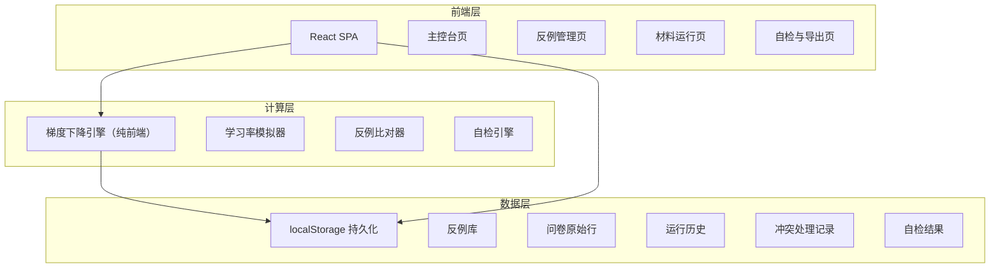
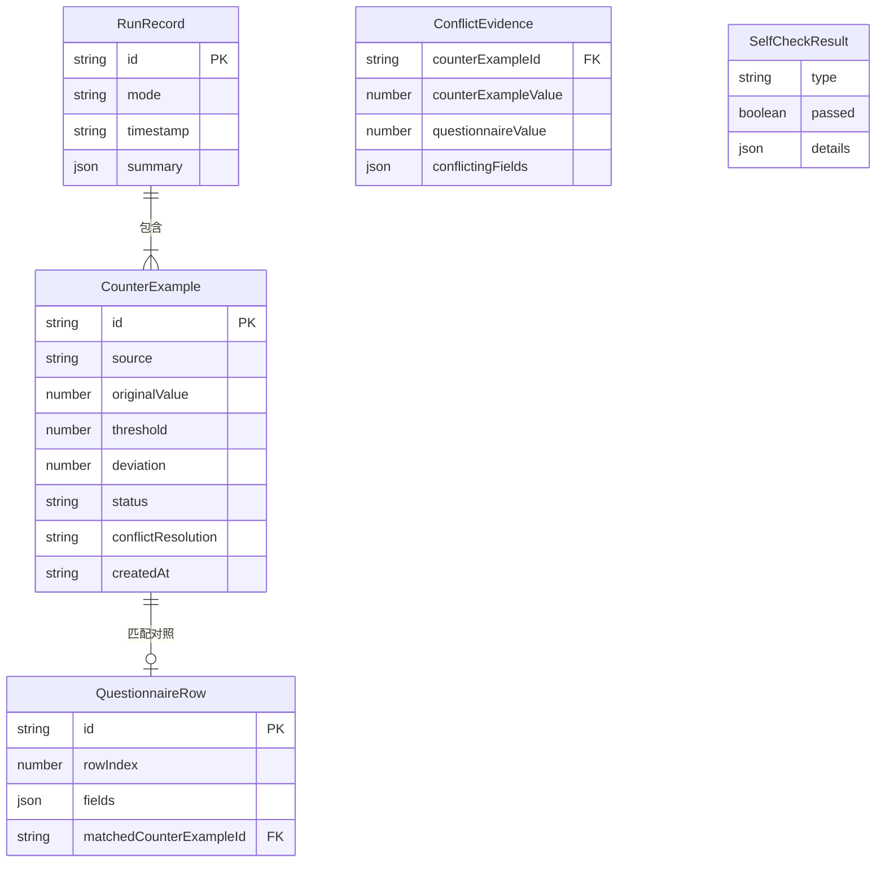

## 1. 架构设计



## 2. 技术说明

- 前端：React 18 + Tailwind CSS 3 + Vite
- 初始化工具：Vite (react-ts 模板)
- 后端：无（纯前端应用，数据存 localStorage）
- 数据库：无（localStorage + 内存状态管理）
- 动画：Canvas 2D 绘制梯度下降路径 + 等高线
- 状态管理：React Context + useReducer
- 图标：Lucide React

## 3. 路由定义

| 路由 | 用途 |
|------|------|
| `/` | 主控台：学习率演示 + 状态摘要 + 快捷入口 |
| `/counter-examples` | 反例管理：反例列表 + 问卷对照 + 冲突处理 |
| `/runs` | 材料运行：三种模式运行 + 历史记录 |
| `/checks` | 自检与导出：四项自检 + 报告导出 |

## 4. API 定义

无后端 API，所有逻辑在前端完成。

### 4.1 核心数据类型

```typescript
interface CounterExample {
  id: string
  source: "normal" | "mismatch" | "supplementary"
  originalValue: number
  threshold: number
  deviation: number
  status: "normal" | "boundary" | "conflict" | "pending_review"
  questionnaireRow: QuestionnaireRow | null
  conflictResolution: "confirmed" | "rejected" | null
  createdAt: string
  updatedAt: string
}

interface QuestionnaireRow {
  id: string
  rowIndex: number
  fields: Record<string, string | number>
  matchedCounterExampleId: string | null
}

interface RunRecord {
  id: string
  mode: "normal" | "mismatch" | "supplementary"
  timestamp: string
  counterExamples: CounterExample[]
  summary: RunSummary
}

interface ConflictEvidence {
  counterExampleId: string
  counterExampleValue: number
  questionnaireValue: number
  conflictingFields: string[]
  suggestedAction: "confirm" | "reject" | null
}

interface SelfCheckResult {
  type: "duplicate_import" | "boundary_threshold" | "supplementary_recalc" | "export_consistency"
  passed: boolean
  details: SelfCheckDetail[]
}

interface SelfCheckDetail {
  item: string
  status: "pass" | "fail"
  message: string
}
```

## 5. 服务器架构图

不适用，无后端服务。

## 6. 数据模型

### 6.1 数据模型定义



### 6.2 数据定义语言

使用 localStorage 键值对存储：

- `gd_counter_examples`：反例列表 JSON
- `gd_questionnaire_rows`：问卷原始行 JSON
- `gd_run_records`：运行历史 JSON
- `gd_conflict_evidences`：冲突证据 JSON
- `gd_self_check_results`：自检结果 JSON
- `gd_settings`：用户设置 JSON
