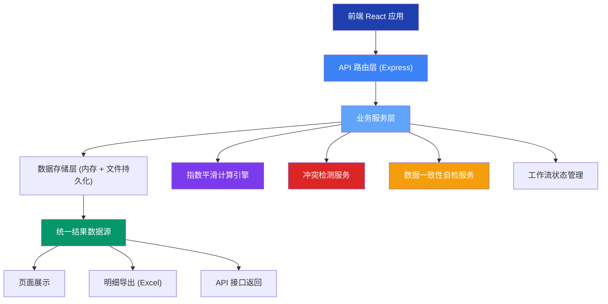
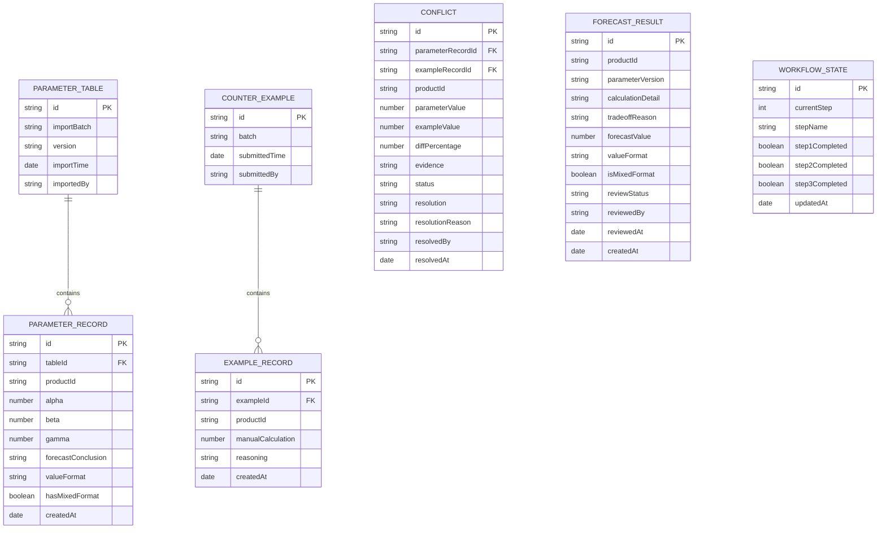

## 1. 架构设计



## 2. 技术描述

- **前端**：React@18 + TypeScript + Vite + tailwindcss@3 + zustand + lucide-react + react-router-dom
- **后端**：Express@4 + TypeScript
- **初始化工具**：vite-init
- **数据存储**：内存存储 + JSON 文件持久化（无需数据库，轻量级方案）
- **导出**：xlsx 库生成 Excel 文件

## 3. 目录结构

```
├── src/                    # 前端代码
│   ├── components/         # 可复用组件
│   │   ├── WorkflowStepper.tsx    # 工作流进度条
│   │   ├── ImportZone.tsx         # 导入区域
│   │   ├── ConflictCard.tsx       # 冲突对比卡片
│   │   ├── SelfCheckPanel.tsx     # 自检面板
│   │   ├── DataTable.tsx          # 数据表格
│   │   └── CalculationDetail.tsx  # 计算明细展开行
│   ├── pages/              # 页面
│   │   ├── Workbench.tsx         # 预测工作台
│   │   ├── ConflictResolve.tsx   # 冲突处理页
│   │   └── ForecastResult.tsx    # 预测结果页
│   ├── hooks/              # 自定义 Hooks
│   │   ├── useForecast.ts        # 预测业务逻辑
│   │   └── useWorkflow.ts        # 工作流管理
│   ├── store/              # 状态管理 (zustand)
│   │   └── forecastStore.ts      # 全局状态
│   ├── utils/              # 工具函数
│   │   ├── exponentialSmoothing.ts  # 指数平滑算法
│   │   ├── conflictDetector.ts      # 冲突检测
│   │   ├── selfChecker.ts          # 数据自检
│   │   └── exporter.ts             # Excel 导出
│   ├── types/              # 类型定义
│   │   └── index.ts
│   ├── App.tsx
│   ├── main.tsx
│   └── index.css
├── api/                    # 后端代码
│   ├── index.ts            # Express 服务入口
│   ├── routes/
│   │   ├── forecast.ts     # 预测相关 API
│   │   └── export.ts       # 导出 API
│   ├── services/
│   │   ├── forecastService.ts
│   │   ├── conflictService.ts
│   │   └── storageService.ts
│   └── types/
│       └── index.ts
├── shared/                 # 前后端共享类型
│   └── types.ts
├── data/                   # 数据存储目录
│   ├── parameters.json
│   ├── counterExamples.json
│   └── results.json
├── .trae/
│   └── documents/
│       ├── PRD.md
│       └── ARCHITECTURE.md
├── package.json
├── tsconfig.json
├── vite.config.ts
├── tailwind.config.js
└── postcss.config.js
```

## 4. 路由定义

| 前端路由 | 页面 | 功能 |
|---------|------|------|
| `/` | 预测工作台 | 参数表导入、手算反例补录、工作流进度 |
| `/conflicts` | 冲突处理页 | 冲突列表、冲突对比、确认/驳回操作 |
| `/results` | 预测结果页 | 自检面板、数据表格、计算明细、导出 |

| 后端 API | 方法 | 功能 |
|---------|------|------|
| `/api/parameters` | POST | 导入参数调试表 |
| `/api/parameters` | GET | 获取参数表列表 |
| `/api/counter-examples` | POST | 补录手算反例 |
| `/api/counter-examples` | GET | 获取手算反例列表 |
| `/api/conflicts` | GET | 获取冲突列表 |
| `/api/conflicts/:id/resolve` | POST | 处理冲突（确认/驳回） |
| `/api/forecast/calculate` | POST | 执行指数平滑计算 |
| `/api/forecast/results` | GET | 获取预测结果（统一数据源） |
| `/api/forecast/self-check` | GET | 执行数据自检 |
| `/api/export/details` | GET | 导出明细 Excel |
| `/api/workflow/status` | GET | 获取工作流状态 |
| `/api/workflow/step` | POST | 更新工作流步骤 |

## 5. 核心数据模型



## 6. 关键技术实现要点

### 6.1 单一数据源原则
所有展示层（页面、导出、API）必须调用同一个 `/api/forecast/results` 接口获取数据，确保三者完全一致。后端读取同一份 `results.json` 数据文件。

### 6.2 指数平滑算法
实现三次指数平滑（Holt-Winters 方法），支持加法和乘法两种季节性模式，参数版本与结果绑定存储。

### 6.3 冲突检测机制
按 `productId` 关联参数表记录和手算反例记录，当数值差异超过 5% 时标记为冲突，自动生成冲突证据对比。

### 6.4 百分数/小数混合检测
自动识别同一字段既有百分数（如 85%）又有小数（如 0.85）的记录，保留原始格式不自动转换，标记后推送给活动负责人复核。

### 6.5 自检服务
实现四项独立自检函数，每项返回状态（通过/警告/失败）和详细说明，结果展示在页面顶部的自检面板。

### 6.6 工作流状态机
严格控制三步工作流的状态流转，上一步未完成时下一步操作按钮置灰不可点击。

## 7. Mock 数据预设

为支持完整演示，预置以下 mock 数据：

1. **参数调试表**：5 条产品记录，其中 1 条存在百分数/小数混合（alpha=0.7 vs alpha=70%）
2. **手算反例**：3 条记录，其中 2 条与参数表结论存在明显冲突（差异 > 10%）
3. **冲突记录**：自动生成 2 条冲突，状态为"待处理"
4. **预测结果**：基于 mock 数据预生成 5 条结果，其中 1 条标记为"待活动负责人复核"
