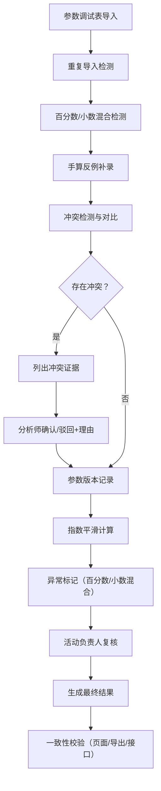

## 1. 产品概述

指数平滑销量预测系统，用于对商品销量进行基于指数平滑算法的预测分析。解决参数调试与手算反例冲突、数据一致性难以保证、人工复核流程缺失等业务痛点。目标用户为数据分析师（小祁）、活动负责人及业务运营人员。

核心价值：建立"冲突发现→人工复核→计算更新"的闭环工作流，确保预测结果的准确性和可追溯性。

## 2. 核心功能

### 2.1 用户角色

| 角色 | 权限说明 | 核心操作 |
|------|----------|----------|
| 数据分析师（小祁） | 可导入参数调试表、查看手算反例、处理冲突、执行计算 | 导入、冲突处理、计算、复核 |
| 活动负责人 | 仅可复核百分数/小数混合记录、确认最终结果 | 复核确认 |
| 业务运营 | 仅可查看预测结果和导出明细 | 查看、导出 |

### 2.2 功能模块

1. **参数调试表管理**：导入参数表、重复导入检测、参数版本记录
2. **手算反例管理**：补录手算反例、与参数表的冲突检测
3. **冲突处理中心**：列出冲突证据、支持确认/驳回操作、保留决策理由
4. **指数平滑计算引擎**：核心预测算法、参数版本关联、计算明细追溯
5. **数据一致性自检**：重复导入检测、百分数/小数混合检测、补录重算、导出一致性校验
6. **结果展示与导出**：页面展示、明细导出、接口返回统一数据源
7. **工作流进度追踪**：三步工作流状态展示、待办提醒

### 2.3 页面详情

| 页面名称 | 模块名称 | 功能描述 |
|-----------|-------------|---------------------|
| 预测工作台 | 工作流进度条 | 显示当前所处步骤：导入参数表→补看手算反例→计算更新 |
| 预测工作台 | 参数调试表导入 | 支持Excel/CSV导入、重复导入检测、导入历史 |
| 预测工作台 | 手算反例补录 | 支持逐条录入或批量导入反例数据 |
| 冲突处理页 | 冲突列表 | 展示参数表与手算反例的冲突记录，显示冲突证据对比 |
| 冲突处理页 | 冲突详情 | 并排展示参数表结论和手算反例数据，提供确认/驳回按钮和理由输入 |
| 预测结果页 | 自检状态面板 | 显示四项自检结果：重复导入、百分数小数混合、补录重算、导出一致 |
| 预测结果页 | 异常记录标记 | 百分数/小数混合记录用醒目标记，留待活动负责人复核 |
| 预测结果页 | 计算明细 | 展示预测计算过程，附带参数版本和取舍理由 |
| 预测结果页 | 结果导出 | 导出Excel明细，与页面展示和接口数据完全一致 |

## 3. 核心流程

### 3.1 三步工作流

1. **第一步：参数调试表第一次导入**
   - 数据分析师小祁导入参数调试表
   - 系统执行重复导入检测
   - 系统检测百分数和小数混合记录并标记

2. **第二步：数据分析师小祁补看手算反例**
   - 系统自动比对参数表与手算反例
   - 发现冲突时列出冲突证据
   - 小祁选择"确认（采用手算反例）"或"驳回（维持参数表）"，并填写理由

3. **第三步：计算明细更新**
   - 根据复核结果重新执行指数平滑计算
   - 记录参数版本和取舍理由
   - 百分数/小数混合记录保持标记状态，推送给活动负责人复核
   - 生成最终预测结果，确保页面、导出、接口三端数据一致

## 4. 用户界面设计

### 4.1 设计风格

- **主色调**：专业深蓝色系 `#1e40af`（权威、可信）
- **辅助色**：冲突警告色 `#dc2626`、异常标记色 `#f59e0b`、成功确认色 `#059669`
- **按钮风格**：圆角 6px，带微妙悬停阴影，主要操作按钮使用深蓝色填充
- **字体**：标题使用 `Playfair Display`（专业感），正文使用 `Inter`（清晰易读）
- **布局风格**：卡片式布局，清晰的视觉层级，数据表格为主
- **图标**：使用 Lucide 图标，保持一致的线条风格

### 4.2 页面设计概述

| 页面名称 | 模块名称 | UI 元素 |
|-----------|-------------|-------------|
| 预测工作台 | 工作流进度 | 横向时间轴，当前步骤高亮，已完成步骤打勾 |
| 预测工作台 | 导入区域 | 拖拽上传区域，支持点击选择，显示导入历史列表 |
| 冲突处理页 | 冲突对比 | 左右分栏对比，差异项高亮闪烁动画 |
| 冲突处理页 | 操作区域 | 大按钮"确认手算反例"（绿色）、"驳回维持原结论"（灰色）、理由输入框 |
| 预测结果页 | 自检面板 | 四个状态卡片，分别显示四项自检结果，带图标和状态文字 |
| 预测结果页 | 异常记录 | 表格行背景使用淡橙色，带"待复核"标签，悬停显示详细提示 |
| 预测结果页 | 计算明细 | 可展开的行，显示计算过程、参数版本号、取舍理由 |

### 4.3 响应式设计

- **桌面端优先**：主内容区最小宽度 1200px，适合数据表格展示
- **平板适配**：1024px 以下，侧边栏收起为图标，表格支持横向滚动
- **移动适配**：768px 以下，卡片堆叠展示，关键数据优先，复杂表格切换为列表视图

### 4.4 交互与动画

- 页面加载：内容区淡入 + 轻微上移动画，延迟 100ms 错开
- 冲突发现：警告图标脉冲动画，吸引注意力
- 按钮悬停：背景色过渡 + 轻微上浮阴影
- 表格行展开：平滑高度过渡
- 自检状态更新：进度条动画，完成后显示对勾
